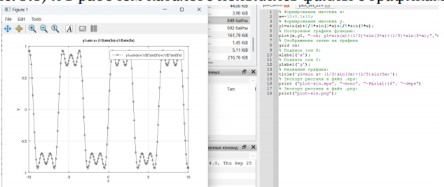
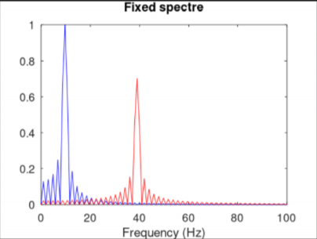
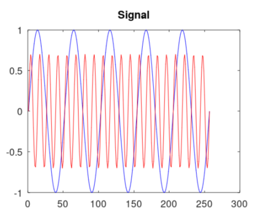

# Введение

## Цель и задачи

- Изучить методы построения сигналов в Octave  
- Определить спектры сигналов и их сумм (БПФ)  
- Продемонстрировать амплитудную модуляцию  
- Реализовать и сравнить методы кодирования:  
  Unipolar, AMI, NRZ, RZ, Manchester, Diff. Manchester  
- Проверить свойство самосинхронизации  

# Построение графиков

## Суммарные гармоники

{ width=78% }

# Ряд Фурье

## Приближение меандра

- Нечётные гармоники  
- Амплитуда ∝ 1/n  
- Эффект Гиббса на фронтах  

{ width=78% }

# Спектральный анализ

## Сумма синусоид (10 Гц и 40 Гц)

- Пики на частотах составляющих  
- Нормировка спектра  
- Алиасинг при fd < 80 Гц  

{ width=78% }

# Амплитудная модуляция

## Сигнал и спектр АМ

- Несущая: 50 Гц  
- Модуляция: 5 Гц  
- Боковые полосы вокруг несущей  

{ width=46% }
{ width=46% }

# Кодирование сигналов

## Примеры форм

Сравнение линий по переходам и спектральным свойствам.  

{ width=48% }
{ width=48% }

# Самосинхронизация

## Иллюстрация

Коды с переходом в середине бита обеспечивают синхронизацию при длинных сериях.  

{ width=60% }

# Итоги

## Выводы

- БПФ подтверждает частотный состав сигналов  
- АМ демонстрирует огибающую и боковые полосы  
- Манчестер и дифф. Манчестер — самосинхронизируемые  
- Unipolar и NRZ хуже при длинных сериях  
- Практика в Octave закрепила навыки анализа сигналов
