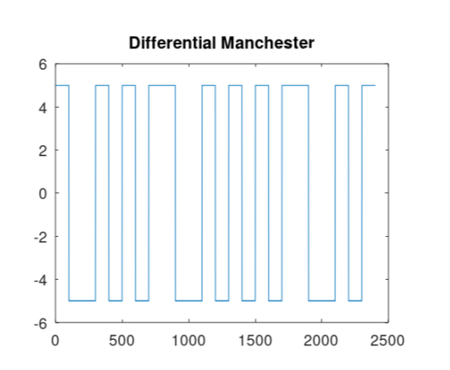
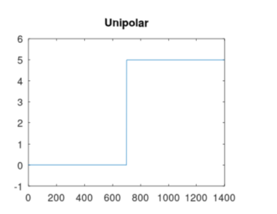
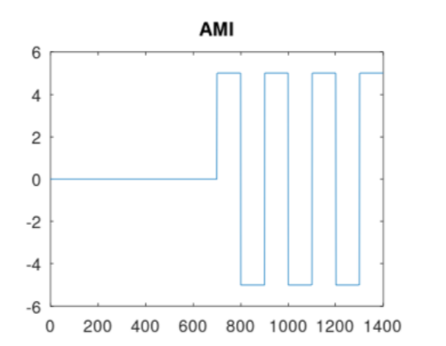
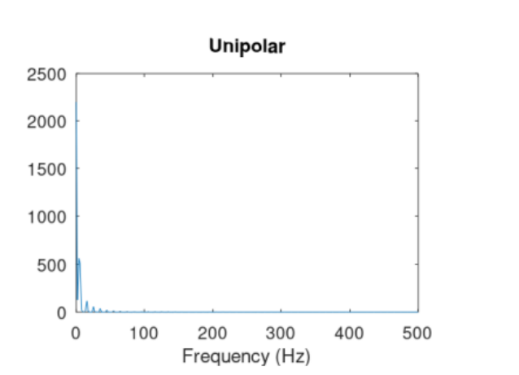
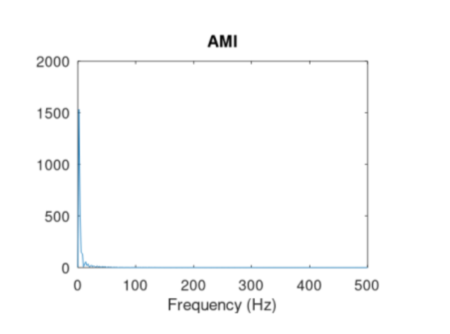
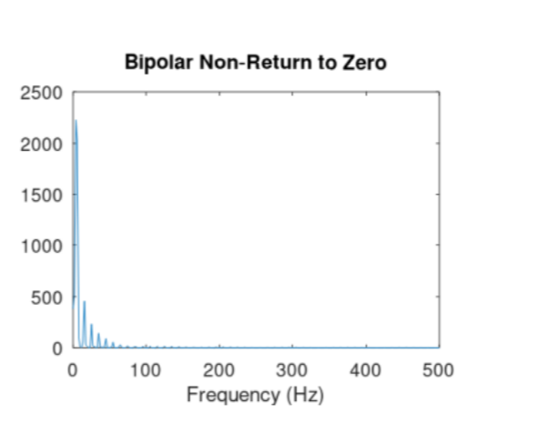
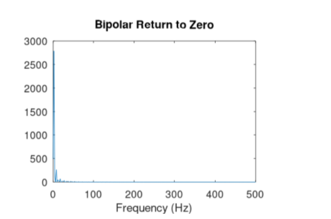
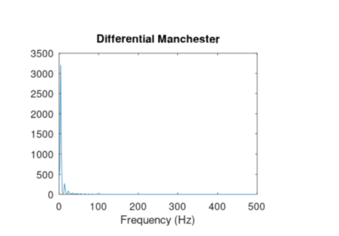

## Докладчик

* Талебу Тенке Франк Устон
* Студент группы НФИбд-02-23
* Студ. билет 1032224534
* Российский университет дружбы народов

## Цель работы

Изучение принципов работы сетевых технологий

---

## После запуска Octave создал сценарий `plot_sin.m` для построения графика функции (рис. @fig:001):

{ width=90% }

---

## Далее построил графики функций y1 и y2 на одном рисунке (рис. @fig:002):

{ width=90% }

---

## Разложил импульсный сигнал в частичный ряд Фурье. Получил графики меандра через косинусы (рис. @fig:003) и через синусы (рис. @fig:004):

{ width=90% }

---

## {#fig:003 width=70%}

{#fig:003 width=70%}](4.png){ width=90% }

---

## Определил спектр двух отдельных сигналов разной частоты (рис. @fig:005):

{ width=90% }

---

## Построил график спектров сигналов (рис. @fig:006) и исправленный график спектров (рис. @fig:007):

{ width=90% }

---

## {#fig:006 width=70%}

{#fig:006 width=70%}](7.png){ width=90% }

---

## Определил спектр суммы сигналов (рис. @fig:008, @fig:009):

{ width=90% }

---

## {#fig:008 width=70%}

{#fig:008 width=70%}](9.png){ width=90% }

---

## Выполнил задание с частотой дискретизации 50 Гц (меньше 80 Гц). Получил искажённые графики (рис. @fig:010-014):

{ width=90% }

---

## {#fig:010 width=70%}

{#fig:010 width=70%}](11.png){ width=90% }

---

## {#fig:011 width=70%}

{#fig:011 width=70%}](12.png){ width=90% }

---

## {#fig:012 width=70%}

{#fig:012 width=70%}](13.png){ width=90% }

---

## {#fig:013 width=70%}

{#fig:013 width=70%}](14.png){ width=90% }

---

## Продемонстрировал аналоговую амплитудную модуляцию (рис. @fig:015, @fig:016):

{ width=90% }

---

## {#fig:015 width=70%}

{#fig:015 width=70%}](16.png){ width=90% }

---

## Получил кодированные сигналы для различных кодов (рис. @fig:017-022):

{ width=90% }

---

## {#fig:017 width=70%}

{#fig:017 width=70%}](18.png){ width=90% }

---

## {#fig:018 width=70%}

{#fig:018 width=70%}](19.png){ width=90% }

---

## {#fig:019 width=70%}

{#fig:019 width=70%}](20.png){ width=90% }

---

## {#fig:020 width=70%}

{#fig:020 width=70%}](21.png){ width=90% }

---

## {#fig:021 width=70%}

{#fig:021 width=70%}](22.png){ width=90% }

---

## Проверил свойства самосинхронизации кодов (рис. @fig:023-028):

{ width=90% }

---

## {#fig:023 width=70%}

{#fig:023 width=70%}](24.png){ width=90% }

---

## {#fig:024 width=70%}

{#fig:024 width=70%}](25.png){ width=90% }

---

## {#fig:025 width=70%}

{#fig:025 width=70%}](26.png){ width=90% }

---

## {#fig:026 width=70%}

{#fig:026 width=70%}](27.png){ width=90% }

---

## {#fig:027 width=70%}

{#fig:027 width=70%}](28.png){ width=90% }

---

## Получил спектры сигналов для различных кодов (рис. @fig:029-034):

{ width=90% }

---

## {#fig:029 width=70%}

{#fig:029 width=70%}](30.png){ width=90% }

---

## {#fig:030 width=70%}

{#fig:030 width=70%}](31.png){ width=90% }

---

## {#fig:031 width=70%}

{#fig:031 width=70%}](32.png){ width=90% }

---

## {#fig:032 width=70%}

{#fig:032 width=70%}](33.png){ width=90% }

---

## {#fig:033 width=70%}

{#fig:033 width=70%}](34.png){ width=90% }

---

## Этап выполнения работы №35

{ width=90% }

---

## Вывод

В ходе выполнения лабораторной работы были получены практические навыки

---

## Список литературы

[1] Методические указания к лабораторной работе №01
[2] Документация по сетевым технологиям
