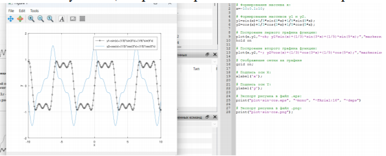
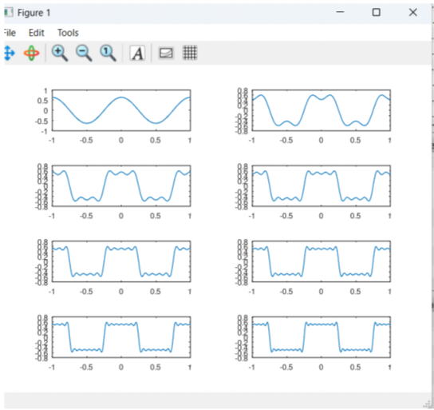
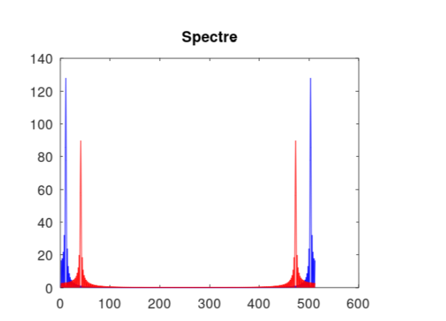
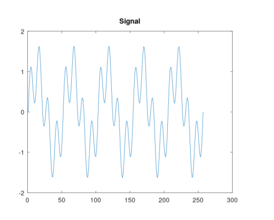
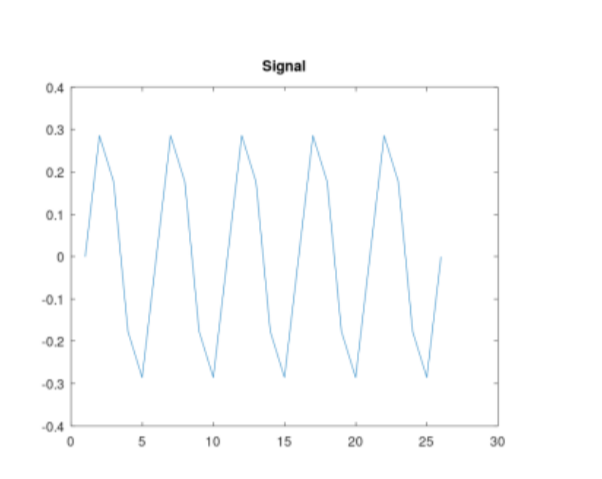
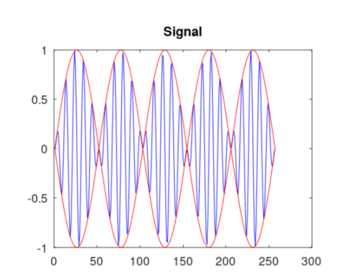
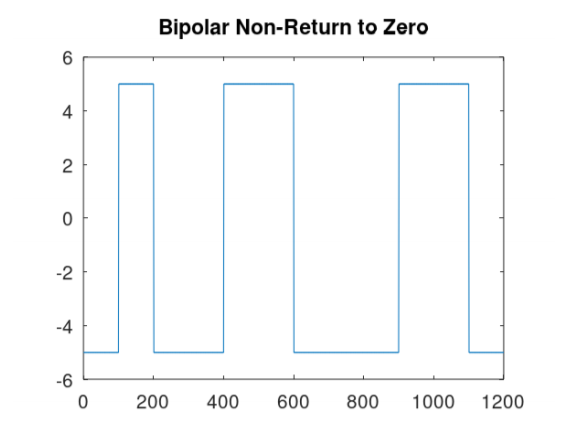
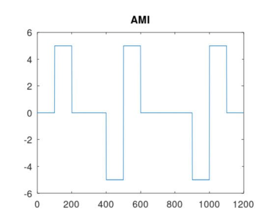

## Докладчик

* Талебу Тенке Франк Устон
* Студент группы НФИбд-02-23
* Студ. билет 1032224534
* Российский университет дружбы народов

## Цель работы

Изучение принципов работы сетевых технологий

## После запуска Octave создал сценарий `plot_sin.m` для построения графика функции (рис. @fig:001):

## Далее построил графики функций y1 и y2 на одном рисунке (рис. @fig:002):

## Разложил импульсный сигнал в частичный ряд Фурье. Получил графики меандра через косинусы (рис. @fig:003) и через синусы (рис. @fig:004):

## {#fig:003 width=70%}

{#fig:003 width=70%}](4.png)

## Определил спектр двух отдельных сигналов разной частоты (рис. @fig:005):

## Построил график спектров сигналов (рис. @fig:006) и исправленный график спектров (рис. @fig:007):

## {#fig:006 width=70%}

{#fig:006 width=70%}](7.png)

## Определил спектр суммы сигналов (рис. @fig:008, @fig:009):

## {#fig:008 width=70%}

{#fig:008 width=70%}](9.png)

## Выполнил задание с частотой дискретизации 50 Гц (меньше 80 Гц). Получил искажённые графики (рис. @fig:010-014):

## {#fig:010 width=70%}

{#fig:010 width=70%}](11.png)

## {#fig:011 width=70%}

{#fig:011 width=70%}](12.png)

## {#fig:012 width=70%}

{#fig:012 width=70%}](13.png)

## {#fig:013 width=70%}

{#fig:013 width=70%}](14.png)

## Продемонстрировал аналоговую амплитудную модуляцию (рис. @fig:015, @fig:016):

## {#fig:015 width=70%}

{#fig:015 width=70%}](16.png)

## Получил кодированные сигналы для различных кодов (рис. @fig:017-022):

## {#fig:017 width=70%}

{#fig:017 width=70%}](18.png)

## {#fig:018 width=70%}

{#fig:018 width=70%}](19.png)

## {#fig:019 width=70%}

{#fig:019 width=70%}](20.png)

## Вывод

В ходе выполнения лабораторной работы были получены практические навыки

## Список литературы

[1] Методические указания к лабораторной работе №01
[2] Документация по сетевым технологиям
