# Цель работы

Изучить методы кодирования и модуляции сигналов с использованием языка Octave. Определить спектры и параметры сигналов, исследовать свойства самосинхронизации.

# Выполнение работы

## Построение графиков в Octave

### Постановка задачи

Необходимо построить графики функций:

$$
y_1 = \sin(x) + \frac{1}{3}\sin(3x) + \frac{1}{5}\sin(5x),
$$

$$
y_2 = \cos(x) + \frac{1}{3}\cos(3x) + \frac{1}{5}\cos(5x),
$$

на интервале $$[-10; 10]$$, используя Octave e функцию `plot`. Графики требуется экспортировать в файлы формата `.eps` e `.png`.

### Ход работы

В среде Octave создан скрипт, в котором:  
1. Задан интервал изменения аргумента $$x \in [-10; 10]$$.  
2. Определены функции $$y_1$$ e $$y_2$$.  
3. Построен график функции $$y_1$$ e экспортирован в форматы `.eps` e `.png`.  
4. На одном графике построены функции $$y_1$$ e $$y_2$$, добавлена легенда для удобства анализа.  

### Полученные результаты

На первом рисунке представлен график функции $$y_1$$:  

{ #fig:001 width=80% }

На втором рисунке представлены оба графика функций $$y_1$$ e $$y_2$$:  

{ #fig:002 width=80% }

##  Разложение импульсного сигнала в частичный ряд Фурье

### Постановка задачи
Требуется построить набор графиков приближений меандра при увеличении числа нечётных гармоник. Рассматриваются два варианта разложения: через cos-ряд e через sin-ряд.  

### Параметры моделирования
- число используемых гармоник: 8  
- временной интервал: от -1 до 1 с шагом 0.01  
- амплитуда: 1  
- период: 1  
В спектре меандра участвуют только нечётные гармоники, амплитуда которых обратно пропорциональна их номеру.  

### Ход работы
1. Построены графики частичных сумм ряда Фурье, приближающих меандр, при числе гармоник от 1 до 8.  
2. Выполнено моделирование как через cos-ряд (с чередующимися знаками членов), так и через sin-ряд (с положительными членами).  
3. Каждый частичный ряд показан в отдельной ячейке окна, что позволяет наглядно видеть процесс приближения.  
4. Полученные графики экспортированы в формат `.png`.  

### Результаты моделирования
Графики частичных сумм косинусного ряда:  

{ #fig:003 width=80% }

Графики частичных сумм синусного ряда:  

{ #fig:004 width=80% }

### Анализ результатов
- При малом числе гармоник сигнал имеет плавную форму и плохо напоминает меандр.  
- С увеличением количества гармоник фронты становятся более крутыми, форма сигнала всё ближе к прямоугольной.  
- Вблизи разрывов наблюдаются колебания (эффект Гиббса), которые сохраняются при любом числе гармоник, но их ширина уменьшается.  
- Cos- e sin-разложения дают эквивалентное приближение меандра при одинаковом числе гармоник.  

## Определение спектра и параметров сигнала

### Постановка задачи
Необходимо определить спектры двух отдельных сигналов (синусоидальных колебаний различной частоты) и их суммы. Также требуется рассмотреть случай изменения частоты дискретизации и объяснить, что произойдёт при её уменьшении ниже 80 Гц.

### Ход работы
1. В каталоге `spectre1` заданы параметры: длительность сигнала 0.5 с, частота дискретизации 512 Гц, частоты сигналов 10 Гц и 40 Гц, амплитуды 1 и 0.7.  
2. Сформированы два синусоидальных сигнала:  
   $$
   s_1(t) = a_1 \sin(2\pi f_1 t), \quad s_2(t) = a_2 \sin(2\pi f_2 t).
   $$  
3. Построены графики сигналов и их спектров с использованием БПФ.  
4. Выполнена корректировка спектров: удалены отрицательные частоты, произведена нормировка амплитуд.  
5. В каталоге `spectre_sum` построен суммарный сигнал и найден его спектр.  

### Результаты
График двух исходных сигналов:  

{ #fig:005 width=80% }

Спектры сигналов до исправления:  

{ #fig:006 width=80% }

Исправленные спектры сигналов:  

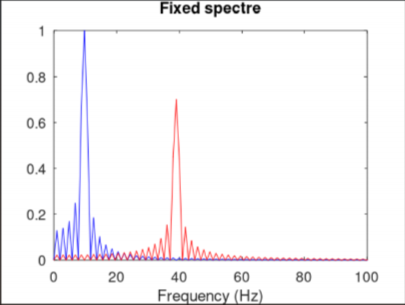{ #fig:007 width=80% }

Суммарный сигнал:  

{ #fig:008 width=80% }

Спектр суммарного сигнала:  

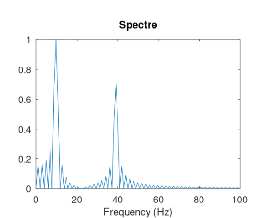{ #fig:009 width=80% }

### Анализ и выводы
- При дискретизации 512 Гц сигналы с частотами 10 Гц и 40 Гц корректно отображаются, спектры чётко выделены.  
- Спектр суммы сигналов совпадает с суммой отдельных спектров, что подтверждает свойства преобразования Фурье.  
- Если частота дискретизации будет меньше 80 Гц, то сигнал с частотой 40 Гц не сможет корректно отобразиться: произойдёт наложение спектров (алиасинг), что приведёт к искажению сигнала.  
- Для корректного представления сигнала частота дискретизации должна быть как минимум в два раза выше максимальной частоты спектра (критерий Найквиста–Котельникова).  

## Амплитудная модуляция

### Постановка задачи
Необходимо продемонстрировать принципы амплитудной модуляции (АМ) на примере модуляции низкочастотного сигнала синусоидой высокой частоты и исследовать спектр полученного сигнала.

### Ход работы
1. В рабочем каталоге создан сценарий `am.m` и заданы параметры моделирования:  
   - длительность сигнала: 0.5 с,  
   - частота дискретизации: 512 Гц,  
   - частота модулирующего сигнала: 5 Гц,  
   - частота несущей: 50 Гц.  

2. Сформированы сигналы:  
   - модулирующий сигнал $$s_1(t) = \sin(2\pi f_1 t)$$,  
   - несущая $$s_2(t) = \sin(2\pi f_2 t)$$,  
   - амплитудно-модулированный сигнал $$s(t) = s_1(t) \cdot s_2(t)$$.  

3. Построен график модулированного сигнала вместе с огибающей.  

4. С помощью быстрого преобразования Фурье рассчитан спектр модулированного сигнала.  

### Результаты
График амплитудно-модулированного сигнала с огибающей:  

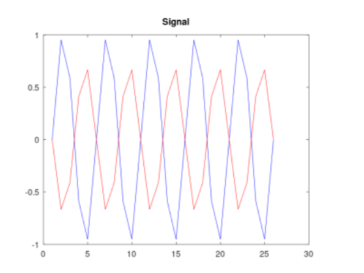{ #fig:010 width=80% }

Спектр амплитудно-модулированного сигнала:  

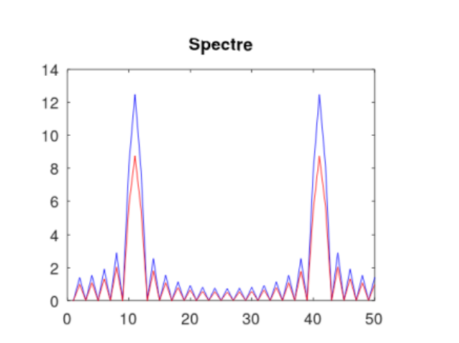{ #fig:011 width=80% }

### Анализ и выводы
- Амплитудная модуляция заключается в изменении амплитуды высокочастотной несущей в зависимости от низкочастотного модулирующего сигнала.  
- На графике чётко видна огибающая, совпадающая с модулирующим сигналом.  
- Спектр модулированного сигнала состоит из центральной частоты (несущей) и двух боковых полос, расположенных симметрично относительно несущей на расстоянии частоты модуляции.  
- Полученные результаты подтверждают принцип свёртки спектров при умножении сигналов во временной области.  

## Кодирование сигнала и исследование самосинхронизации

### Постановка задачи
Сформировать кодированные сигналы по заданным битовым последовательностям для нескольких линийных кодов. Проверить самосинхронизацию на длинных сериях одинаковых символов. Построить спектры сигналов и сравнить энергетическое распределение.

### Ход работы
1. Подготовлены три наборa данных: основная последовательность для визуализации формы сигнала; последовательность для проверки самосинхронизации с длинными сериями нулей/единиц; последовательность для расчёта спектров.
2. Для каждого кода получены три вида результатов: форма сигнала, иллюстрация самосинхронизации, амплитудный спектр.
3. Рассмотренные коды: Unipolar, AMI, Bipolar NRZ, Bipolar RZ, Manchester, Differential Manchester.

### Результаты: формы сигналов (основная последовательность)
Unipolar  
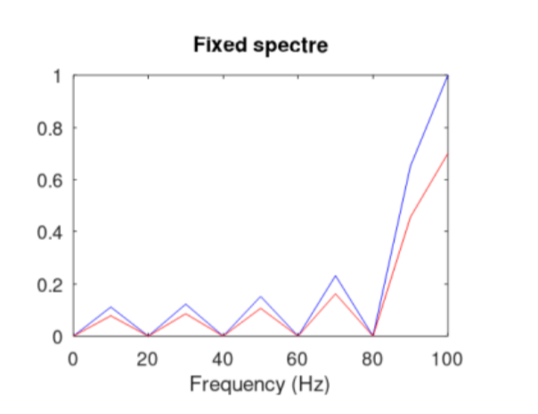{ #fig:012 width=80% }

AMI  
{ #fig:013 width=80% }

Bipolar NRZ  
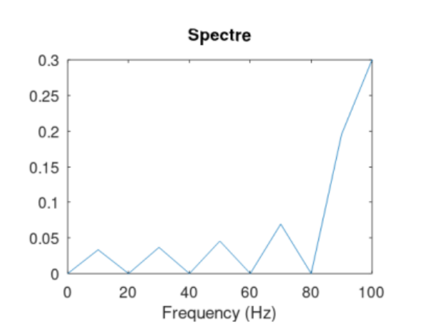{ #fig:014 width=80% }

Bipolar RZ  
{ #fig:015 width=80% }

Manchester  
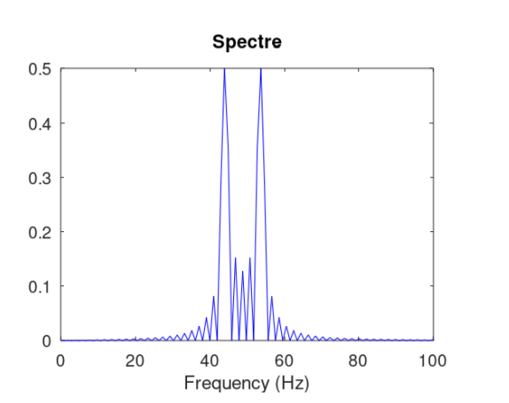{ #fig:016 width=80% }

Differential Manchester  
{ #fig:017 width=80% }

### Результаты: самосинхронизация (длинные серии)
Unipolar  
{ #fig:018 width=80% }

AMI  
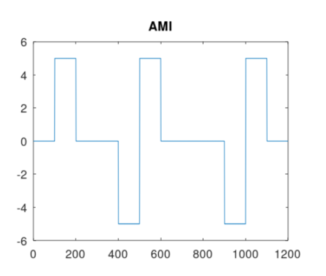{ #fig:019 width=80% }

Bipolar NRZ  
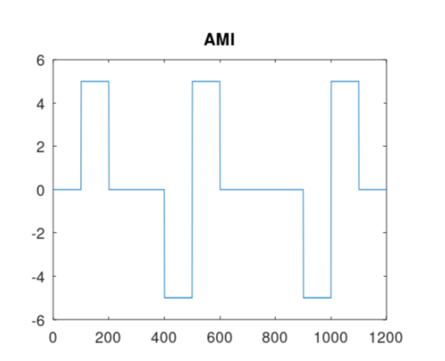{ #fig:020 width=80% }

Bipolar RZ  
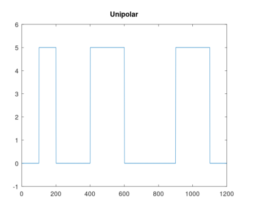{ #fig:021 width=80% }

Manchester  
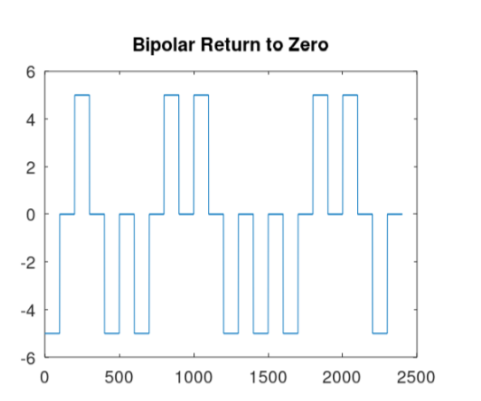{ #fig:022 width=80% }

Differential Manchester  
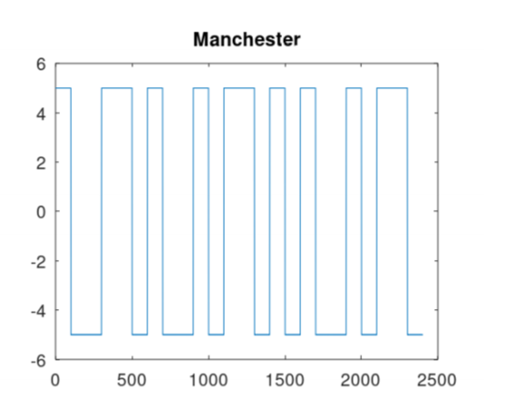{ #fig:023 width=80% }

### Результаты: спектры сигналов
Unipolar  
{ #fig:024 width=80% }

AMI  
{ #fig:025 width=80% }

Bipolar NRZ  
{ #fig:026 width=80% }

Bipolar RZ  
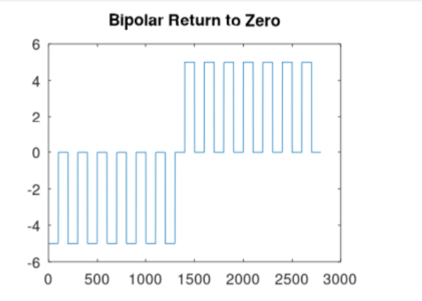{ #fig:027 width=80% }

Manchester  
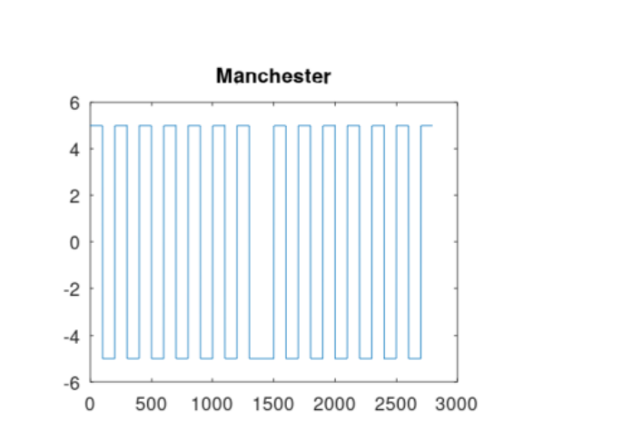{ #fig:028 width=80% }

Differential Manchester  
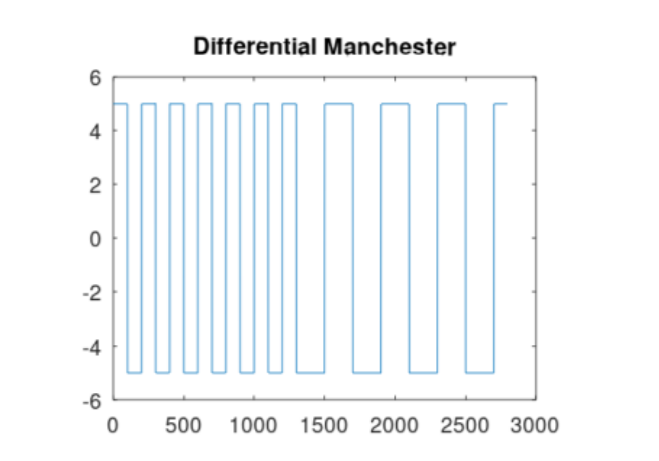{ #fig:029 width=80% }

### Анализ
Unipolar  
Нет инверсий на длинной серии нулей. Сильная DC-составляющая. Самосинхронизация отсутствует на последовательностях с малой числом переходов.

AMI  
Единицы чередуют полярность, что исключает DC и облегчает обнаружение ошибок полярности. На длинной серии нулей переходов нет, самосинхронизация ухудшается. Применяются вставки скреймблинга/подстановочные шаблоны для ограничения длины серии нулей.

Bipolar NRZ  
Переходы только при смене бита. На длинной серии одинаковых символов переходов нет, синхронизация теряется. DC подавлена слабее, чем у AMI.

Bipolar RZ  
Возврат к нулю в каждом такте создаёт обязательный переход внутри бита. Самосинхронизация выше, чем у NRZ/Unipolar. Ширина спектра больше из-за удвоения числа фронтов.

Manchester  
Переход в середине каждого такта обеспечивает самосинхронизацию даже на одинаковых сериях. Отсутствует DC-составляющая. Эффективная полоса вдвое шире относительно исходной битовой скорости.

Differential Manchester  
Сохранены свойства Manchester по самосинхронизации и отсутствию DC. Информация кодируется изменением/сохранением фазы относительно предыдущего такта, что повышает устойчивость к инверсии полярности канала.

Сопоставление по спектру  
Unipolar показывает выраженный низкочастотный пик (DC). AMI и биполярные коды подавляют DC и концентрируют энергию в области тактовых частот и гармоник переходов. RZ и Manchester расширяют спектр за счёт обязательных переходов середины такта. Differential Manchester аналогичен Manchester по ширине спектра.

Коды с принудительными переходами (RZ, Manchester, Differential Manchester) демонстрируют лучшую самосинхронизацию ценой увеличенной полосы. AMI эффективен по спектру и отсутствию DC, но требует мер против длинных серий нулей. Unipolar и Bipolar NRZ чувствительны к синхронизации при малом числе переходов и имеют менее благоприятные спектральные свойства.

# Вывод

В ходе лабораторной работы были реализованы методы построения сигналов, их спектральный анализ, амплитудная модуляция и различные способы кодирования. Полученные графики подтвердили теоретические положения о разложении в ряд Фурье, свойстве самосинхронизации и спектральных характеристиках сигналов. Практическая работа в Octave закрепила понимание методов обработки сигналов.
