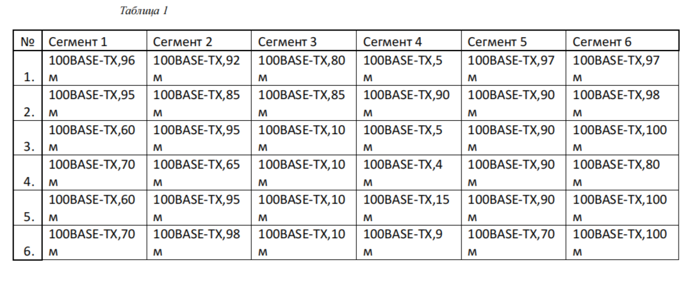
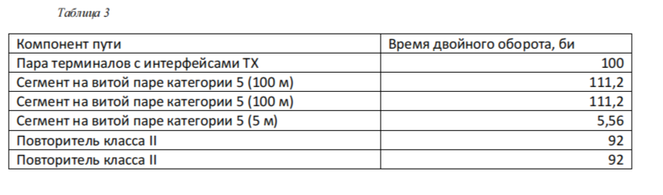
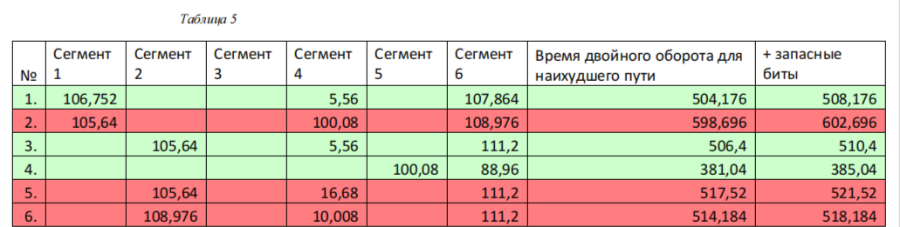

# Цель работы

Изучить методы кодирования и модуляции сигналов с помощью высокоуровнего языка программирования Octave. Определить спектр и параметры сигнала. Продемонстрировать принципы модуляции сигнала на примере аналоговой амплитудной модуляции. Исследовать свойства самосинхронизации сигнала.

# Выполнение лабораторной работы

## Задание №1

После запуска Octave создал сценарий `plot_sin.m` для построения графика функции (рис. @fig:001):

{#fig:001 width=70%}

Далее построил графики функций y1 и y2 на одном рисунке (рис. @fig:002):

{#fig:002 width=70%}

## Задание №2

Разложил импульсный сигнал в частичный ряд Фурье. Получил графики меандра через косинусы (рис. @fig:003) и через синусы (рис. @fig:004):

{#fig:003 width=70%}

{#fig:004 width=70%}

## Задание №3

Определил спектр двух отдельных сигналов разной частоты (рис. @fig:005):

{#fig:005 width=70%}

Построил график спектров сигналов (рис. @fig:006) и исправленный график спектров (рис. @fig:007):

{#fig:006 width=70%}

{#fig:007 width=70%}

Определил спектр суммы сигналов (рис. @fig:008, @fig:009):

{#fig:008 width=70%}

{#fig:009 width=70%}

Выполнил задание с частотой дискретизации 50 Гц (меньше 80 Гц). Получил искажённые графики (рис. @fig:010-014):

{#fig:010 width=70%}

{#fig:011 width=70%}

{#fig:012 width=70%}

{#fig:013 width=70%}

{#fig:014 width=70%}

## Задание №4

Продемонстрировал аналоговую амплитудную модуляцию (рис. @fig:015, @fig:016):

{#fig:015 width=70%}

{#fig:016 width=70%}

## Задание №5

Получил кодированные сигналы для различных кодов (рис. @fig:017-022):

{#fig:017 width=70%}

{#fig:018 width=70%}

{#fig:019 width=70%}

{#fig:020 width=70%}

{#fig:021 width=70%}

{#fig:022 width=70%}

Проверил свойства самосинхронизации кодов (рис. @fig:023-028):

{#fig:023 width=70%}

{#fig:024 width=70%}

{#fig:025 width=70%}

{#fig:026 width=70%}

{#fig:027 width=70%}

{#fig:028 width=70%}

Получил спектры сигналов для различных кодов (рис. @fig:029-034):

{#fig:029 width=70%}

{#fig:030 width=70%}

{#fig:031 width=70%}

{#fig:032 width=70%}

{#fig:033 width=70%}

{#fig:034 width=70%}

# Выводы

В ходе выполнения лабораторной работы изучил методы кодирования и модуляции сигналов с помощью Octave, определил спектры сигналов, продемонстрировал принципы амплитудной модуляции и исследовал свойства самосинхронизации различных кодов.
