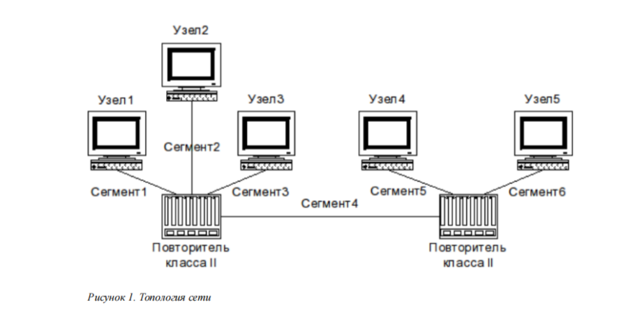

# Цели и задачи работы

## Цель лабораторной работы

Изучить принципы технологий Ethernet и Fast Ethernet и освоить методики оценки работоспособности сети Fast Ethernet на практике.

# Исходные данные и схема

## Варианты заданий

{ #fig:001 width=80% }

## Топология сети

{ #fig:002 width=80% }

## Временные задержки компонентов

{ #fig:003 width=80% }

# Выполнение работы

## Методики оценки работоспособности

- **Первая модель**: проверка по суммарной длине выбранных сегментов (сравнение с допустимой длиной для 2 повторителей).
- **Вторая модель**: расчёт по задержкам (терминалы + повторители + кабель с коэффициентом категории) и проверка итогового значения с учётом резерва.

# Вариант 1

## Первая модель (Вариант 1)

Выбираем сегменты **(1–4–5)**  
- 96 + 5 + 97 = **198 м**  
- Для двух повторителей длина допустима  
**Вывод:** сеть работоспособна.

## Вторая модель (Вариант 1)

- Пара терминалов TX — **100**
- Сегмент 1: 96 м, кат. 5 — **96 × 1,112**
- Повторитель класса II TX — **92**
- Сегмент 4: 5 м, кат. 5 — **5 × 1,112**
- Повторитель класса II TX — **92**
- Сегмент 5: 97 м, кат. 5 — **97 × 1,112**
- Итого (+4 резерв): **508,176**  
**Вывод:** работоспособна.

# Вариант 2

## Первая модель (Вариант 2)

Выбираем сегменты **(1–4–6)**  
- 95 + 90 + 98 = **283 м**  
- Допустимо для 2 повторителей: **205 м**  
**Вывод:** сеть неработоспособна.

## Вторая модель (Вариант 2)

- Пара терминалов TX — **100**
- Сегмент 1: 95 м, кат. 5 — **95 × 1,112**
- Повторитель класса II TX — **92**
- Сегмент 4: 90 м, кат. 5 — **90 × 1,112**
- Повторитель класса II TX — **92**
- Сегмент 6: 98 м, кат. 5 — **98 × 1,112**
- Итого (+4 резерв): **602,696**  
**Вывод:** неработоспособна.

# Вариант 3

## Первая модель (Вариант 3)

Выбираем сегменты **(2–4–6)**  
- 95 + 5 + 100 = **200 м**  
- Для 2 повторителей не превышает **205 м**  
**Вывод:** сеть работоспособна.

## Вторая модель (Вариант 3)

- Пара терминалов TX — **100**
- Сегмент 2: 95 м, кат. 5 — **95 × 1,112**
- Повторитель класса II TX — **92**
- Сегмент 4: 5 м, кат. 5 — **5 × 1,112**
- Повторитель класса II TX — **92**
- Сегмент 6: 100 м, кат. 5 — **100 × 1,112**
- Итого (+4 резерв): **510,4**  
**Вывод:** работоспособна.

# Вариант 4

## Первая модель (Вариант 4)

Выбираем сегменты **(1–4–5)**  
- 70 + 4 + 90 = **164 м**  
- Для 2 повторителей не превышает **205 м**  
**Вывод:** сеть работоспособна.

## Вторая модель (Вариант 4)

- Пара терминалов TX — **100**
- Сегмент 1: 70 м, кат. 5 — **70 × 1,112**
- Повторитель класса II TX — **92**
- Сегмент 4: 4 м, кат. 5 — **4 × 1,112**
- Повторитель класса II TX — **92**
- Сегмент 6: 90 м, кат. 5 — **90 × 1,112**
- Итого (+4 резерв): **470,368**  
**Вывод:** работоспособна.

# Вариант 5

## Первая модель (Вариант 5)

Выбираем сегменты **(2–4–6)**  
- 95 + 15 + 100 = **210 м**  
- Превышает допустимые **205 м**  
**Вывод:** сеть неработоспособна.

## Вторая модель (Вариант 5)

- Пара терминалов TX — **100**
- Сегмент 2: 95 м, кат. 5 — **95 × 1,112**
- Повторитель класса II TX — **92**
- Сегмент 4: 15 м, кат. 5 — **15 × 1,112**
- Повторитель класса II TX — **92**
- Сегмент 6: 100 м, кат. 5 — **100 × 1,112**
- Итого (+4 резерв): **521,52**  
**Вывод:** неработоспособна.

# Вариант 6

## Первая модель (Вариант 6)

Выбираем сегменты **(2–4–6)**  
- 98 + 9 + 100 = **207 м**  
- Превышает допустимые **205 м**  
**Вывод:** сеть неработоспособна.

## Вторая модель (Вариант 6)

- Пара терминалов TX — **100**
- Сегмент 2: 98 м, кат. 5 — **98 × 1,112**
- Повторитель класса II TX — **92**
- Сегмент 4: 9 м, кат. 5 — **9 × 1,112**
- Повторитель класса II TX — **92**
- Сегмент 6: 100 м, кат. 5 — **100 × 1,112**
- Итого (+4 резерв): **518,184**  
**Вывод:** неработоспособна.

# Выводы по работе

## Общий вывод

- Изучены принципы технологий **Ethernet** и **Fast Ethernet**
- Освоены две методики оценки работоспособности сети Fast Ethernet:
  - по **суммарной длине сегментов**
  - по **расчёту задержек** с учётом компонентов и резерва
- Для вариантов **1, 3, 4** сеть работоспособна, для **2, 5, 6** — неработоспособна
