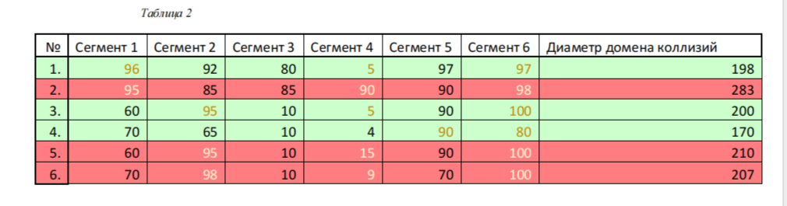
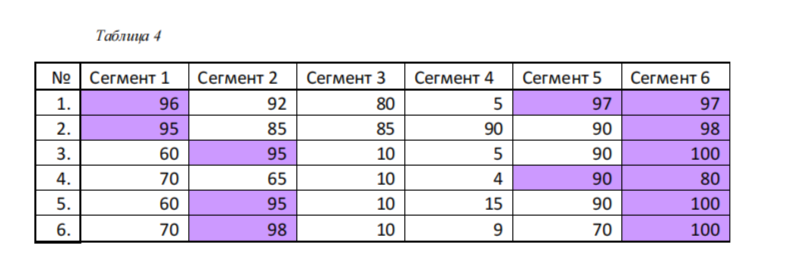

## Докладчик

* Талебу Тенке Франк Устон
* Студент группы НФИбд-02-23
* Студ. билет 1032224534
* Российский университет дружбы народов

## Цель работы

Изучение принципов работы сетевых технологий

---

## После запуска Octave создал сценарий `plot_sin.m` для построения графика функции (рис. @fig:001):

{ width=90% }

---

## Далее построил графики функций y1 и y2 на одном рисунке (рис. @fig:002):

{ width=90% }

---

## Разложил импульсный сигнал в частичный ряд Фурье. Получил графики меандра через косинусы (рис. @fig:003) и через синусы (рис. @fig:004):

{ width=90% }

---

## {#fig:003 width=70%}

{#fig:003 width=70%}](4.png){ width=90% }

---

## Определил спектр двух отдельных сигналов разной частоты (рис. @fig:005):

{ width=90% }

---

## Построил график спектров сигналов (рис. @fig:006) и исправленный график спектров (рис. @fig:007):

{ width=90% }

---

## Вывод

В ходе выполнения лабораторной работы были получены практические навыки

---

## Список литературы

[1] Методические указания к лабораторной работе №02
[2] Документация по сетевым технологиям
