# Цель работы

Изучение посредством Wireshark кадров Ethernet, анализ PDU протоколов транспортного и прикладного уровней стека TCP/IP.

# Выполнение работы

## Подготовка к работе

С помощью команды `ipconfig` вывел информацию о текущем сетевом соединении (рис. @fig:001):

{#fig:001 width=70%}

Использовал различные опции команды (рис. @fig:002-005):

{#fig:002 width=70%}

{#fig:003 width=70%}

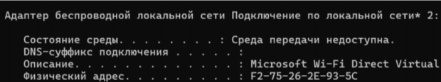{#fig:004 width=70%}

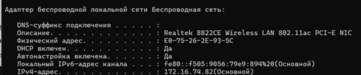{#fig:005 width=70%}

Определил MAC-адреса сетевых интерфейсов с помощью команды `GETMAC` (рис. @fig:006):

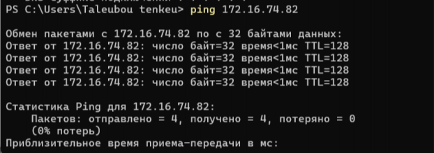{#fig:006 width=70%}

## Работа с Wireshark

Установил Wireshark (рис. @fig:007):

{#fig:007 width=70%}

Запустил Wireshark и выбрал активный сетевой интерфейс для захвата трафика (рис. @fig:008):

{#fig:008 width=70%}

Определил IP-адрес устройства и шлюз по умолчанию (рис. @fig:009):

{#fig:009 width=70%}

Выполнил пинг шлюза по умолчанию (рис. @fig:010):

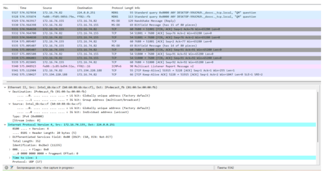{#fig:010 width=70%}

Остановил захват трафика и применил фильтр `arp or icmp` (рис. @fig:011):

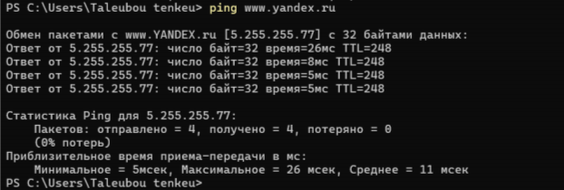{#fig:011 width=70%}

## Анализ ICMP пакетов

Изучил эхо-запрос ICMP (рис. @fig:012):

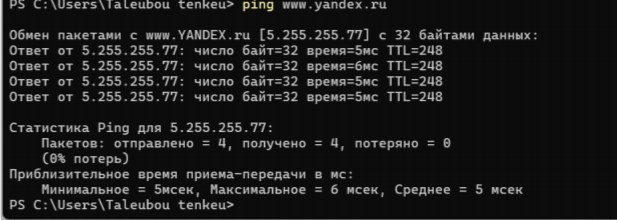{#fig:012 width=70%}

Изучил эхо-ответ ICMP (рис. @fig:013):

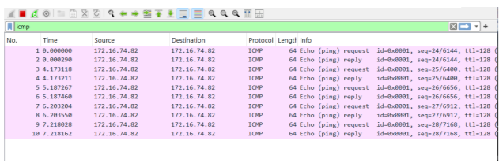{#fig:013 width=70%}

Изучил кадры данных протокола ARP (рис. @fig:014):

{#fig:014 width=70%}

Выполнил пинг по имени `www.yandex.ru` (рис. @fig:015):

{#fig:015 width=70%}

Изучил MAC-адрес источника (рис. @fig:016):

{#fig:016 width=70%}

Изучил MAC-адрес получателя (рис. @fig:017):

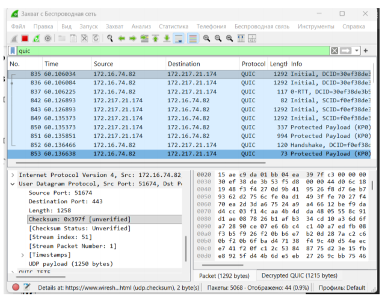{#fig:017 width=70%}

## Анализ протоколов прикладного уровня

Запустил новый захват трафика (рис. @fig:018):

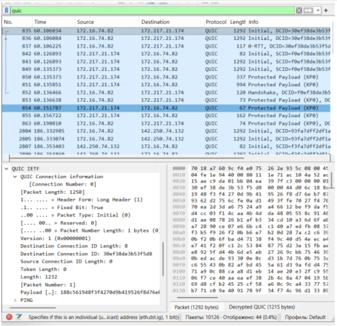{#fig:018 width=70%}

Открыл в браузере сайт CERN (http://info.cern.ch/) (рис. @fig:019):

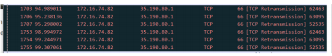{#fig:019 width=70%}

Проанализировал запросы по протоколу HTTP/TCP (рис. @fig:020):

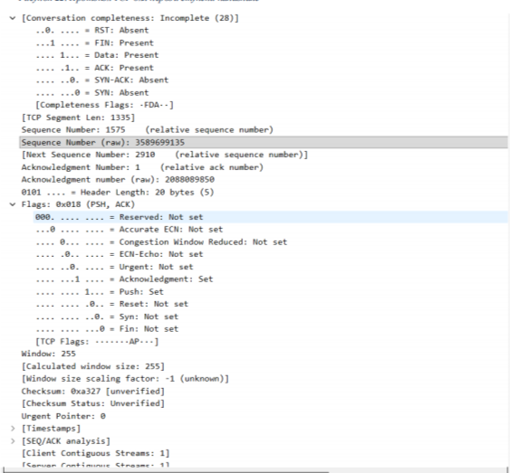{#fig:020 width=70%}

Проанализировал запросы по протоколу DNS/UDP (рис. @fig:021):

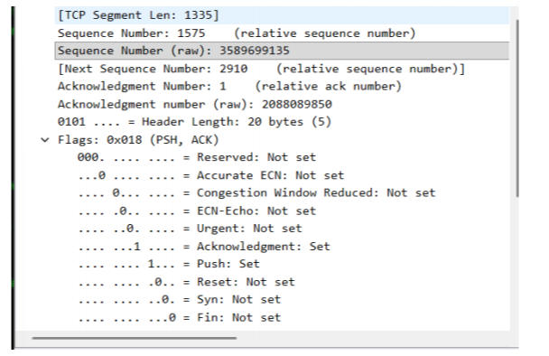{#fig:021 width=70%}

Проанализировал запросы по протоколу QUIC (рис. @fig:022):

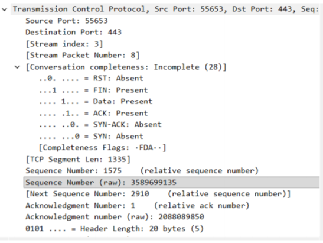{#fig:022 width=70%}

## Анализ TCP handshake

Запустил захват трафика для анализа TCP соединения (рис. @fig:023):

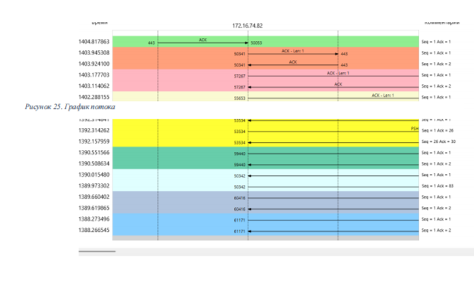{#fig:023 width=70%}

Выполнил соединение по HTTP с сайтом CERN (рис. @fig:024):

{#fig:024 width=70%}

Проанализировал handshake протокола TCP (рис. @fig:025):

{#fig:025 width=70%}

Построил график потока (рис. @fig:026):

{#fig:026 width=70%}

# Выводы

В ходе выполнения лабораторной работы изучил посредством Wireshark кадры Ethernet, провёл анализ PDU протоколов транспортного и прикладного уровней стека TCP/IP.
