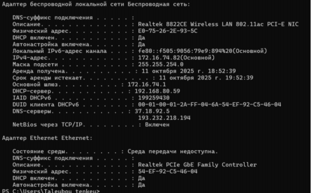
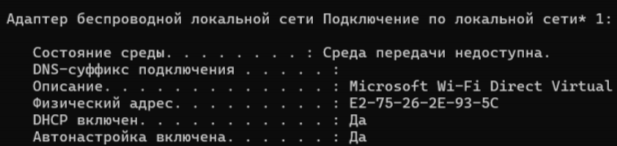
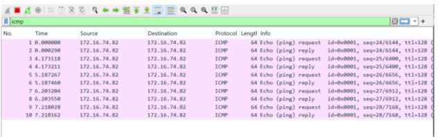
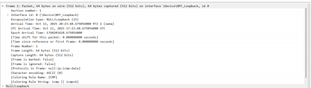
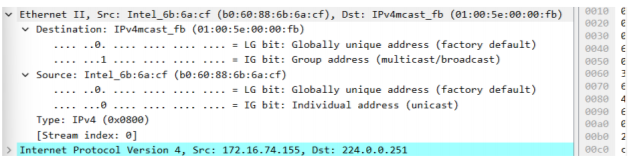
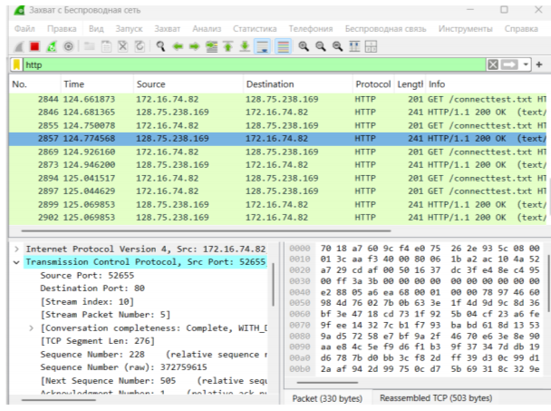
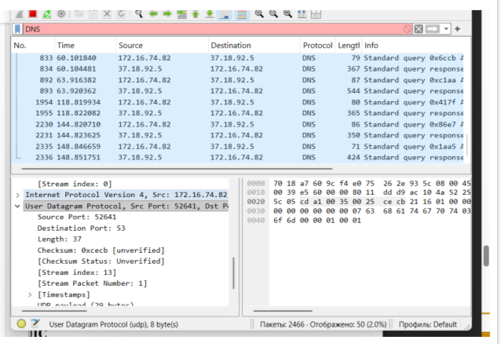

## Докладчик

* Талебу Тенке Франк Устон
* Студент группы НФИбд-02-23
* Студ. билет 1032224534
* Российский университет дружбы народов

## Цель работы

Изучение принципов работы сетевых технологий

## С помощью команды `ipconfig` вывел информацию о текущем сетевом соединении (рис. @fig:001):

## Использовал различные опции команды (рис. @fig:002-005):

## {#fig:002 width=70%}

{#fig:002 width=70%}](3.png)

## {#fig:003 width=70%}

{#fig:003 width=70%}](4.png)

## {#fig:004 width=70%}

{#fig:004 width=70%}](5.png)

## Определил MAC-адреса сетевых интерфейсов с помощью команды `GETMAC` (рис. @fig:006):

## Установил Wireshark (рис. @fig:007):

## Запустил Wireshark и выбрал активный сетевой интерфейс для захвата трафика (рис. @fig:008):

## Определил IP-адрес устройства и шлюз по умолчанию (рис. @fig:009):

## Выполнил пинг шлюза по умолчанию (рис. @fig:010):

## Остановил захват трафика и применил фильтр `arp or icmp` (рис. @fig:011):

## Изучил эхо-запрос ICMP (рис. @fig:012):

## Изучил эхо-ответ ICMP (рис. @fig:013):

## Изучил кадры данных протокола ARP (рис. @fig:014):

## Выполнил пинг по имени `www.yandex.ru` (рис. @fig:015):

## Изучил MAC-адрес источника (рис. @fig:016):

## Изучил MAC-адрес получателя (рис. @fig:017):

## Запустил новый захват трафика (рис. @fig:018):

## Открыл в браузере сайт CERN (http://info.cern.ch/) (рис. @fig:019):

## Проанализировал запросы по протоколу HTTP/TCP (рис. @fig:020):

## Вывод

В ходе выполнения лабораторной работы были получены практические навыки

## Список литературы

[1] Методические указания к лабораторной работе №03
[2] Документация по сетевым технологиям
