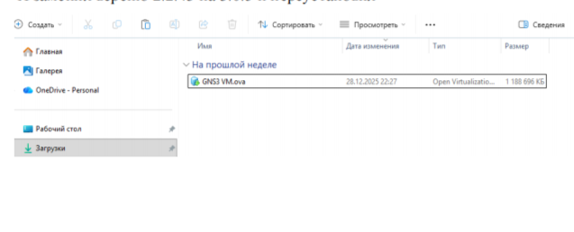
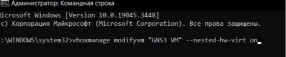
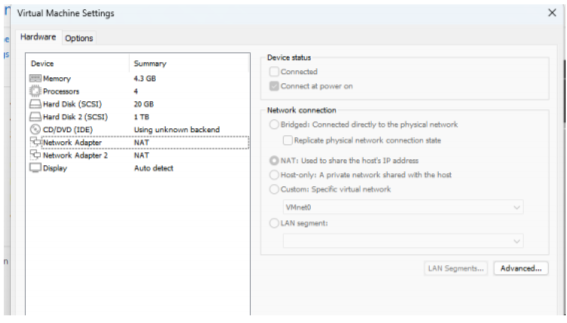
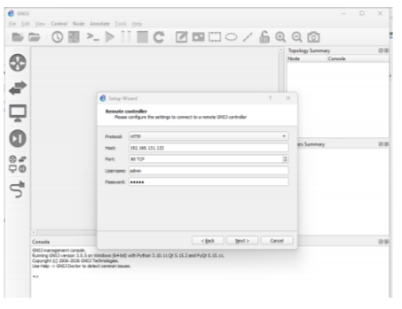
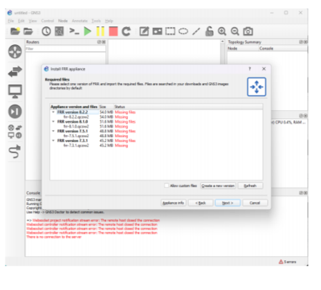
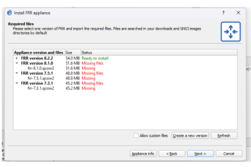

# Цель работы

Установка и настройка GNS3 и сопутствующего программного обеспечения.

# Выполнение лабораторной работы

## Установка GNS3

### Установка GNS3-all-in-one

Установил GNS3 с помощью менеджера пакетов Chocolatey. В процессе установки выбрал компоненты: MSVC Runtime, GNS3-Desktop, GNS3-VM, Tools (рис. @fig:001):

{#fig:001 width=70%}

После завершения установки появилось окно с подтверждением (рис. @fig:002):

{#fig:002 width=70%}

### Установка GNS3 VM для VirtualBox

Скачал архив с образом виртуальной машины GNS3 VM с официального сайта. В VirtualBox выполнил импорт конфигурации (рис. @fig:003):

{#fig:003 width=70%}

Включил вложенную виртуализацию с помощью команды (рис. @fig:004):

{#fig:004 width=70%}

Проверил, что опция включена (рис. @fig:005):

{#fig:005 width=70%}

Настроил сетевой адаптер в режиме "Виртуальный адаптер хоста" (рис. @fig:006):

{#fig:006 width=70%}

### Запуск GNS3 VM

Запустил виртуальную машину GNS3 VM (рис. @fig:007):

{#fig:007 width=70%}

Запустил приложение GNS3 и выполнил подключение к серверу (рис. @fig:008):

{#fig:008 width=70%}

В списке серверов отобразилась GNS3 VM (рис. @fig:009):

{#fig:009 width=70%}

## Подключение образов оборудования

### Добавление образа маршрутизатора FRR

Добавил новый шаблон маршрутизатора FRR (рис. @fig:010):

{#fig:010 width=70%}

Выполнил скачивание и импорт необходимых файлов (рис. @fig:011):

{#fig:011 width=70%}

Настроил параметры образа: во вкладке General settings выбрал "Send the shutdown signal (ACPI)" (рис. @fig:012):

{#fig:012 width=70%}

Во вкладке HDD включил опцию "Automatically create a config disk on HDD" (рис. @fig:013):

{#fig:013 width=70%}

### Добавление образа маршрутизатора VyOS

Импортировал образ маршрутизатора VyOS (рис. @fig:014):

{#fig:014 width=70%}

Изменил отображаемый символ устройства для VyOS (рис. @fig:015):

{#fig:015 width=70%}

В рабочем пространстве GNS3 отобразились оба образа маршрутизаторов (рис. @fig:016):

{#fig:016 width=70%}

# Выводы

В результате выполнения работы была произведена установка и настройка GNS3 и сопутствующего программного обеспечения. Импортированы образы маршрутизаторов FRR и VyOS.
