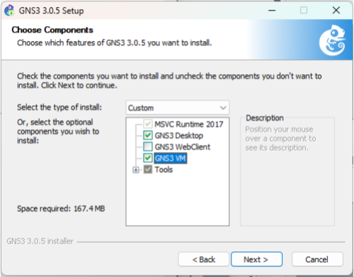
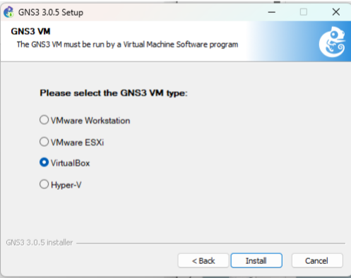
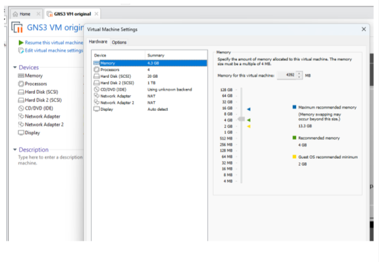

# Цель работы

## Цель лабораторной работы

Установить и настроить программный комплекс GNS3 и сопутствующее программное обеспечение, а также подготовить лабораторный стенд для моделирования сетевых устройств.

# Выполнение работы

## Подключение к GNS3 VM

{ width=80% }

## Выбор устройства FRR

{ width=80% }

## Установка FRR

{ width=80% }

## Информация об использовании FRR

{ width=80% }

## Проверка запуска FRR

{ width=80% }

## Выбор устройства VyOS

{ width=80% }

## Информация об использовании VyOS

{ width=80% }

## Проверка запуска VyOS

{ width=80% }

# Итоги работы

## Вывод

В ходе лабораторной работы выполнена установка и настройка GNS3 и GNS3 VM, а также произведён импорт и проверка работоспособности маршрутизаторов FRR и VyOS. Подготовленный лабораторный стенд готов к дальнейшему моделированию и исследованию сетевых конфигураций.
