## Докладчик

* Талебу Тенке Франк Устон
* Студент группы НФИбд-02-23
* Студ. билет 1032224534
* Российский университет дружбы народов

## Цель работы

Изучение принципов работы сетевых технологий

## Установил GNS3 с помощью менеджера пакетов Chocolatey. В процессе установки выбрал компоненты: MSVC Runtime, GNS3-Desktop, GNS3-VM, Tools (рис. @fig:001):

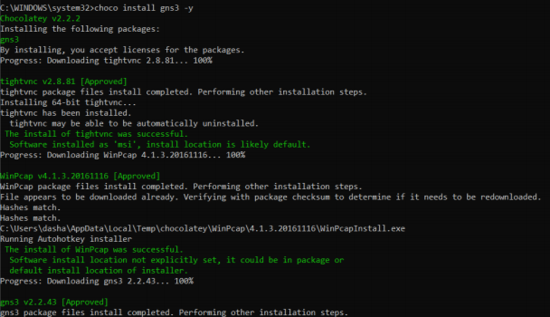

## После завершения установки появилось окно с подтверждением (рис. @fig:002):

## Скачал архив с образом виртуальной машины GNS3 VM с официального сайта. В VirtualBox выполнил импорт конфигурации (рис. @fig:003):

## Включил вложенную виртуализацию с помощью команды (рис. @fig:004):

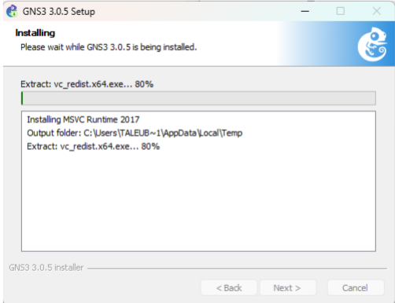

## Проверил, что опция включена (рис. @fig:005):

## Настроил сетевой адаптер в режиме Виртуальный адаптер хоста (рис. @fig:006):

## Запустил виртуальную машину GNS3 VM (рис. @fig:007):

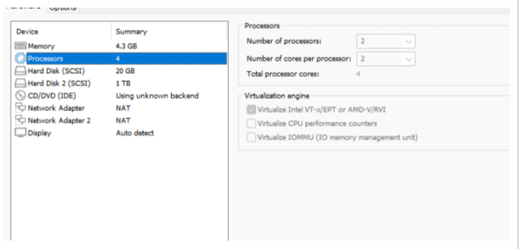

## Запустил приложение GNS3 и выполнил подключение к серверу (рис. @fig:008):

## В списке серверов отобразилась GNS3 VM (рис. @fig:009):

## Добавил новый шаблон маршрутизатора FRR (рис. @fig:010):

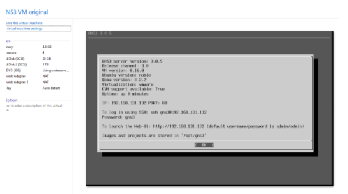

## Выполнил скачивание и импорт необходимых файлов (рис. @fig:011):

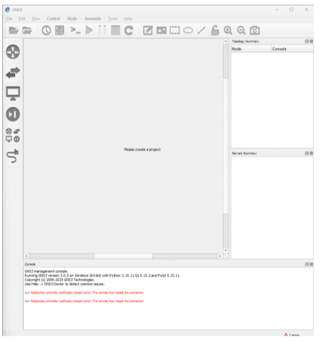

## Настроил параметры образа: во вкладке General settings выбрал Send the shutdown signal (ACPI) (рис. @fig:012):

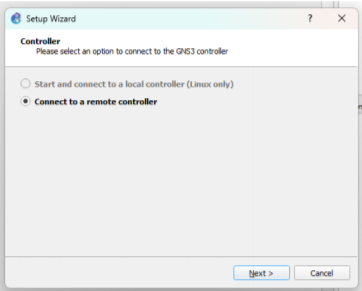

## Во вкладке HDD включил опцию Automatically create a config disk on HDD (рис. @fig:013):

## Импортировал образ маршрутизатора VyOS (рис. @fig:014):

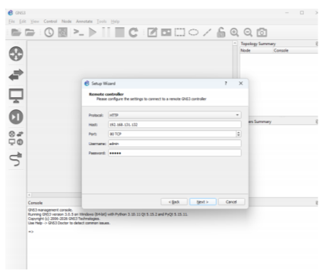

## Изменил отображаемый символ устройства для VyOS (рис. @fig:015):

## В рабочем пространстве GNS3 отобразились оба образа маршрутизаторов (рис. @fig:016):

## Этап выполнения работы №17

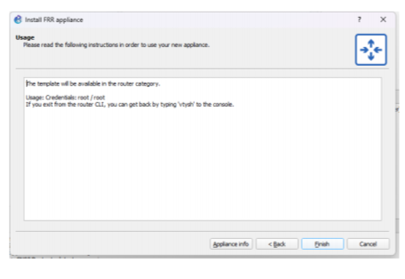

## Этап выполнения работы №18

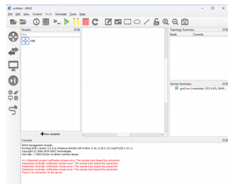

## Этап выполнения работы №19

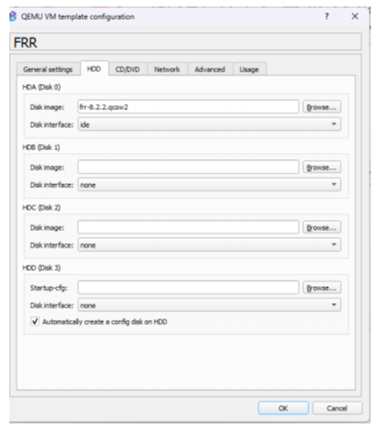

## Этап выполнения работы №20

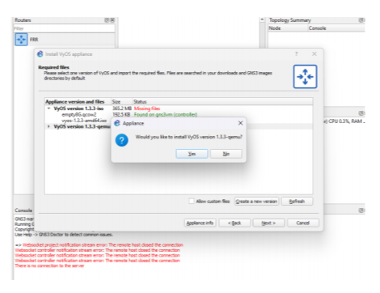

## Вывод

В ходе выполнения лабораторной работы были получены практические навыки

## Список литературы

[1] Методические указания к лабораторной работе №04
[2] Документация по сетевым технологиям
