# Цель работы

Построить простейшие модели сетей на базе коммутатора и маршрутизаторов FRR и VyOS в GNS3, проанализировать трафик посредством Wireshark.

# Выполнение лабораторной работы

## Анализ трафика в GNS3 посредством Wireshark

Запустил GNS3 VM и GNS3, создал новый проект. В рабочей области разместил коммутатор Ethernet и два VPCS. Присвоил устройствам имена: коммутатору — `msk-alkamal-sw-01`. Соединил VPCS с коммутатором (рис. @fig:001):

{#fig:001 width=70%}

Задал IP-адреса VPCS. Для PC-1 установил адрес 192.168.1.11/24 со шлюзом 192.168.1.1 (рис. @fig:002):

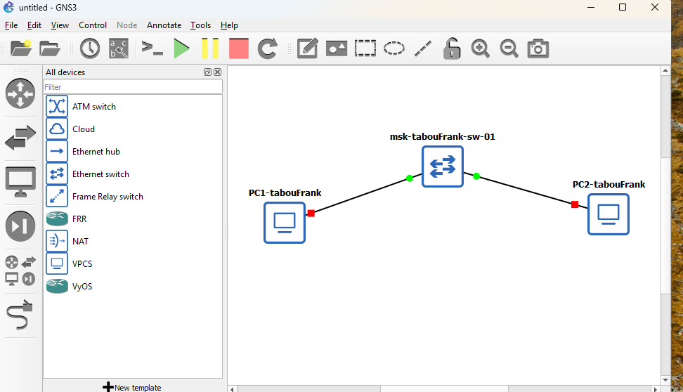{#fig:002 width=70%}

Для PC-2 установил адрес 192.168.1.12/24 (рис. @fig:003):

{#fig:003 width=70%}

Проверил доступность между PC-1 и PC-2 с помощью команды ping (рис. @fig:004):

{#fig:004 width=70%}

Остановил все узлы проекта (рис. @fig:005):

{#fig:005 width=70%}

Запустил анализатор трафика на соединении между PC-1 и коммутатором. После запуска Wireshark на линии соединения появился значок захвата. Затем запустил все узлы проекта (рис. @fig:006):

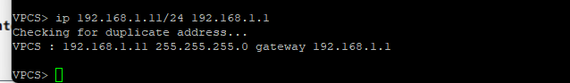{#fig:006 width=70%}

В окне Wireshark отобразились ARP-пакеты (рис. @fig:007). Длина кадра составляет 64 байта, MAC-адрес назначения — широковещательный (ff:ff:ff:ff:ff:ff), адрес источника — глобально уникальный.

{#fig:007 width=70%}

В терминале PC-2 выполнил эхо-запрос в ICMP-режиме к узлу PC-1 с опцией `-1` (рис. @fig:008):

{#fig:008 width=70%}

Проанализировал эхо-запрос по протоколу ICMP в Wireshark (рис. @fig:009, @fig:010). На канальном уровне видны MAC-адреса источника и получателя (unicast). На сетевом уровне указан протокол ICMP, IP-адрес источника 192.168.1.12 (PC-2) и адрес назначения 192.168.1.11 (PC-1).

{#fig:009 width=70%}

{#fig:010 width=70%}

Выполнил эхо-запрос в UDP-режиме к узлу PC-1 с опцией `-2` (рис. @fig:011):

{#fig:011 width=70%}

Проанализировал UDP-пакеты в Wireshark (рис. @fig:012, @fig:013). На транспортном уровне указаны UDP-порты: порт источника — 19241, порт назначения — 7 (Echo).

{#fig:012 width=70%}

{#fig:013 width=70%}

Выполнил эхо-запрос в TCP-режиме к узлу PC-1 с опцией `-3` (рис. @fig:014):

{#fig:014 width=70%}

Проанализировал TCP-пакеты в Wireshark. На первом этапе передаётся сегмент с флагом SYN (рис. @fig:015):

{#fig:015 width=70%}

На втором этапе принимающая сторона отвечает сегментом с флагами SYN и ACK (рис. @fig:016):

{#fig:016 width=70%}

На третьем этапе инициатор отправляет сегмент с флагом ACK, завершая установление TCP-соединения (рис. @fig:017):

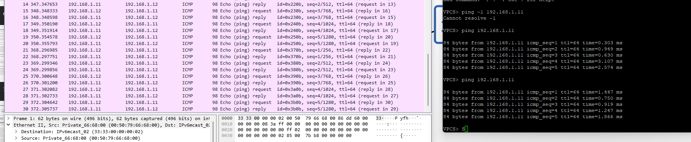{#fig:017 width=70%}

## Моделирование сети на базе маршрутизатора FRR

Построил топологию сети с маршрутизатором FRR, коммутатором и оконечным устройством (рис. @fig:018):

{#fig:018 width=70%}

Настроил IP-адресацию для интерфейса узла PC1: 192.168.1.10/24 со шлюзом 192.168.1.1 (рис. @fig:019):

{#fig:019 width=70%}

Настроил IP-адресацию для интерфейса локальной сети маршрутизатора FRR и проверил конфигурацию (рис. @fig:020):

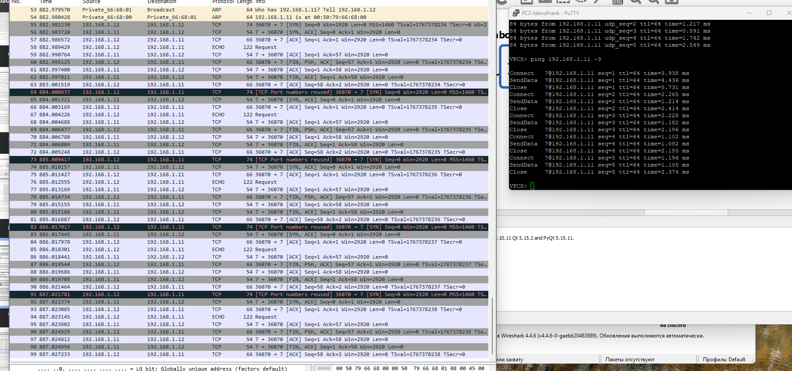{#fig:020 width=70%}

Проверил работоспособность соединения. Узел PC1 успешно отправляет ICMP эхо-запросы на адрес маршрутизатора 192.168.1.1 (рис. @fig:021):

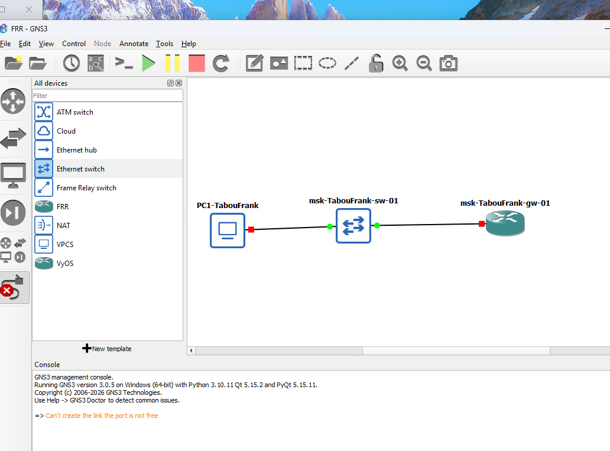{#fig:021 width=70%}

В Wireshark проанализировал захваченный трафик (рис. @fig:022):

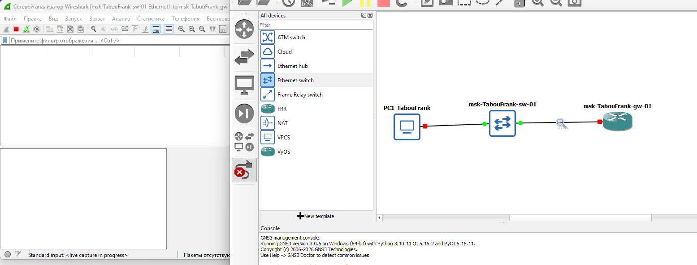{#fig:022 width=70%}

## Моделирование сети на базе маршрутизатора VyOS

Построил топологию сети с маршрутизатором VyOS (рис. @fig:023):

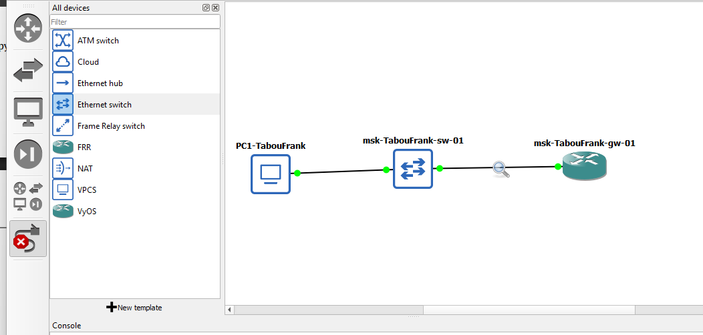{#fig:023 width=70%}

Настроил IP-адресацию для интерфейса узла PC1: 192.168.1.10/24 со шлюзом 192.168.1.1 (рис. @fig:024):

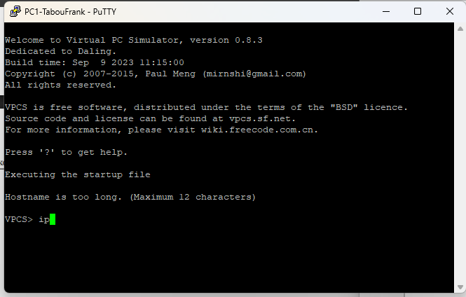{#fig:024 width=70%}

Выполнил вход в систему VyOS (логин: vyos, пароль: vyos) (рис. @fig:025):

{#fig:025 width=70%}

Перешёл в режим конфигурирования командой `configure` и назначил IP-адрес 192.168.1.1/24 интерфейсу eth0. Применил изменения командой `commit` и сохранил конфигурацию командой `save` (рис. @fig:026, @fig:027):

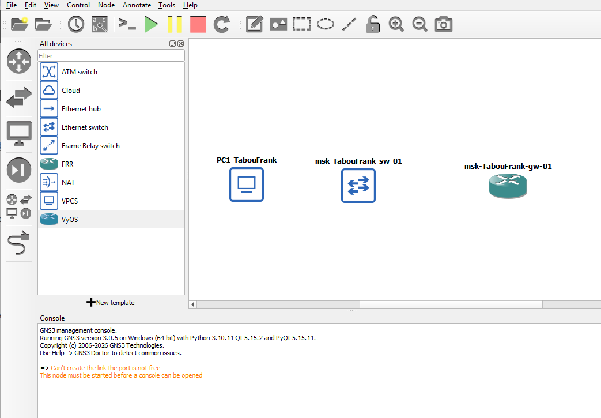{#fig:026 width=70%}

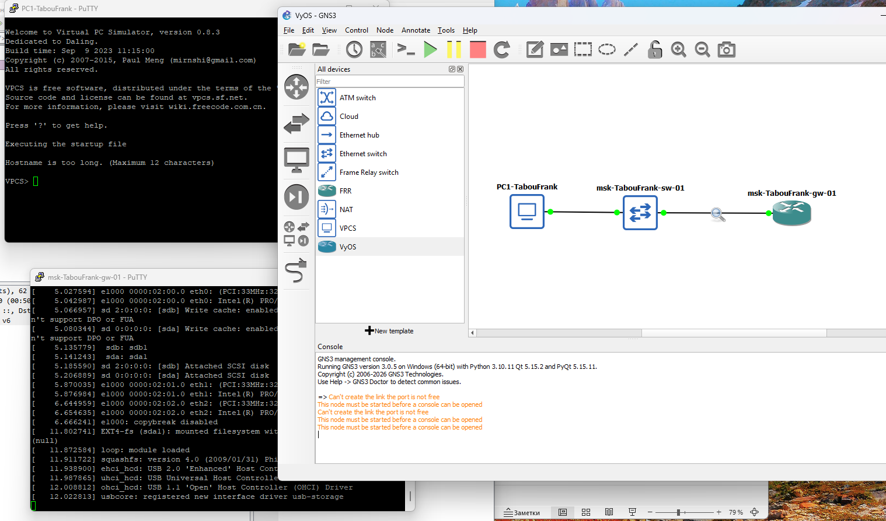{#fig:027 width=70%}

Проверил подключение. Узел PC1 успешно отправляет ICMP эхо-запросы на адрес маршрутизатора 192.168.1.1 (рис. @fig:028):

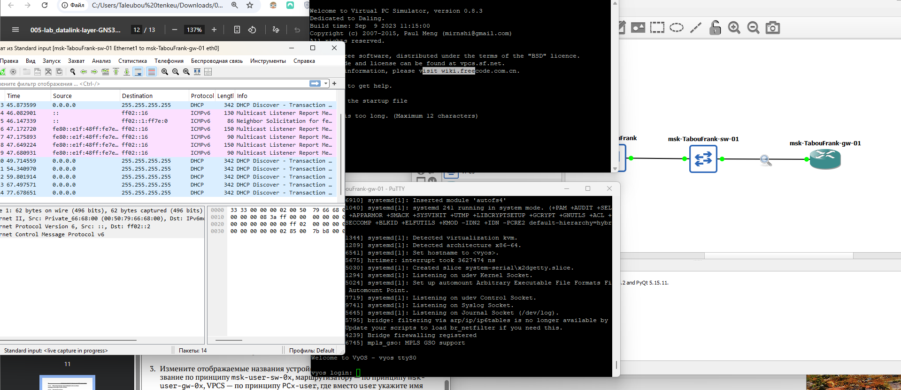{#fig:028 width=70%}

В Wireshark проанализировал захваченный трафик (рис. @fig:029):

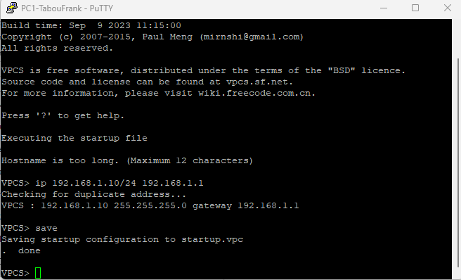{#fig:029 width=70%}

# Выводы

В ходе выполнения лабораторной работы были построены и настроены простейшие модели локальных сетей в среде GNS3 с использованием коммутатора Ethernet, маршрутизаторов FRR и VyOS, а также оконечных узлов VPCS. Выполнена настройка IP-адресации сетевых интерфейсов, проверена связность узлов с помощью ICMP эхо-запросов.

С использованием анализатора трафика Wireshark исследованы протоколы ARP, ICMP, UDP и TCP, рассмотрена структура кадров и пакетов на канальном, сетевом и транспортном уровнях модели OSI, а также проанализирован процесс установления TCP-соединения.
