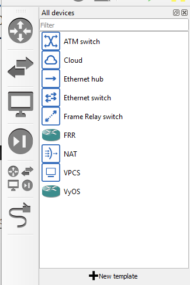
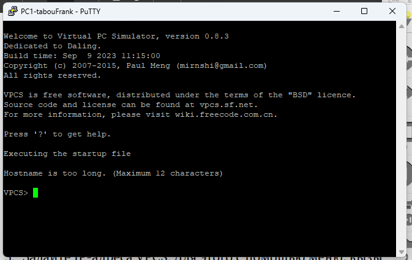
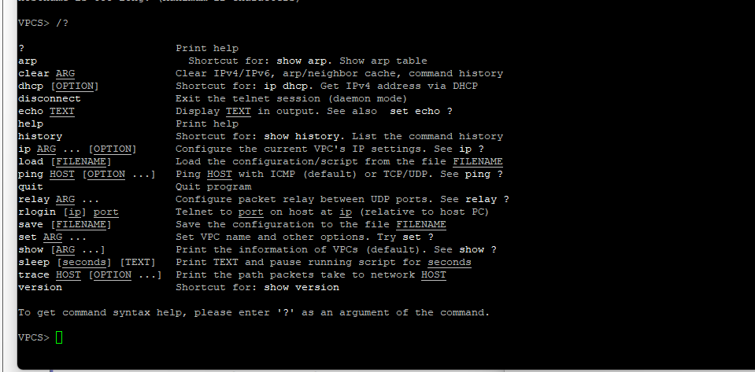
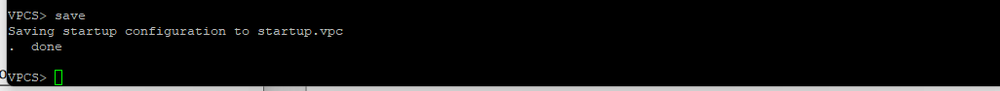
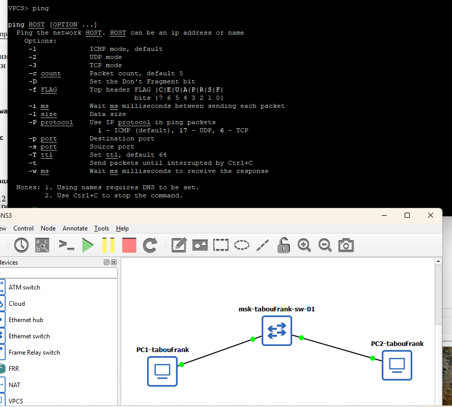
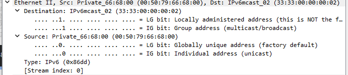

# Цели и задачи работы

## Цель лабораторной работы

Построение простейших моделей сети на базе коммутатора и маршрутизаторов FRR и VyOS в GNS3, анализ трафика посредством Wireshark.

# Выполнение лабораторной работы

## Справка по командам VPCS

{ #fig:001 width=80% }

## Справка по настройке IP

{ #fig:002 width=80% }

## Настройка IP-адреса PC1

{ #fig:003 width=80% }

## Проверка связности PC1 ↔ PC2

{ #fig:004 width=80% }

## ARP-сообщения (gratuitous ARP)

{ #fig:005 width=80% }

## Опции ping в VPCS

{ #fig:006 width=80% }

## Выполнение ping с PC2

{ #fig:007 width=80% }

## ICMP Echo Request/Reply

{ #fig:008 width=80% }

## UDP mode (Echo over UDP)

{ #fig:009 width=80% }

## TCP mode (Echo over TCP)

{ #fig:010 width=80% }

## Топология: VPCS — Switch — FRR

{ #fig:011 width=80% }

## Настройка IP на PC1 (192.168.1.10/24)

{ #fig:012 width=80% }

## Настройка eth0 на FRR (192.168.1.1/24)

{ #fig:013 width=80% }

## Проверка конфигурации FRR

{ #fig:014 width=80% }

## Проверка связности PC1 → FRR (192.168.1.1)

{ #fig:015 width=80% }

## ICMP/ARP в Wireshark (PC1 ↔ FRR)

{ #fig:016 width=80% }

# Моделирование сети на базе VyOS

## Топология: VPCS — Switch — VyOS

{ #fig:017 width=80% }

## Настройка интерфейса eth0 на VyOS (192.168.1.1/24)

{ #fig:018 width=80% }

## Проверка связности PC1 → VyOS (192.168.1.1)

{ #fig:019 width=80% }

## ICMP/ARP в Wireshark (PC1 ↔ VyOS)

{ #fig:020 width=80% }

# Выводы по работе

## Вывод

В ходе выполнения лабораторной работы были смоделированы простейшие сети в GNS3 на базе коммутатора Ethernet и маршрутизаторов FRR и VyOS. Выполнена статическая настройка IP-адресации в подсети 192.168.1.0/24 и проверена связность между узлами с использованием ICMP эхо-запросов.

С помощью Wireshark были захвачены и проанализированы ARP- и ICMP-сообщения, а также особенности формирования трафика при выполнении ping в режимах ICMP/UDP/TCP. Поставленные задачи выполнены в полном объёме.
