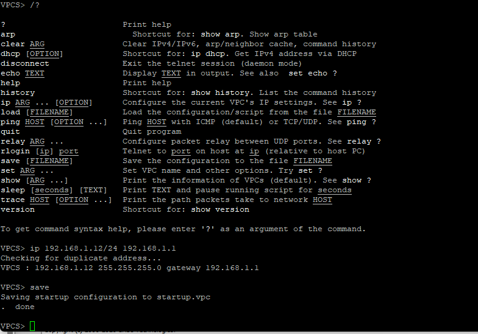
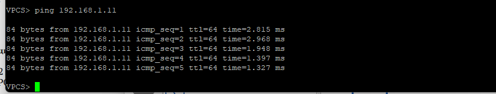
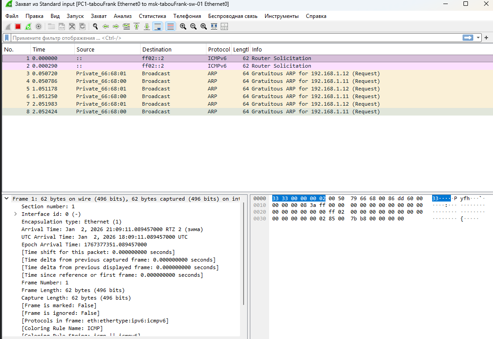
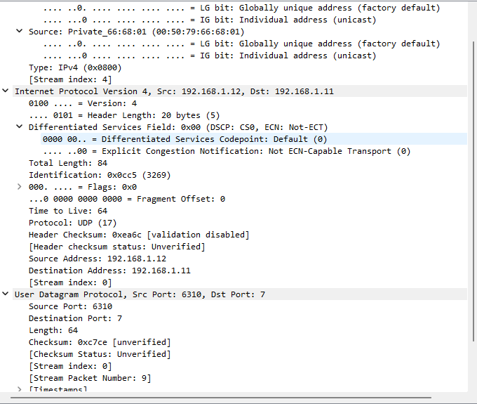

## Докладчик

* Талебу Тенке Франк Устон
* Студент группы НФИбд-02-23
* Студ. билет 1032224534
* Российский университет дружбы народов

## Цель работы

Изучение принципов работы сетевых технологий

## Запустил GNS3 VM и GNS3, создал новый проект. В рабочей области разместил коммутатор Ethernet и два VPCS. Присвоил устройствам имена: коммутатору — `msk-alkamal-sw-01`. Соединил VPCS с коммутатором (рис. @fig:001):

## Задал IP-адреса VPCS. Для PC-1 установил адрес 192.168.1.11/24 со шлюзом 192.168.1.1 (рис. @fig:002):

## Для PC-2 установил адрес 192.168.1.12/24 (рис. @fig:003):

## Проверил доступность между PC-1 и PC-2 с помощью команды ping (рис. @fig:004):

## Остановил все узлы проекта (рис. @fig:005):

## Запустил анализатор трафика на соединении между PC-1 и коммутатором. После запуска Wireshark на линии соединения появился значок захвата. Затем запустил все узлы проекта (рис. @fig:006):

## В окне Wireshark отобразились ARP-пакеты (рис. @fig:007). Длина кадра составляет 64 байта, MAC-адрес назначения — широковещательный (ff:ff:ff:ff:ff:ff), адрес источника — глобально уникальный.

## В терминале PC-2 выполнил эхо-запрос в ICMP-режиме к узлу PC-1 с опцией `-1` (рис. @fig:008):

## Проанализировал эхо-запрос по протоколу ICMP в Wireshark (рис. @fig:009, @fig:010). На канальном уровне видны MAC-адреса источника и получателя (unicast). На сетевом уровне указан протокол ICMP, IP-адрес источника 192.168.1.12 (PC-2) и адрес назначения 192.168.1.11 (PC-1).

## {#fig:009 width=70%}

{#fig:009 width=70%}](10.png)

## Выполнил эхо-запрос в UDP-режиме к узлу PC-1 с опцией `-2` (рис. @fig:011):

## Проанализировал UDP-пакеты в Wireshark (рис. @fig:012, @fig:013). На транспортном уровне указаны UDP-порты: порт источника — 19241, порт назначения — 7 (Echo).

## {#fig:012 width=70%}

{#fig:012 width=70%}](13.png)

## Выполнил эхо-запрос в TCP-режиме к узлу PC-1 с опцией `-3` (рис. @fig:014):

## Проанализировал TCP-пакеты в Wireshark. На первом этапе передаётся сегмент с флагом SYN (рис. @fig:015):

## На втором этапе принимающая сторона отвечает сегментом с флагами SYN и ACK (рис. @fig:016):

## На третьем этапе инициатор отправляет сегмент с флагом ACK, завершая установление TCP-соединения (рис. @fig:017):

## Построил топологию сети с маршрутизатором FRR, коммутатором и оконечным устройством (рис. @fig:018):

## Настроил IP-адресацию для интерфейса узла PC1: 192.168.1.10/24 со шлюзом 192.168.1.1 (рис. @fig:019):

## Настроил IP-адресацию для интерфейса локальной сети маршрутизатора FRR и проверил конфигурацию (рис. @fig:020):

## Вывод

В ходе выполнения лабораторной работы были получены практические навыки

## Список литературы

[1] Методические указания к лабораторной работе №05
[2] Документация по сетевым технологиям
