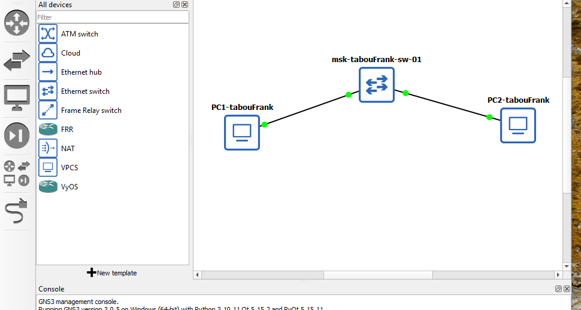
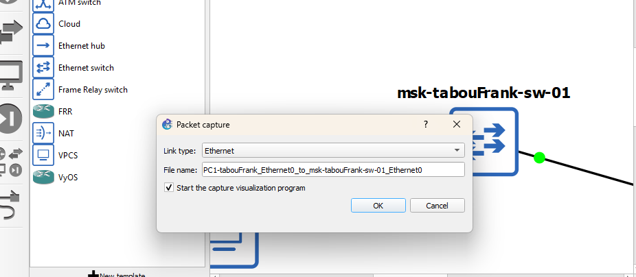
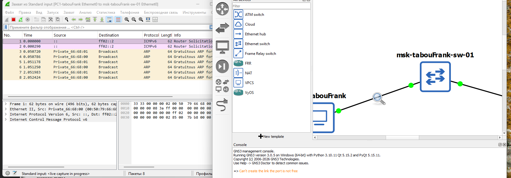

# Цель работы

Построение простейших моделей сети на базе коммутатора и маршрутизаторов FRR и VyOS в GNS3, анализ трафика посредством Wireshark.

# Выполнение

## Моделирование простейшей сети на базе коммутатора в GNS3

1. Запущены GNS3 VM и среда моделирования GNS3.  
   Создан новый проект для выполнения лабораторной работы.

2. В рабочей области GNS3 размещены следующие сетевые устройства:
   - Ethernet-коммутатор;
   - два виртуальных персональных компьютера VPCS.

   Коммутатор переименован в **msk-akabrikosov-sw-01**.  
   Оконечные устройства переименованы в **PC1-akabrikosov** и **PC2-akabrikosov**.  
   VPCS подключены к коммутатору, включено отображение обозначений интерфейсов соединений.

3. Для настройки сетевых параметров запущено устройство **PC1-akabrikosov** и открыт его терминал Console.  
   Для просмотра доступных команд отображён список поддерживаемых команд VPCS.

   { #fig:001 width=80% }

4. Для уточнения синтаксиса настройки IP-адреса отображена справочная информация по параметрам команды настройки IP.

   { #fig:002 width=80% }

5. На устройстве **PC1-akabrikosov** задан статический IP-адрес **192.168.1.11/24** с указанием шлюза **192.168.1.1**.  
   После проверки отсутствия конфликта адресов конфигурация сохранена.  
   Выполнена проверка текущих сетевых параметров оконечного устройства.

   { #fig:003 width=80% }

6. Аналогичным образом выполнена настройка второго оконечного устройства **PC2-akabrikosov**.  
   Для него задан IP-адрес **192.168.1.12/24** с использованием того же шлюза.  
   Конфигурация устройства сохранена.

7. Для проверки работоспособности сети между оконечными устройствами выполнена проверка связности.  
   В результате получены ответы ICMP, что подтверждает корректную работу сети.

   { #fig:004 width=80% }

8. После завершения работы все узлы проекта были остановлены с использованием меню управления GNS3.

## Анализ трафика в GNS3 посредством Wireshark

1. На соединении между устройством **PC1-akabrikosov** и коммутатором **msk-akabrikosov-sw-01** запущен захват трафика.  
   Для этого в рабочей области GNS3 выполнен запуск анализа трафика на соответствующем линке, после чего автоматически открылось окно Wireshark.  
   В проекте GNS3 на соединении появился индикатор активного захвата.

2. После запуска всех узлов проекта в окне Wireshark были зафиксированы ARP-сообщения.  
   В частности, наблюдаются **gratuitous ARP-запросы**, отправленные узлами PC1 и PC2, что свидетельствует о рассылке информации о собственных IP- и MAC-адресах в широковещательном режиме.

   В деталях ARP-пакета отображены следующие параметры:
   - тип оборудования — Ethernet;
   - тип протокола — IPv4;
   - операция — запрос;
   - IP-адрес отправителя совпадает с IP-адресом целевого узла, что подтверждает характер gratuitous ARP.

   { #fig:005 width=80% }

3. В терминале устройства **PC2-akabrikosov** просмотрена справочная информация по параметрам команды ping.  
   Отображены режимы работы ICMP, UDP и TCP, а также дополнительные опции управления отправкой пакетов.

   { #fig:006 width=80% }
   
   { #fig:007 width=80% }

4. С устройства **PC2-akabrikosov** выполнен одиночный эхо-запрос в **ICMP-режиме** к узлу **PC1-akabrikosov**.  
   В окне Wireshark зафиксированы ICMP Echo Request и соответствующий Echo Reply.

   При анализе ICMP-пакета установлено:
   - протокол верхнего уровня — ICMP;
   - тип сообщения — Echo (ping) request;
   - корректные значения контрольной суммы;
   - корректная обработка запроса удалённым узлом.

   { #fig:008 width=80% }

5. Далее выполнен одиночный эхо-запрос в **UDP-режиме**.  
   В Wireshark зафиксирован UDP-пакет, содержащий полезную нагрузку Echo, отправленный на порт 7 (Echo Protocol).

   В результате анализа установлено:
   - используется протокол UDP;
   - отсутствует механизм подтверждения доставки;
   - передача данных осуществляется без установления соединения.

   { #fig:009 width=80% }

6. Затем выполнен одиночный эхо-запрос в **TCP-режиме**.  
   В процессе захвата трафика в Wireshark зафиксирована последовательность сегментов TCP, включающая:
   - установление соединения (SYN, SYN-ACK, ACK);
   - передачу данных;
   - корректное завершение соединения (FIN, ACK).

   Анализ показал, что TCP обеспечивает надёжную доставку данных с подтверждением и управлением соединением.

   { #fig:010 width=80% }

7. После завершения анализа сетевого взаимодействия захват пакетов в Wireshark был остановлен.  
   Все узлы проекта переведены в остановленное состояние средствами управления GNS3.

## Моделирование простейшей сети на базе маршрутизатора FRR в GNS3

1. Запущены GNS3 VM и среда моделирования GNS3.  
   Создан новый проект для выполнения лабораторной работы.

2. В рабочей области GNS3 размещены следующие устройства:
   - оконечное устройство VPCS;
   - Ethernet-коммутатор;
   - маршрутизатор FRR.

   Устройства соединены в линейной топологии:  
   **PC1-akabrikosov → msk-akabrikosov-sw-01 → msk-akabrikosov-gw-01**.

   { #fig:011 width=80% }

3. Выполнено переименование сетевых устройств в соответствии с заданием:
   - VPCS — **PC1-akabrikosov**;
   - коммутатор — **msk-akabrikosov-sw-01**;
   - маршрутизатор — **msk-akabrikosov-gw-01**.

4. На соединении между коммутатором и маршрутизатором включён захват трафика.  
   После этого запущены все узлы проекта и открыты консоли устройств.

5. На устройстве **PC1-akabrikosov** выполнена настройка IP-адресации.  
   Оконечному устройству назначен IP-адрес **192.168.1.10/24** с указанием шлюза **192.168.1.1**.  
   Конфигурация сохранена и выполнена проверка текущих сетевых параметров.

   { #fig:012 width=80% }

6. В консоли маршрутизатора FRR выполнена базовая настройка.  
   Маршрутизатору присвоено имя **msk-akabrikosov-gw-01**, после чего конфигурация сохранена в постоянную память.

7. Выполнена настройка интерфейса локальной сети маршрутизатора.  
   Интерфейсу **eth0** назначен IP-адрес **192.168.1.1/24**, интерфейс переведён в активное состояние.  
   Изменения сохранены.

   { #fig:013 width=80% }

8. Проверена текущая конфигурация маршрутизатора.  
   Просмотрена активная конфигурация и состояние сетевых интерфейсов.  
   Установлено, что интерфейс **eth0** находится в состоянии *up* и имеет корректный IP-адрес.

   { #fig:014 width=80% }

9. С устройства **PC1-akabrikosov** выполнена проверка связности с маршрутизатором.  
   Эхо-запросы к адресу **192.168.1.1** успешно обработаны, что подтверждает корректную настройку сети.

   { #fig:015 width=80% }

10. В окне Wireshark проанализирован захваченный трафик.  
    Зафиксированы ARP-сообщения, используемые для определения MAC-адреса маршрутизатора, а также ICMP Echo Request и Echo Reply.  
    Анализ ICMP-пакета показал корректные значения полей заголовка IPv4 и ICMP, а также успешную обработку запроса маршрутизатором.

    { #fig:016 width=80% }

11. После завершения анализа захват пакетов в Wireshark остановлен.  
    Все устройства проекта остановлены средствами управления GNS3.

## Моделирование простейшей сети на базе маршрутизатора VyOS в GNS3

1. Запущены GNS3 VM и среда моделирования GNS3.  
   Создан новый проект для выполнения лабораторной работы.

2. В рабочей области GNS3 размещены следующие сетевые устройства:
   - оконечное устройство VPCS;
   - Ethernet-коммутатор;
   - маршрутизатор VyOS.

   Устройства соединены в линейной топологии:  
   **PC1-akabrikosov → msk-akabrikosov-sw-01 → msk-akabrikosov-gw-01**.

   { #fig:017 width=80% }

3. Выполнено переименование устройств в соответствии с заданием:
   - VPCS — **PC1-akabrikosov**;
   - коммутатор — **msk-akabrikosov-sw-01**;
   - маршрутизатор — **msk-akabrikosov-gw-01**.

4. На соединении между коммутатором и маршрутизатором включён захват трафика.  
   После этого запущены все узлы проекта и открыты консоли устройств.

5. На устройстве **PC1-akabrikosov** выполнена настройка IP-адресации.  
   Оконечному устройству назначен IP-адрес **192.168.1.10/24** с указанием шлюза **192.168.1.1**.  
   Конфигурация сохранена и выполнена проверка текущих сетевых параметров.

6. После загрузки маршрутизатора выполнен вход под учётной записью **vyos**.  
   Маршрутизатор переведён в режим конфигурирования.

7. Выполнена базовая настройка маршрутизатора VyOS.  
   Интерфейсу **eth0** назначен IP-адрес **192.168.1.1/24**.  
   Изменения применены и сохранены в конфигурации устройства.

   После сохранения конфигурации выполнена проверка состояния и параметров сетевых интерфейсов.

   { #fig:018 width=80% }

8. С устройства **PC1-akabrikosov** выполнена проверка связности с маршрутизатором.  
   Эхо-запросы к адресу **192.168.1.1** успешно обработаны, что подтверждает корректную настройку сети.

   { #fig:019 width=80% }

9. В окне Wireshark проанализирован захваченный трафик.  
   Зафиксированы ARP-сообщения, используемые для определения MAC-адреса маршрутизатора, а также ICMP Echo Request и Echo Reply.  
   Анализ ICMP-пакетов показал корректные значения полей заголовков и успешную обработку запросов маршрутизатором.

    { #fig:020 width=80% }

10. После завершения анализа захват пакетов в Wireshark остановлен.  
    Все устройства проекта остановлены, работа с GNS3 завершена.

# Вывод

В ходе выполнения лабораторной работы было проведено моделирование простейших компьютерных сетей в среде GNS3 с использованием коммутатора Ethernet, а также маршрутизаторов на базе FRR и VyOS. Были последовательно реализованы различные варианты топологий, включающие оконечные устройства, сетевые коммутаторы и маршрутизаторы, что позволило на практике изучить принципы построения локальных сетей.

В процессе работы выполнена настройка статической IP-адресации для оконечных устройств и сетевых интерфейсов маршрутизаторов в подсети 192.168.1.0/24. Проверка связности между узлами с использованием эхо-запросов показала корректность выполненных настроек и работоспособность всех смоделированных сетей.

С помощью анализатора трафика Wireshark были захвачены и проанализированы ARP- и ICMP-сообщения. Анализ ARP-трафика позволил изучить механизм сопоставления IP- и MAC-адресов в локальной сети, а анализ ICMP-пакетов — процесс обмена эхо-запросами и эхо-ответами при проверке сетевой доступности узлов. Дополнительно рассмотрены особенности передачи данных в режимах ICMP, UDP и TCP.

