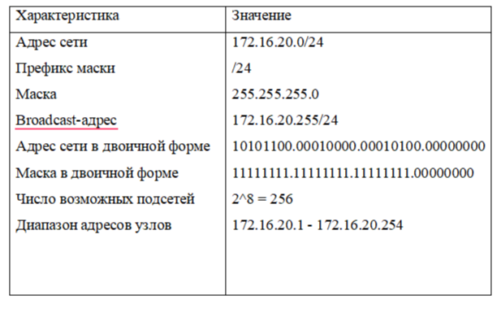
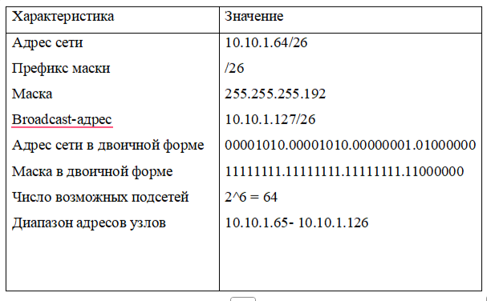
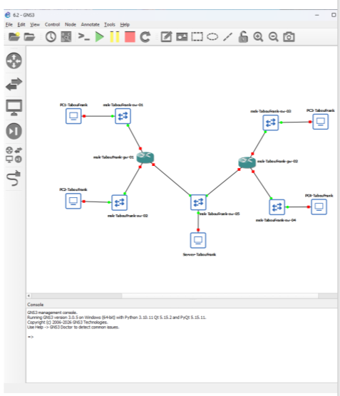
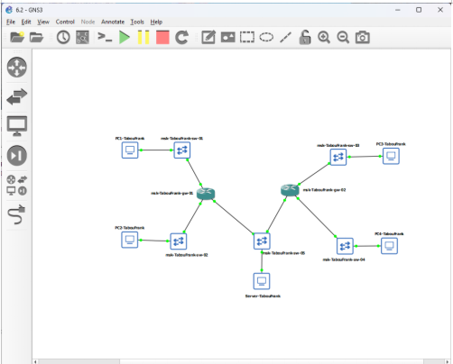
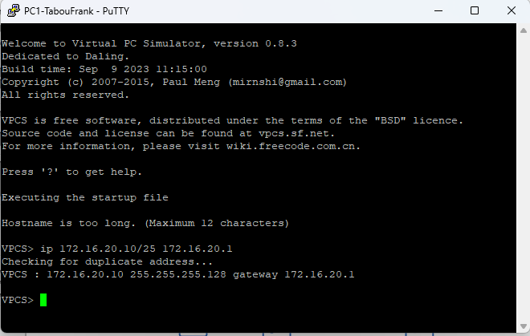
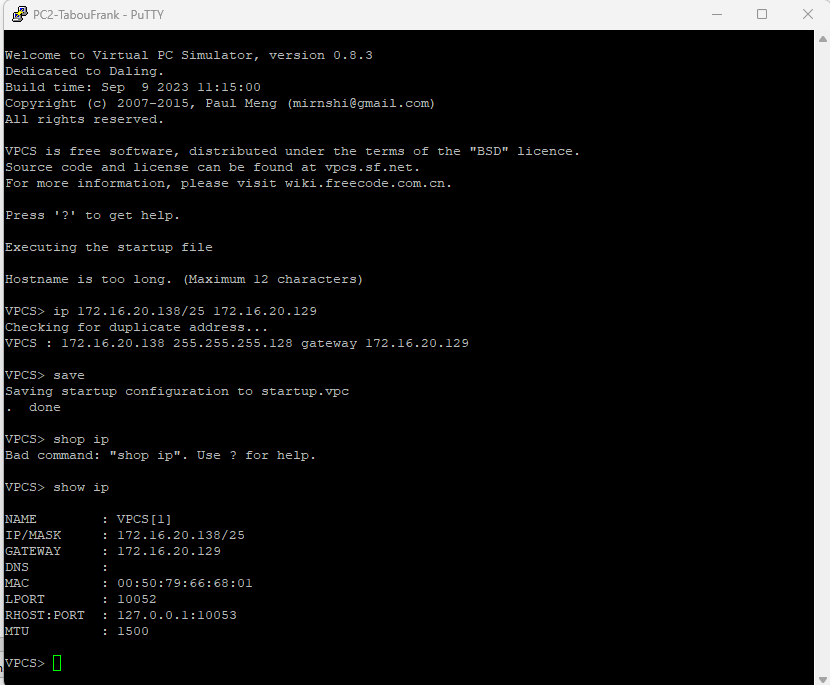
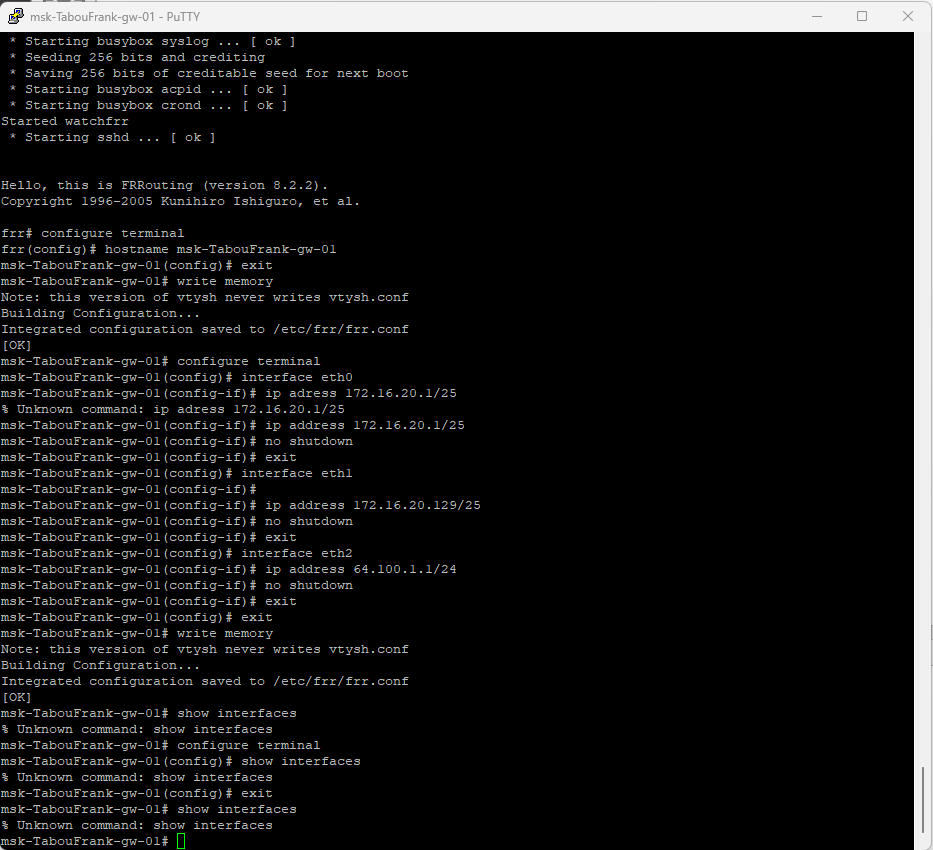

# Цель работы

Изучение принципов распределения и настройки адресного пространства на устройствах сети.

# Выполнение лабораторной работы

## Разбиение сети на подсети

### Разбиение IPv4-сети на подсети

**1. Задана IPv4-сеть 172.16.20.0/24.**

Характеристики сети:

| Параметр | Значение |
|----------|----------|
| Адрес сети | 172.16.20.0/24 |
| Префикс маски | /24 |
| Маска | 255.255.255.0 |
| Broadcast-адрес | 172.16.20.255 |
| Число возможных подсетей | 256 |
| Диапазон адресов узлов | 172.16.20.1 – 172.16.20.254 |

Разбиение на 3 подсети с узлами 126, 62, 62:

**Подсеть 1 (на 126 узлов)**
- Требуется 126 + 2 = 128 адресов → /25
- Маска: 255.255.255.128
- Адрес подсети: 172.16.20.0/25
- Диапазон узлов: 172.16.20.1 – 172.16.20.126
- Broadcast: 172.16.20.127

**Подсеть 2 (на 62 узла)**
- Требуется 62 + 2 = 64 адреса → /26
- Маска: 255.255.255.192
- Адрес подсети: 172.16.20.128/26
- Диапазон узлов: 172.16.20.129 – 172.16.20.190
- Broadcast: 172.16.20.191

**Подсеть 3 (на 62 узла)**
- Требуется 62 + 2 = 64 адреса → /26
- Маска: 255.255.255.192
- Адрес подсети: 172.16.20.192/26
- Диапазон узлов: 172.16.20.193 – 172.16.20.254
- Broadcast: 172.16.20.255

**2. Задана сеть 10.10.1.64/26.**

Характеристики сети:

| Параметр | Значение |
|----------|----------|
| Адрес сети | 10.10.1.64/26 |
| Префикс маски | /26 |
| Маска | 255.255.255.192 |
| Broadcast-адрес | 10.10.1.127 |
| Число возможных подсетей | 64 |
| Диапазон адресов узлов | 10.10.1.65 – 10.10.1.126 |

Выделение подсети на 30 узлов:
- Требуется 30 + 2 = 32 адреса → /27
- Маска: 255.255.255.224
- Адрес подсети: 10.10.1.64/27
- Broadcast: 10.10.1.95
- Диапазон узлов: 10.10.1.65 – 10.10.1.94

**3. Задана сеть 10.10.1.0/26.**

Характеристики сети:

| Параметр | Значение |
|----------|----------|
| Адрес сети | 10.10.1.0/26 |
| Префикс маски | /26 |
| Маска | 255.255.255.192 |
| Broadcast-адрес | 10.10.1.63 |
| Число возможных подсетей | 64 |
| Диапазон адресов узлов | 10.10.1.1 – 10.10.1.62 |

Выделение подсети на 14 узлов:
- Требуется 14 + 2 = 16 адресов → /28
- Маска: 255.255.255.240
- Адрес подсети: 10.10.1.0/28
- Broadcast: 10.10.1.15
- Диапазон узлов: 10.10.1.1 – 10.10.1.14

### Разбиение IPv6-сети на подсети

**1. Задана сеть 2001:db8:c0de::/48.**

Характеристики сети:

| Параметр | Значение |
|----------|----------|
| Адрес сети | 2001:db8:c0de::/48 |
| Длина префикса | 48 |
| Префикс | 2001:db8:c0de:: |
| Диапазон адресов узлов | 2001:db8:c0de:0000:0000:0000:0000:0000 – 2001:db8:c0de:ffff:ffff:ffff:ffff:ffff |

**Способ 1: разбиение с использованием идентификатора подсети (Subnet ID)**
- Подсеть A: 2001:db8:c0de:0000::/49
- Подсеть B: 2001:db8:c0de:8000::/49

**Способ 2: разбиение с использованием идентификатора интерфейса (Interface ID)**
- Подсеть 1: 2001:db8:c0de:0000::/65
- Подсеть 2: 2001:db8:c0de:0000:8000::/65

**2. Задана сеть 2a02:6b8::/64.**

Характеристики сети:

| Параметр | Значение |
|----------|----------|
| Адрес сети | 2a02:6b8::/64 |
| Длина префикса | 64 |
| Префикс | 2a02:6b8:0000:0000 |
| Диапазон адресов узлов | 2a02:6b8:0000:0000:0000:0000:0000:0000 – 2a02:6b8:0000:0000:ffff:ffff:ffff:ffff |

**Способ 1: разбиение с использованием идентификатора подсети (Subnet ID)**
- Подсеть A: 2a02:6b8::/65
- Подсеть B: 2a02:6b8:8000::/65

**Способ 2: разбиение с использованием идентификатора интерфейса (Interface ID)**
- Подсеть 1: 2a02:6b8::/65
- Подсеть 2: 2a02:6b8:8000::/65

## Настройка двойного стека адресации IPv4 и IPv6 в локальной сети

Запустил GNS3 VM и GNS3, создал новый проект. Разместил и соединил устройства согласно топологии (рис. @fig:001):

{#fig:001 width=70%}

Настроил IPv4-адресацию на узле PC1: 172.16.20.10/25, шлюз 172.16.20.1 (рис. @fig:002):

{#fig:002 width=70%}

Настроил IPv4-адресацию на узле PC2: 172.16.20.138/25, шлюз 172.16.20.129 (рис. @fig:003):

{#fig:003 width=70%}

Настроил IPv4-адресацию на сервере: 64.100.1.10/24, шлюз 64.100.1.1 (рис. @fig:004):

{#fig:004 width=70%}

Настроил IPv4-адресацию на маршрутизаторе FRR (рис. @fig:005):

{#fig:005 width=70%}

Проверил конфигурацию маршрутизатора (рис. @fig:006, @fig:007):

{#fig:006 width=70%}

{#fig:007 width=70%}

Проверил связность PC2 с PC1 и сервером (рис. @fig:008, @fig:009):

{#fig:008 width=70%}

{#fig:009 width=70%}

Настроил IPv6-адресацию на сервере: 2001:db8:c0de:11::a/64 (рис. @fig:010):

{#fig:010 width=70%}

Настроил IPv6-адресацию на PC3: 2001:db8:c0de:12::a/64 (рис. @fig:011):

{#fig:011 width=70%}

Настроил IPv6-адресацию на PC4: 2001:db8:c0de:13::a/64 (рис. @fig:012):

{#fig:012 width=70%}

Изменил имя маршрутизатора VyOS и сохранил конфигурацию (рис. @fig:013):

{#fig:013 width=70%}

Настроил IPv6-адресацию и Router Advertisement на VyOS (рис. @fig:014):

{#fig:014 width=70%}

Проверил IPv6-адресацию интерфейсов VyOS (рис. @fig:015):

{#fig:015 width=70%}

Проверил IPv6-связность между PC4 и PC3 (рис. @fig:016):

{#fig:016 width=70%}

Проверил доступ сервера двойного стека (рис. @fig:017):

{#fig:017 width=70%}

Проверил изоляцию подсетей IPv4 и IPv6 (рис. @fig:018-021):

{#fig:018 width=70%}

{#fig:019 width=70%}

{#fig:020 width=70%}

{#fig:021 width=70%}

Проверил доступ сервера двойного стека к обеим подсетям (рис. @fig:022):

{#fig:022 width=70%}

Проанализировал ICMP-трафик IPv4 в Wireshark (рис. @fig:023, @fig:024):

{#fig:023 width=70%}

{#fig:024 width=70%}

## Задание для самостоятельного выполнения

Рассчитал параметры подсети 10.10.1.96/27 (рис. @fig:025):

{#fig:025 width=70%}

Рассчитал параметры подсети 10.10.1.16/28 (рис. @fig:026):

{#fig:026 width=70%}

Составил таблицу адресации (рис. @fig:027):

{#fig:027 width=70%}

Создал новый проект в GNS3 с переименованными устройствами (рис. @fig:028):

{#fig:028 width=70%}

Настроил IPv4 и IPv6 на PC1 (рис. @fig:029, @fig:030):

{#fig:029 width=70%}

{#fig:030 width=70%}

Настроил IPv4 и IPv6 на PC2 (рис. @fig:031, @fig:032):

{#fig:031 width=70%}

{#fig:032 width=70%}

Настроил IPv4/IPv6 на маршрутизаторе VyOS (рис. @fig:033, @fig:034):

{#fig:033 width=70%}

{#fig:034 width=70%}

Проверил IPv4-связность между PC1 и PC2 (рис. @fig:035, @fig:036):

{#fig:035 width=70%}

{#fig:036 width=70%}

Проверил IPv6-связность между узлами (рис. @fig:037):

{#fig:037 width=70%}

# Выводы

В ходе лабораторной работы были изучены и практически отработаны принципы планирования, распределения и настройки адресного пространства IPv4 и IPv6 в локальной сети. Выполнено разбиение исходных сетей на подсети с заданным числом узлов, корректно определены их основные характеристики.

На практике реализована настройка двойного стека IPv4/IPv6 на оконечных устройствах и маршрутизаторах с использованием FRR и VyOS. Проверка связности подтвердила корректную маршрутизацию внутри каждой подсети и работоспособность настроенного адресного плана.

Подтверждено логическое разделение IPv4- и IPv6-подсетей: узлы разных семейств адресации не имеют прямой связности между собой, за исключением сервера с двойным стеком. Анализ захваченного трафика позволил наглядно проследить процессы обмена данными и диагностики недоступности.
