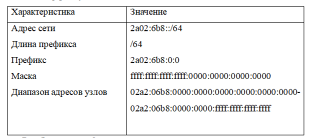
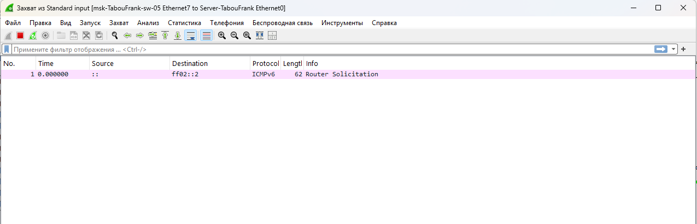
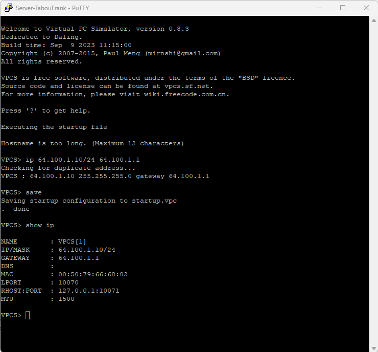
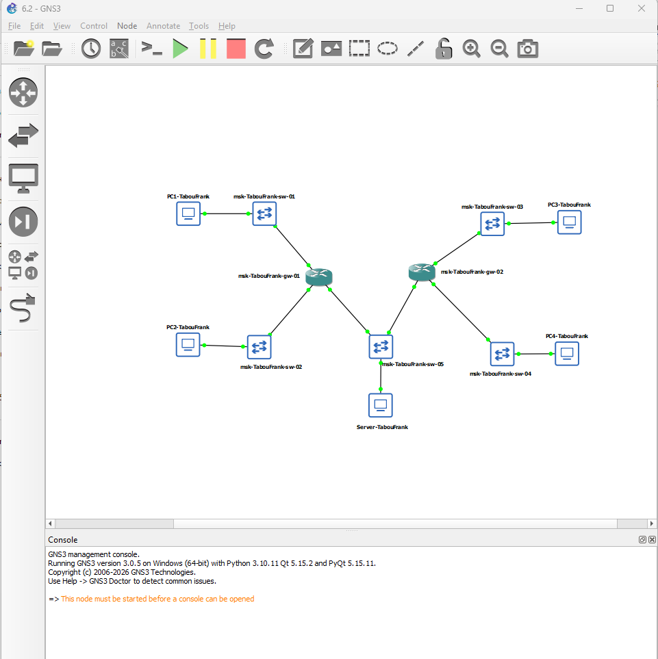

# Цели и задачи работы

## Цель лабораторной работы

Изучение принципов распределения и настройки адресного пространства на устройствах сети.

# Выполнение лабораторной работы

## Топология лабораторного стенда в GNS3

{ #fig:001 width=80% }

## Настройка IPv4-адресации на PC1-akabrikosov

{ #fig:002 width=80% }

## Настройка IPv4-адресации на PC2-akabrikosov

{ #fig:003 width=80% }

## Настройка IPv4-адресации на Server-akabrikosov

{ #fig:004 width=80% }

## Настройка интерфейсов маршрутизатора msk-akabrikosov-gw-01

{ #fig:005 width=80% }

## Проверка состояния интерфейсов маршрутизатора

{ #fig:006 width=80% }

## Проверка связности с PC1-akabrikosov

{ #fig:007 width=80% }

## Проверка связности с PC2-akabrikosov

{ #fig:008 width=80% }

## Настройка IPv6-адресации на PC3-akabrikosov

{ #fig:009 width=80% }

## Настройка IPv6-адресации на PC4-akabrikosov

{ #fig:010 width=80% }

## Проверка IPv4- и IPv6-адресации на Server-akabrikosov

{ #fig:011 width=80% }

## Настройка IPv6-интерфейсов маршрутизатора VyOS

{ #fig:012 width=80% }

## Проверка интерфейсов маршрутизатора VyOS

{ #fig:013 width=80% }

## Проверка IPv6-связности с PC3-akabrikosov

{ #fig:014 width=80% }

## Проверка IPv6-связности с PC4-akabrikosov

{ #fig:015 width=80% }

## Проверка изоляции IPv4 и IPv6 подсетей

{ #fig:016 width=80% }

## Захват ARP-трафика на интерфейсе сервера

{ #fig:017 width=80% }

## Захват ICMP-трафика IPv4

{ #fig:018 width=80% }

## Захват ICMPv6-трафика

{ #fig:019 width=80% }

## Топология сети с двумя локальными подсетями

{ #fig:020 width=80% }

## Проверка IPv4 и IPv6 адресации на PC1-akabrikosov

{ #fig:021 width=80% }

## Проверка IPv4 и IPv6 адресации на PC2-akabrikosov

{ #fig:022 width=80% }

## Проверка настроенной адресации интерфейсов VyOS

{ #fig:023 width=80% }

## Проверка связности ping и trace между PC1 и PC2

{ #fig:024 width=80% }

# Выводы по проделанной работе

## Вывод

В ходе работы:
- выполнено разбиение IPv4 и IPv6 адресных пространств на подсети;
- настроен двойной стек IPv4/IPv6 в GNS3;
- подтверждена связность внутри соответствующих подсетей;
- подтверждена изоляция IPv4 и IPv6 сегментов (кроме Dual Stack сервера);
- выполнен анализ ARP, ICMP, ICMPv6 в захваченном трафике.
