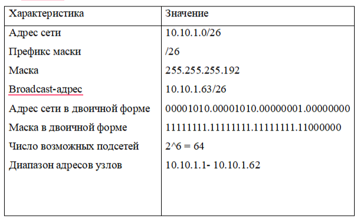
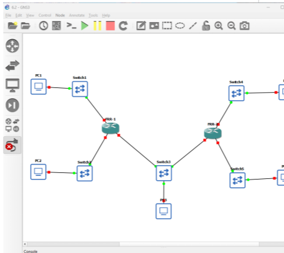
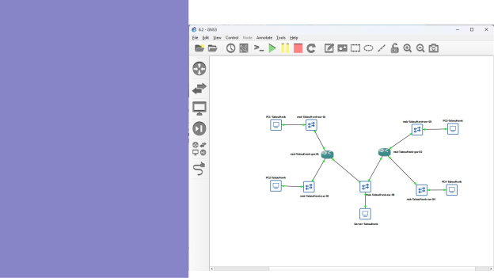
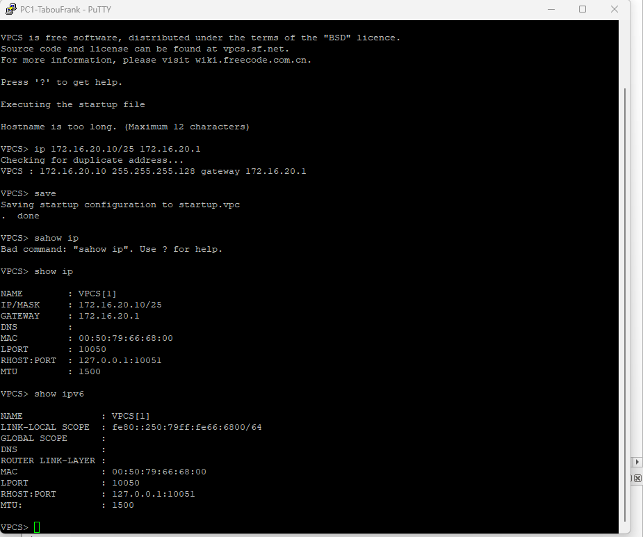
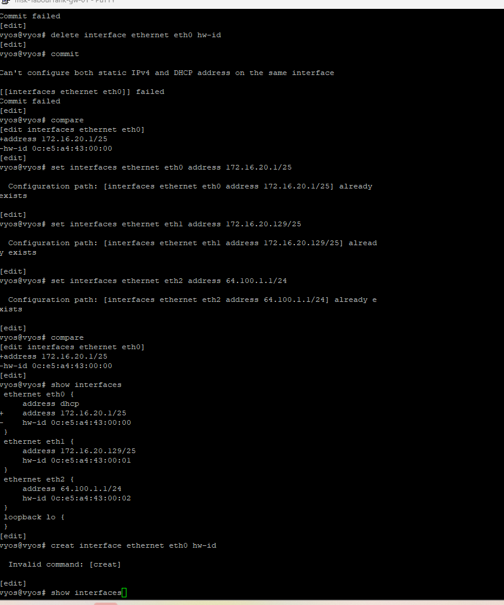

## Докладчик

* Талебу Тенке Франк Устон
* Студент группы НФИбд-02-23
* Студ. билет 1032224534
* Российский университет дружбы народов

## Цель работы

Изучение принципов работы сетевых технологий

---

## Запустил GNS3 VM и GNS3, создал новый проект. Разместил и соединил устройства согласно топологии (рис. @fig:001):

{ width=90% }

---

## Настроил IPv4-адресацию на узле PC1: 172.16.20.10/25, шлюз 172.16.20.1 (рис. @fig:002):

{ width=90% }

---

## Настроил IPv4-адресацию на узле PC2: 172.16.20.138/25, шлюз 172.16.20.129 (рис. @fig:003):

{ width=90% }

---

## Настроил IPv4-адресацию на сервере: 64.100.1.10/24, шлюз 64.100.1.1 (рис. @fig:004):

{ width=90% }

---

## Настроил IPv4-адресацию на маршрутизаторе FRR (рис. @fig:005):

{ width=90% }

---

## Проверил конфигурацию маршрутизатора (рис. @fig:006, @fig:007):

{ width=90% }

---

## {#fig:006 width=70%}

{#fig:006 width=70%}](7.png){ width=90% }

---

## Проверил связность PC2 с PC1 и сервером (рис. @fig:008, @fig:009):

{ width=90% }

---

## {#fig:008 width=70%}

{#fig:008 width=70%}](9.png){ width=90% }

---

## Настроил IPv6-адресацию на сервере: 2001:db8:c0de:11::a/64 (рис. @fig:010):

{ width=90% }

---

## Настроил IPv6-адресацию на PC3: 2001:db8:c0de:12::a/64 (рис. @fig:011):

{ width=90% }

---

## Настроил IPv6-адресацию на PC4: 2001:db8:c0de:13::a/64 (рис. @fig:012):

{ width=90% }

---

## Изменил имя маршрутизатора VyOS и сохранил конфигурацию (рис. @fig:013):

{ width=90% }

---

## Настроил IPv6-адресацию и Router Advertisement на VyOS (рис. @fig:014):

{ width=90% }

---

## Проверил IPv6-адресацию интерфейсов VyOS (рис. @fig:015):

{ width=90% }

---

## Проверил IPv6-связность между PC4 и PC3 (рис. @fig:016):

{ width=90% }

---

## Проверил доступ сервера двойного стека (рис. @fig:017):

{ width=90% }

---

## Проверил изоляцию подсетей IPv4 и IPv6 (рис. @fig:018-021):

{ width=90% }

---

## {#fig:018 width=70%}

{#fig:018 width=70%}](19.png){ width=90% }

---

## Вывод

В ходе выполнения лабораторной работы были получены практические навыки

---

## Список литературы

[1] Методические указания к лабораторной работе №06
[2] Документация по сетевым технологиям
