# Цель работы

Получить навыки настройки службы DHCP на сетевом оборудовании для распределения адресов IPv4 и IPv6.

# Выполнение лабораторной работы

## Настройка DHCP в случае IPv4

Запустил GNS3 VM и GNS3, создал новый проект. Изменил имена устройств согласно шаблону и включил захват трафика (рис. @fig:001):

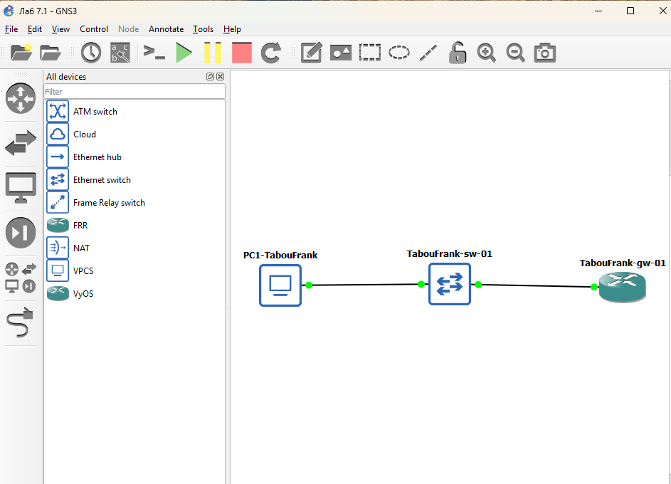{#fig:001 width=70%}

Настроил системные параметры VyOS: имя хоста `alkamal-gw-01`, домен `alkamal.net`, создал пользователя `alkamal` (рис. @fig:002):

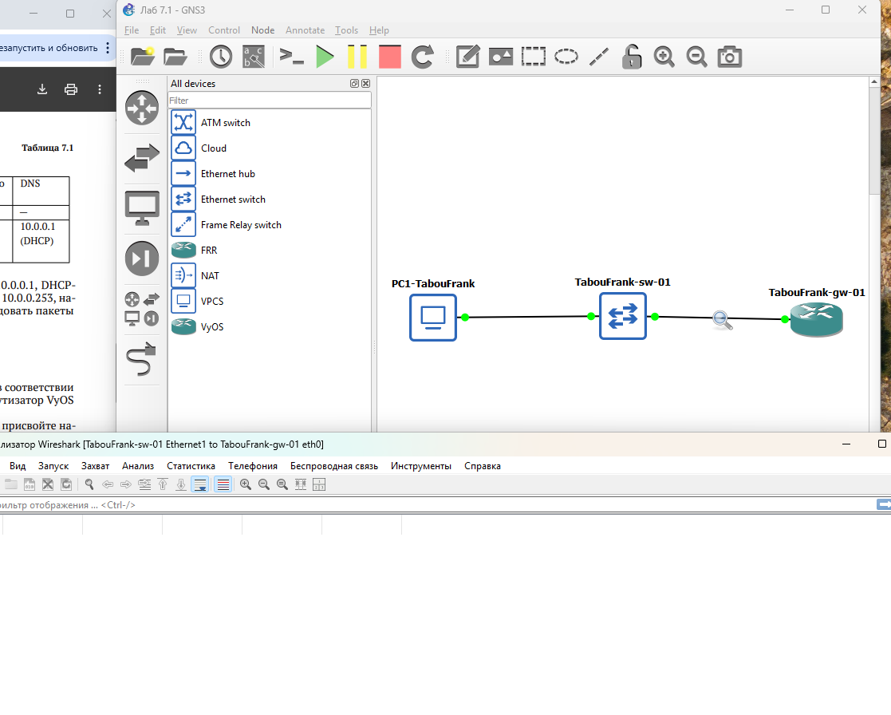{#fig:002 width=70%}

Выполнил повторный вход под новым пользователем и удалил учётную запись `vyos` (рис. @fig:003):

{#fig:003 width=70%}

Назначил статический IPv4-адрес 10.0.0.1/24 интерфейсу eth0 (рис. @fig:004):

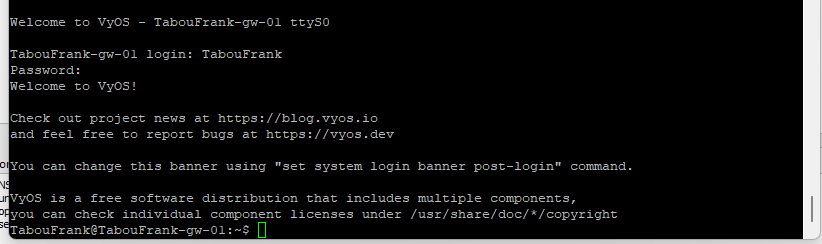{#fig:004 width=70%}

Настроил DHCP-сервер на маршрутизаторе для сети 10.0.0.0/24 (рис. @fig:005):

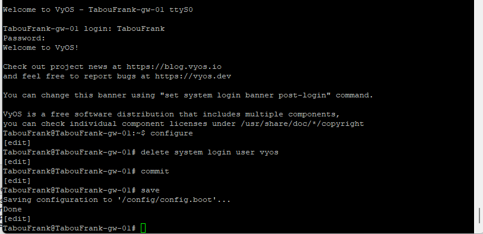{#fig:005 width=70%}

Проверил статистику DHCP-сервера: активных аренд нет (рис. @fig:006):

{#fig:006 width=70%}

На узле PC1 выполнил команду `ip dhcp -d` для получения адреса по DHCP (рис. @fig:007, @fig:008):

{#fig:007 width=70%}

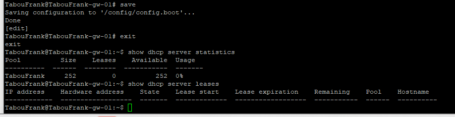{#fig:008 width=70%}

Проверил полученные параметры и связность с маршрутизатором (рис. @fig:009):

{#fig:009 width=70%}

На маршрутизаторе проверил статистику и информацию о выданной аренде (рис. @fig:010):

{#fig:010 width=70%}

Проанализировал журнал DHCP-сервера (рис. @fig:011):

{#fig:011 width=70%}

В Wireshark зафиксирован полный процесс DHCP (рис. @fig:012, @fig:013):

{#fig:012 width=70%}

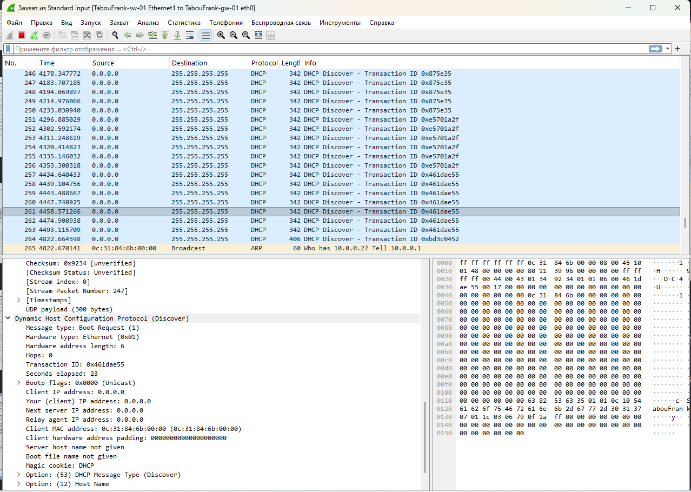{#fig:013 width=70%}

## Настройка DHCP в случае IPv6

Использовал Alpine Linux для поддержки DHCPv6. Топология сети с включённым захватом трафика (рис. @fig:014):

{#fig:014 width=70%}

Настроил системные параметры VyOS для IPv6 (рис. @fig:015):

{#fig:015 width=70%}

Назначил IPv6-адреса интерфейсам eth1 (2000::1/64) и eth2 (2001::1/64) (рис. @fig:016):

{#fig:016 width=70%}

Настроил Stateless DHCPv6 и Router Advertisement на интерфейсе eth1 (рис. @fig:017, @fig:018):

{#fig:017 width=70%}

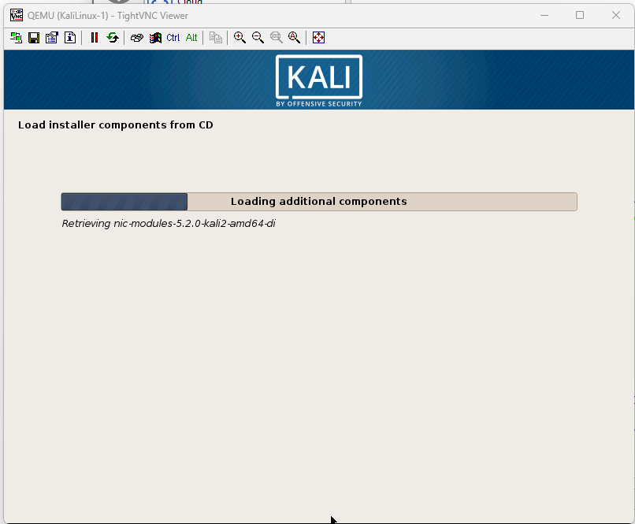{#fig:018 width=70%}

Проверил IPv6-адресацию на узле PC2: адрес получен через SLAAC (рис. @fig:019):

{#fig:019 width=70%}

Попытка получения адреса по DHCPv6 показала отсутствие опции IAADDR (рис. @fig:020):

{#fig:020 width=70%}

Связность с маршрутизатором сохраняется (рис. @fig:021):

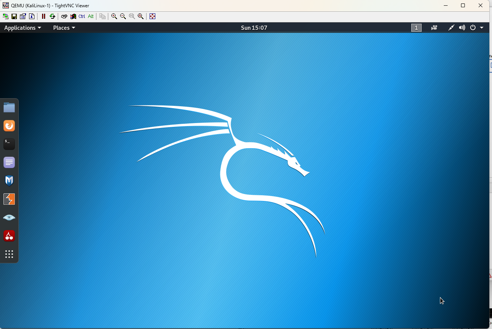{#fig:021 width=70%}

В захваченном трафике видна работа ICMPv6 и DHCPv6 Stateless (рис. @fig:022):

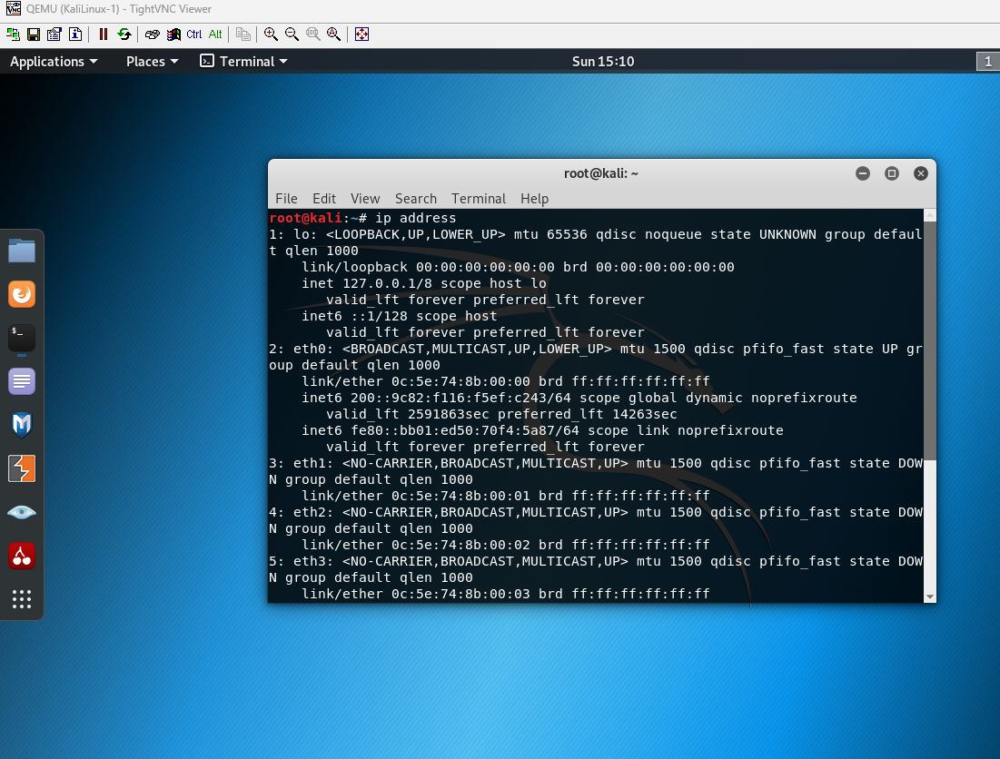{#fig:022 width=70%}

Настроил Stateful DHCPv6 на интерфейсе eth2 (рис. @fig:023):

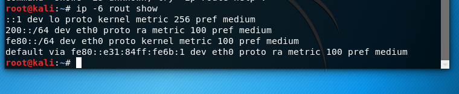{#fig:023 width=70%}

Проверил состояние DHCPv6-сервера до запроса клиента (рис. @fig:024):

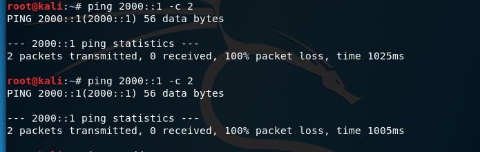{#fig:024 width=70%}

На узле PC3 выполнил получение адреса по Stateful DHCPv6 (рис. @fig:025):

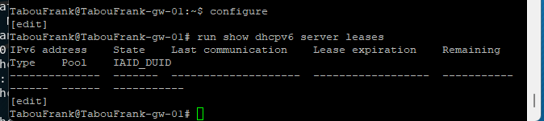{#fig:025 width=70%}

Проверил IPv6-адресацию на узле PC3 после DHCPv6 (рис. @fig:026):

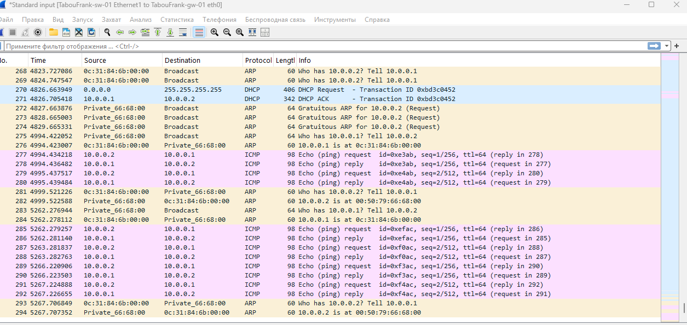{#fig:026 width=70%}

На маршрутизаторе появилась информация о выданной IPv6-аренде (рис. @fig:027):

{#fig:027 width=70%}

В захваченном трафике зафиксирован полный процесс DHCPv6 Stateful (рис. @fig:028):

{#fig:028 width=70%}

# Выводы

В ходе выполнения лабораторной работы была успешно реализована и исследована настройка автоматической адресации IPv4 и IPv6 с использованием протоколов DHCP и DHCPv6 в двух режимах: без отслеживания состояния (stateless) и с отслеживанием состояния (stateful).

На интерфейсе eth1 маршрутизатора был настроен режим DHCPv6 Stateless, при котором узел PC2 получил IPv6-адрес с помощью механизма SLAAC, а дополнительные параметры сети были получены по протоколу DHCPv6.

На интерфейсе eth2 маршрутизатора был настроен режим DHCPv6 Stateful, при котором узел PC3 получил IPv6-адрес из заданного диапазона, а также параметры DNS от DHCPv6-сервера.

Анализ захваченного сетевого трафика показал корректную работу протоколов ICMPv6, Router Advertisement, Neighbor Discovery и DHCPv6, а также последовательность обмена сообщениями при получении адреса.

Таким образом, все поставленные в задании цели были достигнуты: выполнена настройка IPv4/IPv6-адресации, реализованы режимы DHCP, подтверждена их корректная работа и проанализировано взаимодействие сетевых устройств на уровне протоколов.
