## Докладчик

* Талебу Тенке Франк Устон
* Студент группы НФИбд-02-23
* Студ. билет 1032224534
* Российский университет дружбы народов

## Цель работы

Изучение принципов работы сетевых технологий

---

## Запустил GNS3 VM и GNS3, создал новый проект. Изменил имена устройств согласно шаблону и включил захват трафика (рис. @fig:001):

{ width=90% }

---

## Настроил системные параметры VyOS: имя хоста `alkamal-gw-01`, домен `alkamal.net`, создал пользователя `alkamal` (рис. @fig:002):

{ width=90% }

---

## Выполнил повторный вход под новым пользователем и удалил учётную запись `vyos` (рис. @fig:003):

{ width=90% }

---

## Назначил статический IPv4-адрес 10.0.0.1/24 интерфейсу eth0 (рис. @fig:004):

{ width=90% }

---

## Настроил DHCP-сервер на маршрутизаторе для сети 10.0.0.0/24 (рис. @fig:005):

{ width=90% }

---

## Проверил статистику DHCP-сервера: активных аренд нет (рис. @fig:006):

{ width=90% }

---

## На узле PC1 выполнил команду `ip dhcp -d` для получения адреса по DHCP (рис. @fig:007, @fig:008):

{ width=90% }

---

## 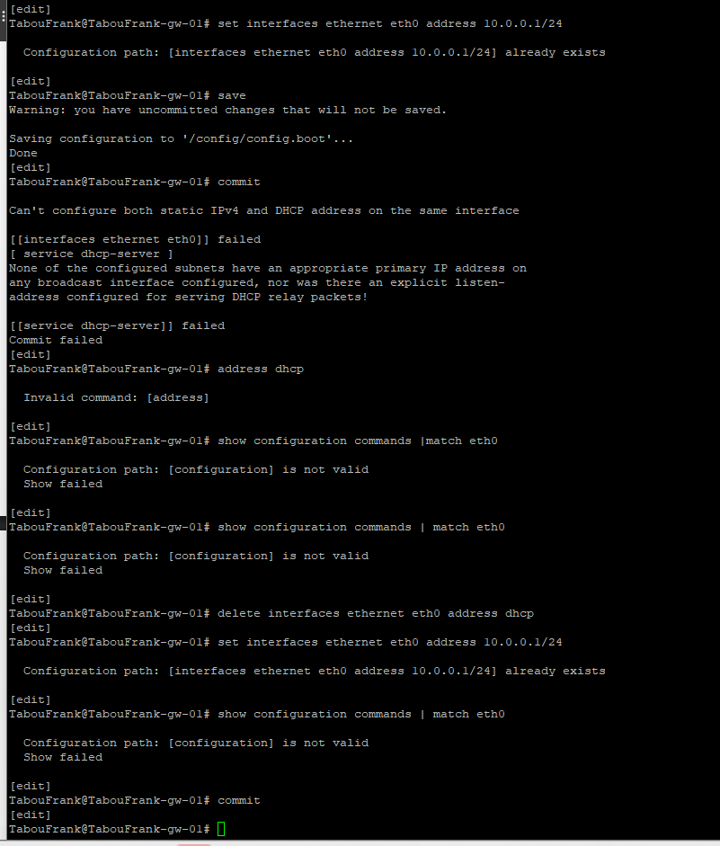{#fig:007 width=70%}

{#fig:007 width=70%}](8.png){ width=90% }

---

## Проверил полученные параметры и связность с маршрутизатором (рис. @fig:009):

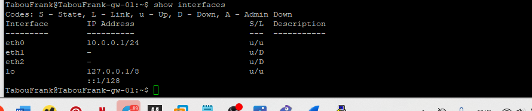{ width=90% }

---

## На маршрутизаторе проверил статистику и информацию о выданной аренде (рис. @fig:010):

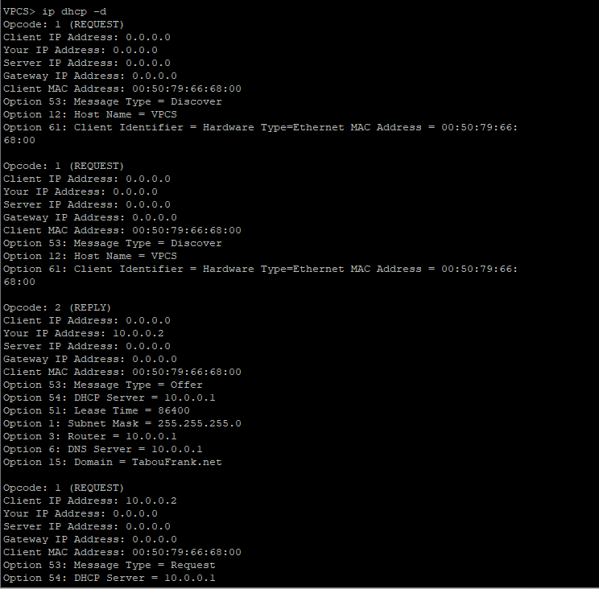{ width=90% }

---

## Проанализировал журнал DHCP-сервера (рис. @fig:011):

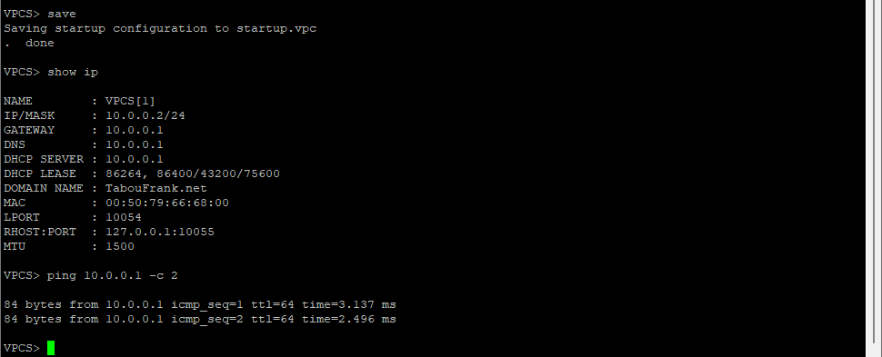{ width=90% }

---

## В Wireshark зафиксирован полный процесс DHCP (рис. @fig:012, @fig:013):

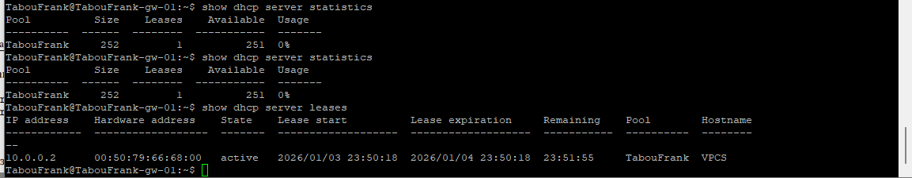{ width=90% }

---

## {#fig:012 width=70%}

{#fig:012 width=70%}](13.png){ width=90% }

---

## Использовал Alpine Linux для поддержки DHCPv6. Топология сети с включённым захватом трафика (рис. @fig:014):

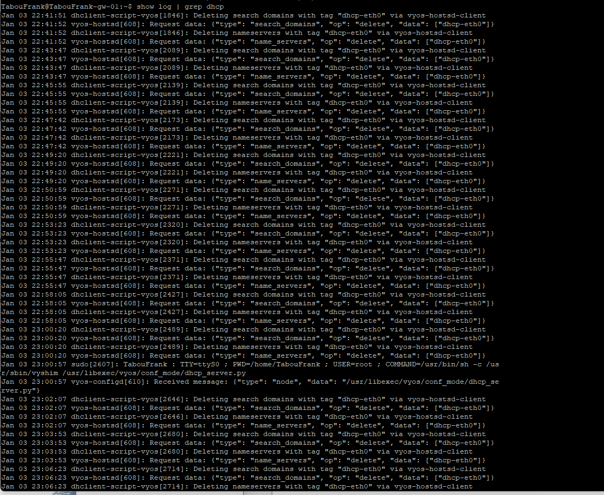{ width=90% }

---

## Настроил системные параметры VyOS для IPv6 (рис. @fig:015):

{ width=90% }

---

## Назначил IPv6-адреса интерфейсам eth1 (2000::1/64) и eth2 (2001::1/64) (рис. @fig:016):

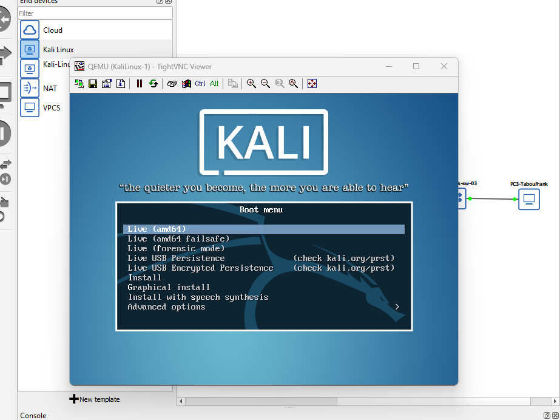{ width=90% }

---

## Настроил Stateless DHCPv6 и Router Advertisement на интерфейсе eth1 (рис. @fig:017, @fig:018):

{ width=90% }

---

## {#fig:017 width=70%}

{#fig:017 width=70%}](18.png){ width=90% }

---

## Проверил IPv6-адресацию на узле PC2: адрес получен через SLAAC (рис. @fig:019):

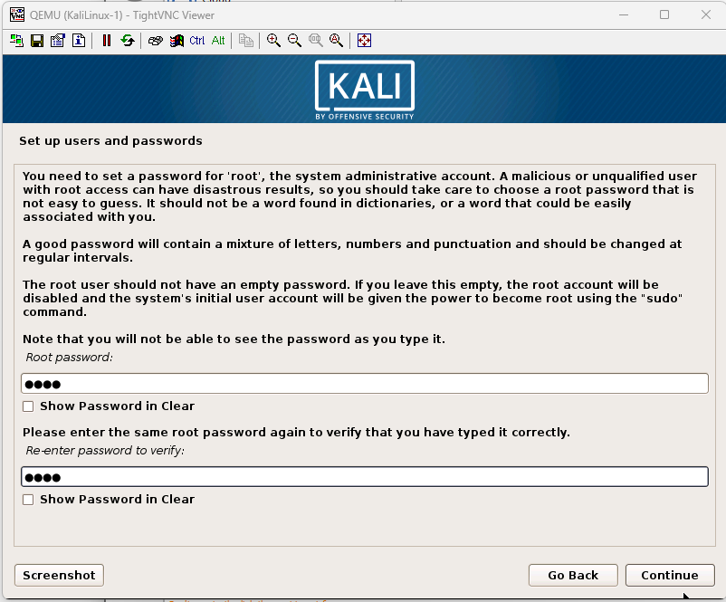{ width=90% }

---

## Попытка получения адреса по DHCPv6 показала отсутствие опции IAADDR (рис. @fig:020):

{ width=90% }

---

## Связность с маршрутизатором сохраняется (рис. @fig:021):

{ width=90% }

---

## В захваченном трафике видна работа ICMPv6 и DHCPv6 Stateless (рис. @fig:022):

{ width=90% }

---

## Настроил Stateful DHCPv6 на интерфейсе eth2 (рис. @fig:023):

{ width=90% }

---

## Проверил состояние DHCPv6-сервера до запроса клиента (рис. @fig:024):

{ width=90% }

---

## На узле PC3 выполнил получение адреса по Stateful DHCPv6 (рис. @fig:025):

{ width=90% }

---

## Проверил IPv6-адресацию на узле PC3 после DHCPv6 (рис. @fig:026):

{ width=90% }

---

## На маршрутизаторе появилась информация о выданной IPv6-аренде (рис. @fig:027):

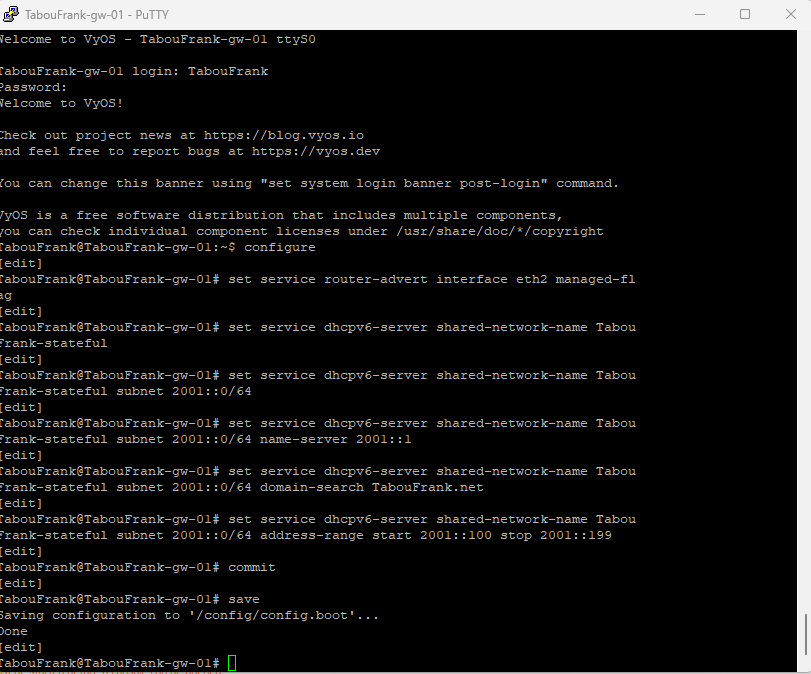{ width=90% }

---

## В захваченном трафике зафиксирован полный процесс DHCPv6 Stateful (рис. @fig:028):

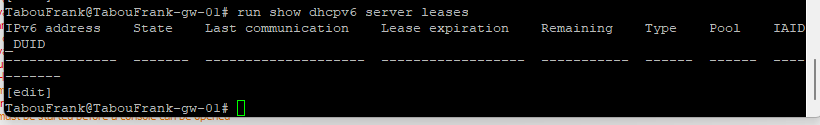{ width=90% }

---

## Этап выполнения работы №29

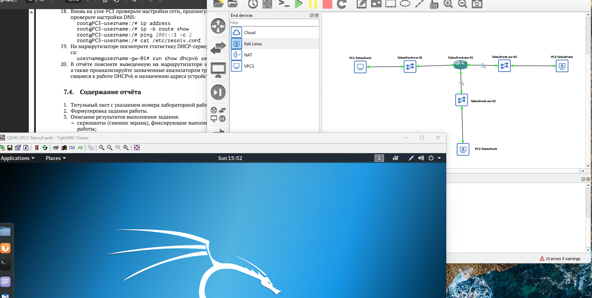{ width=90% }

---

## Вывод

В ходе выполнения лабораторной работы были получены практические навыки

---

## Список литературы

[1] Методические указания к лабораторной работе №07
[2] Документация по сетевым технологиям
