# Цель работы

Изучение принципов маршрутизации в IPv4- и IPv6-сетях и принципов настройки сетевого оборудования.

# Выполнение лабораторной работы

## Настройка динамической маршрутизации в сетях IPv4 и IPv6

В начале выполнения лабораторной работы была запущена GNS3 VM и программа GNS3, после чего создан новый проект. В рабочем пространстве были размещены и соединены сетевые устройства в соответствии с топологией, представленной на рисунке, с использованием маршрутизаторов FRR, коммутаторов и узлов VPCS (рис. @fig:001).

Подключение устройств выполнено таким образом, чтобы сформировать кольцевую топологию из четырёх маршрутизаторов (gw-01, gw-02, gw-03, gw-04). Узел PC1 был подключён через коммутатор sw-01 к маршрутизатору gw-01, а узел PC2 — через коммутатор sw-02 к маршрутизатору gw-03.

Далее были изменены отображаемые имена устройств в соответствии с требованиями задания: коммутаторы получили имена по шаблону `msk-user-sw-0x`, маршрутизаторы — `msk-user-gw-0x`, а узлы VPCS — `PCx-user`. На завершающем этапе был включён захват трафика на соединениях между sw-01 и gw-01, а также между sw-02 и gw-03, что позволило в дальнейшем проанализировать работу протоколов маршрутизации и передачу пользовательского трафика.

{#fig:001 width=70%}

### Назначение IPv4-адресов оконечным устройствам

В соответствии с таблицей адресации были настроены IPv4-адреса на оконечных устройствах PC1 и PC2 с использованием команд VPCS. На узле PC1 был назначен IP-адрес 10.0.10.10/24 с указанием шлюза по умолчанию 10.0.10.1. Конфигурация была сохранена, после чего с помощью команды `show ip` подтверждена корректность заданных параметров (рис. @fig:002).

{#fig:002 width=70%}

На узле PC2 был назначен IP-адрес 10.0.11.10/24 с шлюзом по умолчанию 10.0.11.1. После сохранения конфигурации проверка команды `show ip` показала корректное применение настроек (рис. @fig:003).

{#fig:003 width=70%}

### Настройка IPv4-адресации на маршрутизаторах

На маршрутизаторе msk-user-gw-01 были настроены IPv4-адреса на интерфейсах eth0, eth1 и eth2 в соответствии с таблицей адресации. После назначения адресов интерфейсы были переведены в активное состояние с помощью команды `no shutdown`. Конфигурация была сохранена, а корректность настроек подтверждена командой `show running-config` (рис. @fig:004).

{#fig:004 width=70%}

На маршрутизаторе msk-user-gw-02 была выполнена настройка IPv4-адресов на интерфейсах eth0 и eth1 согласно заданной схеме сети. Все интерфейсы были активированы, после чего конфигурация сохранена (рис. @fig:005).

{#fig:005 width=70%}

На маршрутизаторе msk-user-gw-03 были назначены IPv4-адреса на интерфейсах eth0, eth1 и eth2, обеспечивающих подключение к локальной сети и соседним маршрутизаторам. Все интерфейсы успешно активированы, конфигурация сохранена (рис. @fig:006).

{#fig:006 width=70%}

На маршрутизаторе msk-user-gw-04 выполнена настройка IPv4-адресов на интерфейсах eth0 и eth1 в соответствии с топологией сети. После включения интерфейсов и сохранения конфигурации была выполнена проверка, подтвердившая корректность параметров (рис. @fig:007).

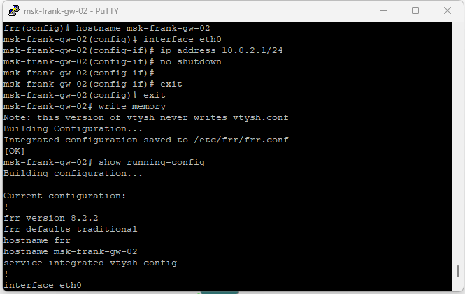{#fig:007 width=70%}

### Назначение IPv6-адресов оконечным устройствам

В соответствии с таблицей адресации на оконечных устройствах PC1 и PC2 были вручную настроены IPv6-адреса с использованием команд VPCS.

На узле PC1 был назначен глобальный IPv6-адрес 2001:10::a/64. После сохранения конфигурации проверка с помощью команды `show ipv6` подтвердила корректное назначение глобального и link-local адресов (рис. @fig:008).

{#fig:008 width=70%}

На узле PC2 был назначен глобальный IPv6-адрес 2001:11::a/64. Конфигурация была сохранена, а вывод команды `show ipv6` подтвердил корректность параметров IPv6 (рис. @fig:009).

{#fig:009 width=70%}

### Настройка IPv6-адресации на маршрутизаторах

На маршрутизаторе msk-user-gw-01 была включена поддержка пересылки IPv6 (`ipv6 forwarding`) и настроены IPv6-адреса на интерфейсах eth0, eth1 и eth2. На интерфейсе eth0 дополнительно включена рассылка Router Advertisement для узлов локальной сети (рис. @fig:010).

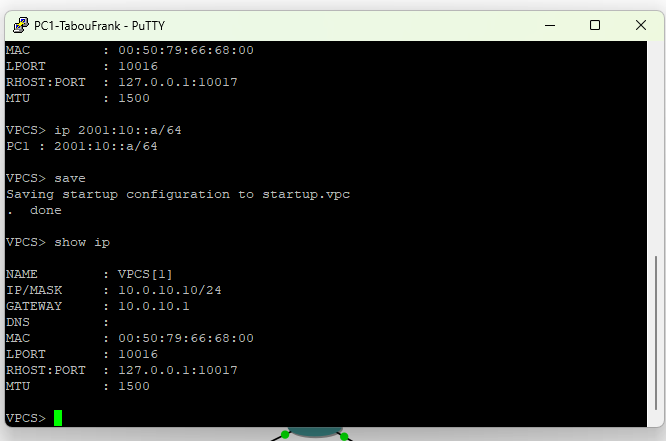{#fig:010 width=70%}

На маршрутизаторе msk-user-gw-02 выполнено включение IPv6-пересылки и назначение IPv6-адресов на интерфейсах eth0 и eth1 (рис. @fig:011).

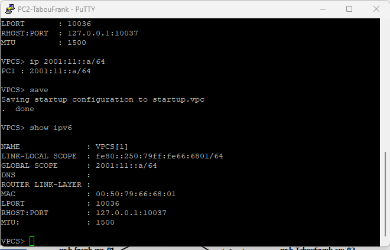{#fig:011 width=70%}

На маршрутизаторе msk-user-gw-03 была активирована поддержка IPv6 и назначены IPv6-адреса на интерфейсах eth0, eth1 и eth2. На интерфейсе eth0 включена рассылка Router Advertisement (рис. @fig:012).

{#fig:012 width=70%}

На маршрутизаторе msk-user-gw-04 выполнена настройка IPv6-адресов на интерфейсах eth0 и eth1 с предварительным включением пересылки IPv6 (рис. @fig:013).

{#fig:013 width=70%}

## Настройка динамической маршрутизации по протоколу RIP

### Настройка RIP на маршрутизаторах

На маршрутизаторе msk-user-gw-01 был включён протокол динамической маршрутизации RIP версии 2. Маршрутизация активирована на интерфейсах eth0, eth1 и eth2, что позволило объявлять все непосредственно подключённые сети и получать маршруты от соседних маршрутизаторов (рис. @fig:014).

{#fig:014 width=70%}

На маршрутизаторе msk-user-gw-02 выполнена настройка RIPv2 с активацией протокола на интерфейсах eth0 и eth1 (рис. @fig:015).

{#fig:015 width=70%}

На маршрутизаторе msk-user-gw-03 был настроен протокол RIPv2 и включён на интерфейсах eth0, eth1 и eth2 (рис. @fig:016).

{#fig:016 width=70%}

На маршрутизаторе msk-user-gw-04 выполнена настройка RIPv2 с включением протокола на интерфейсах eth0 и eth1 (рис. @fig:017).

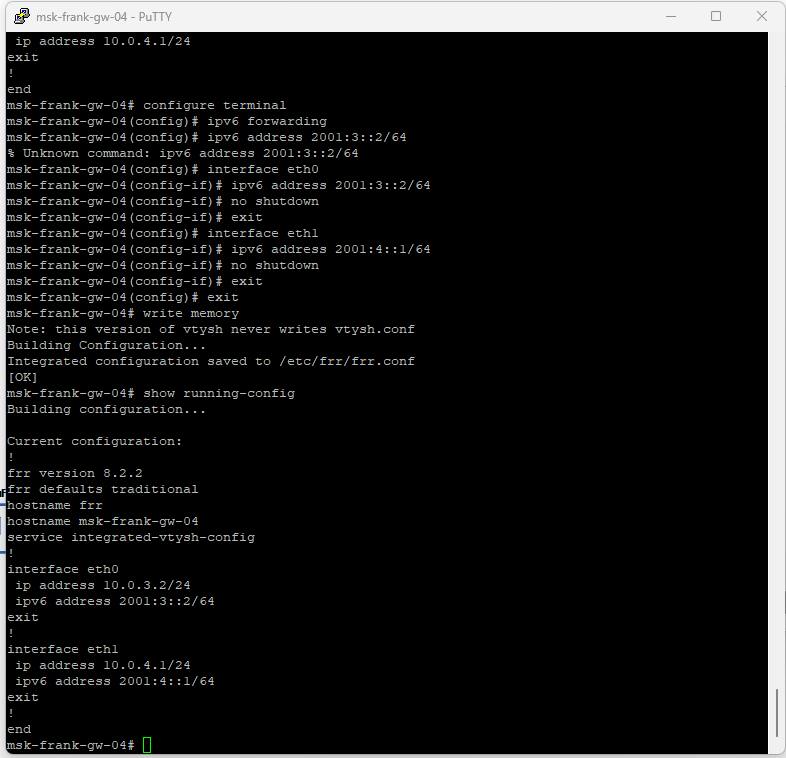{#fig:017 width=70%}

### Проверка маршрутизации RIP

Результаты команды `show ip route rip` показали, что маршрутизаторы успешно получили маршруты к удалённым сетям по протоколу RIP, с указанием следующего перехода (Next Hop) и соответствующих метрик (рис. @fig:018).

{#fig:018 width=70%}

Вывод команды `show ip rip` отразил список объявляемых и полученных сетей, значения метрик и источники маршрутной информации (рис. @fig:019).

{#fig:019 width=70%}

Команда `show ip rip status` показала, что используется RIP версии 2, обновления отправляются каждые 30 секунд, таймеры протокола соответствуют стандартным значениям (рис. @fig:020).

{#fig:020 width=70%}

### Проверка связности и реакции RIP на отказ интерфейса

С узла PC1 была выполнена проверка связности с узлом PC2 с помощью команды `ping 10.0.11.10`. Ответы ICMP были успешно получены, что подтверждает корректную маршрутизацию в сети. С помощью команды `trace 10.0.11.10 -P 6` был определён путь следования пакетов (рис. @fig:021).

{#fig:021 width=70%}

Далее был искусственно смоделирован отказ канала связи путём отключения интерфейса eth0 на маршрутизаторе msk-user-gw-02 с помощью команды `shutdown`. После этого на маршрутизаторе msk-user-gw-01 в таблице RIP маршруты, ранее проходившие через msk-user-gw-02, получили метрику 16 (недостижимый маршрут). После перестроения сети RIP выбрал альтернативный маршрут (через msk-user-gw-04), и связность восстановилась.

В захваченном трафике присутствуют RIP-пакеты, отправляемые на мультикаст-адрес 224.0.0.9, которые содержат информацию об объявляемых сетях и соответствующих метриках маршрутов (рис. @fig:022).

{#fig:022 width=70%}

## Настройка динамической маршрутизации по протоколу OSPF

### Настройка OSPFv2 на маршрутизаторах

На маршрутизаторе msk-alkamal-gw-01 выполнена настройка протокола OSPFv2. В процесс OSPF добавлены сети 10.0.10.0/24, 10.0.1.0/24 и 10.0.4.0/24, все они включены в область 0.0.0.0 (рис. @fig:023).

{#fig:023 width=70%}

На маршрутизаторе msk-alkamal-gw-02 активирован процесс OSPFv2 и выполнено объявление сетей 10.0.1.0/24 и 10.0.2.0/24 в область 0.0.0.0 (рис. @fig:024).

{#fig:024 width=70%}

На маршрутизаторе msk-alkamal-gw-03 в процесс OSPFv2 включены сети 10.0.11.0/24, 10.0.2.0/24 и 10.0.3.0/24, относящиеся к области 0.0.0.0 (рис. @fig:025).

{#fig:025 width=70%}

На маршрутизаторе msk-alkamal-gw-04 выполнена настройка OSPFv2 с добавлением сетей 10.0.3.0/24 и 10.0.4.0/24 в магистральную область 0.0.0.0 (рис. @fig:026).

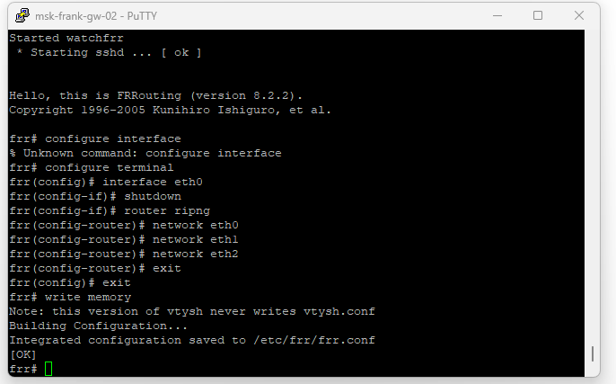{#fig:026 width=70%}

### Проверка работы OSPFv2

С узла PC1 выполнена проверка связности с узлом PC2 (10.0.11.10) командой `ping`, получены ответы ICMP. Командой `trace 10.0.11.10 -P 6` определён маршрут прохождения пакетов: 10.0.10.1 → 10.0.1.2 → 10.0.2.2 → 10.0.11.10 (рис. @fig:027).

{#fig:027 width=70%}

На маршрутизаторе msk-alkamal-gw-01 проверено состояние соседства OSPFv2 и таблица маршрутов протокола командами `show ip ospf neighbor` и `show ip ospf route`. В выводе отображаются два соседа в состоянии Full/Backup. В таблице OSPF присутствуют маршруты к сетям 10.0.2.0/24 и 10.0.3.0/24 через соответствующие next-hop, а также к сети 10.0.11.0/24 сразу по двум направлениям (рис. @fig:028).

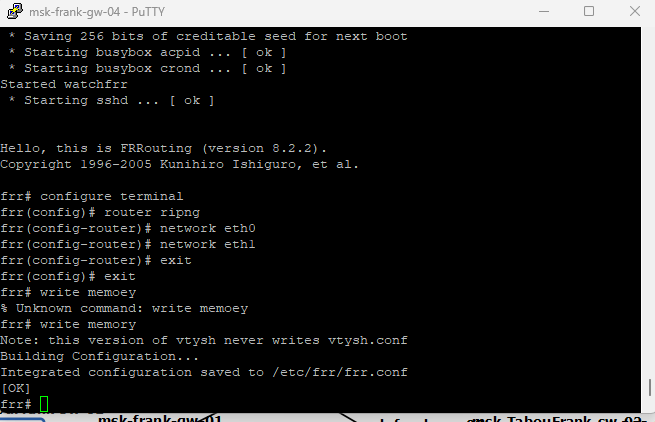{#fig:028 width=70%}

Для моделирования отказа канала на маршрутизаторе msk-alkamal-gw-02 выполнено отключение интерфейса eth0 командой `shutdown`. После отключения на msk-alkamal-gw-01 маршрут к сети 10.0.2.0/24 отображается через 10.0.4.1 (eth2), а маршрут к сети 10.0.11.0/24 остаётся доступным через 10.0.4.1, то есть используется альтернативный путь (рис. @fig:029).

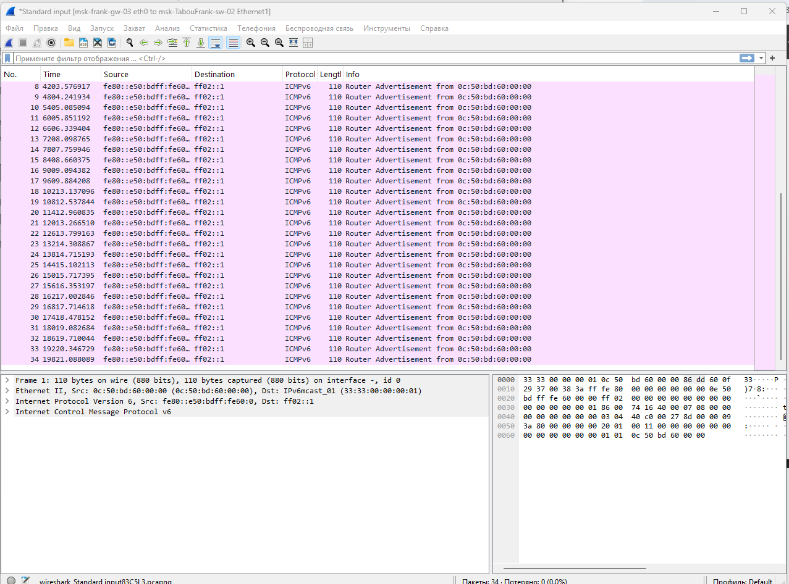{#fig:029 width=70%}

С узла PC1 повторно выполнены `ping` и `trace` — связность сохраняется, а трассировка показывает изменённый маршрут: 10.0.10.1 → 10.0.4.1 → 10.0.3.1 → 10.0.11.10 (рис. @fig:030).

{#fig:030 width=70%}

После включения интерфейса на msk-alkamal-gw-02 командой `no shutdown` маршруты восстановились.

### Анализ захваченного трафика OSPF

В захваченном трафике фиксируются ARP-пакеты, ICMP Echo Request и Echo Reply, а также служебные пакеты протоколов маршрутизации OSPF (Hello Packet), передаваемые на мультикаст-адрес 224.0.0.5 (рис. @fig:031).

{#fig:031 width=70%}

### Настройка OSPFv3 на маршрутизаторах

На маршрутизаторе msk-alkamal-gw-01 активирован процесс маршрутизации OSPFv3 для IPv6 и задан идентификатор маршрутизатора 1.1.1.1. Протокол OSPFv3 включён на интерфейсах eth0, eth1 и eth2 с привязкой к области 0 (рис. @fig:032).

{#fig:032 width=70%}

На маршрутизаторе msk-alkamal-gw-02 выполнено включение OSPFv3 с назначением router-id 2.2.2.2 на интерфейсах eth0 и eth1 (рис. @fig:033).

{#fig:033 width=70%}

На маршрутизаторе msk-alkamal-gw-03 настроен процесс OSPFv3 с идентификатором 3.3.3.3 на интерфейсах eth0, eth1 и eth2 (рис. @fig:034).

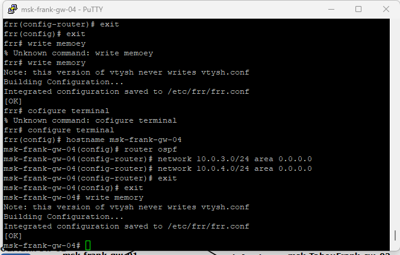{#fig:034 width=70%}

На маршрутизаторе msk-alkamal-gw-04 активирован OSPFv3 с router-id 4.4.4.4 на интерфейсах eth0 и eth1 (рис. @fig:035).

{#fig:035 width=70%}

### Проверка работы OSPFv3

С узла PC1 выполнена проверка связности с PC2 по IPv6-адресу 2001:11::a с помощью `ping`; получены ответы ICMPv6. Командой `trace 2001:11::a` определён маршрут прохождения пакетов: 2001:10::1 → 2001:1::2 → 2001:2::2 → 2001:11::a (рис. @fig:036).

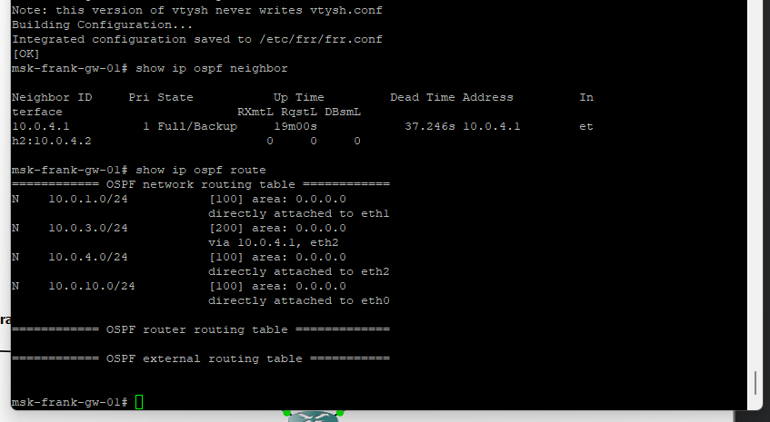{#fig:036 width=70%}

На маршрутизаторе msk-alkamal-gw-01 проверено состояние соседства OSPFv3 и таблица маршрутизации протокола командами `show ipv6 ospf6 neighbor` и `show ipv6 ospf6 route`. В списке соседей отображаются router-id 2.2.2.2 и 4.4.4.4, а в таблице маршрутов присутствуют все префиксы сети (рис. @fig:037).

{#fig:037 width=70%}

После отключения интерфейса eth0 на msk-alkamal-gw-02 таблица маршрутизации перестроилась, и связность сохранилась через альтернативный путь.

## Построение туннеля IPv6–IPv4

### Развёртывание топологии сети

В среде GNS3 был создан новый проект, после чего выполнено размещение и соединение сетевых устройств в соответствии с топологией, включающей маршрутизаторы VyOS, коммутаторы и узлы VPCS (рис. @fig:038). Топология состоит из двух IPv6-сегментов, соединённых через IPv4-транзитную сеть, а также логического IPv6-туннеля между граничными маршрутизаторами.

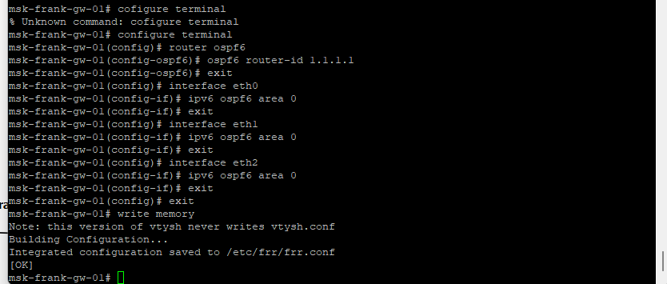{#fig:038 width=70%}

### Назначение IPv6-адресов оконечным устройствам

На узле PC1-alkamal назначен IPv6-адрес 1000::a/64 (рис. @fig:039).

{#fig:039 width=70%}

На узле PC2-alkamal назначен IPv6-адрес 1002::a/64 (рис. @fig:040).

{#fig:040 width=70%}

### Настройка маршрутизаторов VyOS

На маршрутизаторах изменены имена в соответствии с заданием (рис. @fig:041-043).

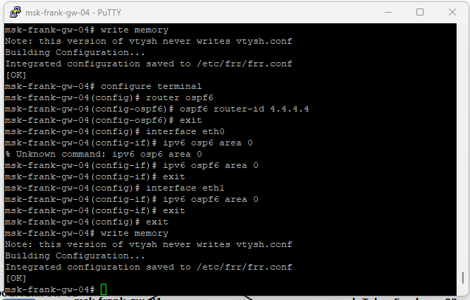{#fig:041 width=70%}
{#fig:042 width=70%}
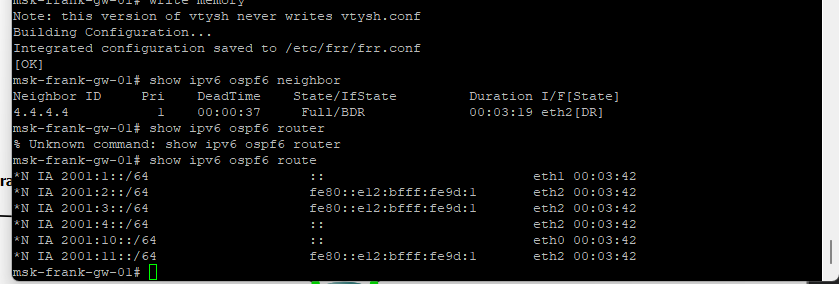{#fig:043 width=70%}

На маршрутизаторах настроены IPv4- и IPv6-адреса. На msk-alkamal-gw-01 на интерфейсе eth0 назначен IPv6-адрес 1000::1/64 с RA, на eth1 — IPv4-адрес 10.0.0.1/8 (рис. @fig:044).

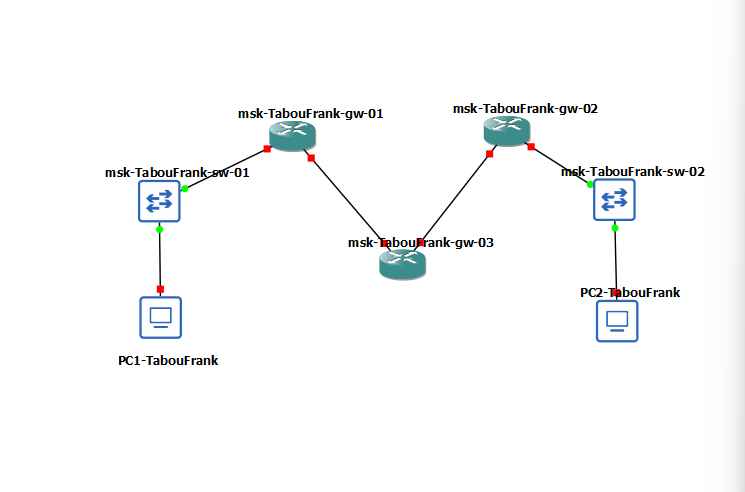{#fig:044 width=70%}

На msk-alkamal-gw-02 на eth0 назначен IPv6-адрес 1002::1/64 с RA, на eth1 — IPv4-адрес 20.0.0.2/8 (рис. @fig:045).

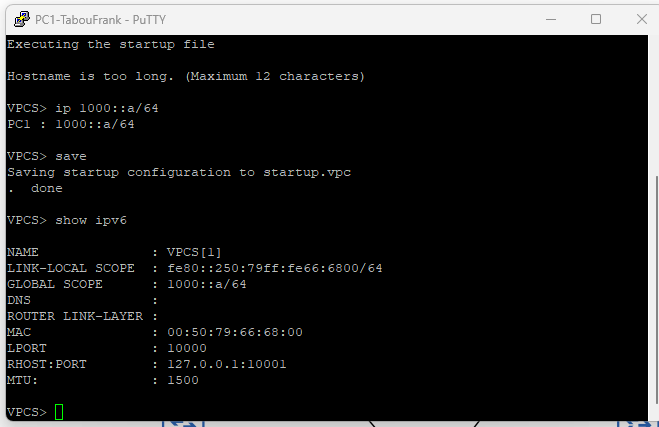{#fig:045 width=70%}

На msk-alkamal-gw-03 на eth0 назначен IPv4-адрес 10.0.0.2/8, на eth1 — 20.0.0.1/8 (рис. @fig:046).

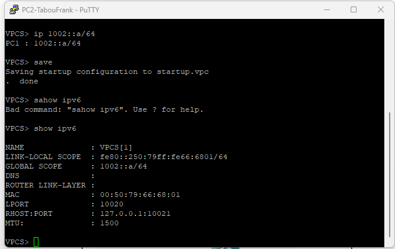{#fig:046 width=70%}

### Проверка получения IPv6 по RA

На узлах PC1 и PC2 проверено получение IPv6-параметров по Router Advertisement (рис. @fig:047-048).

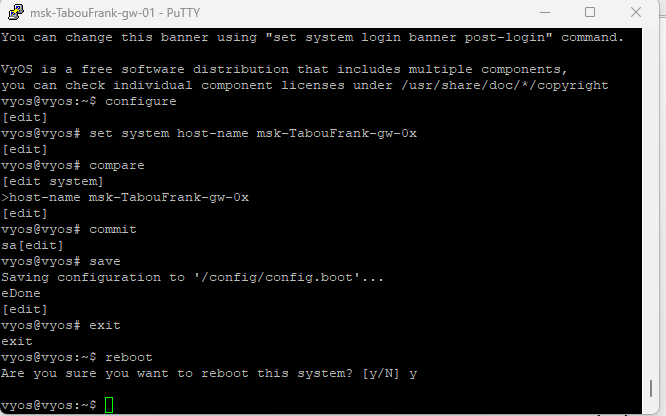{#fig:047 width=70%}
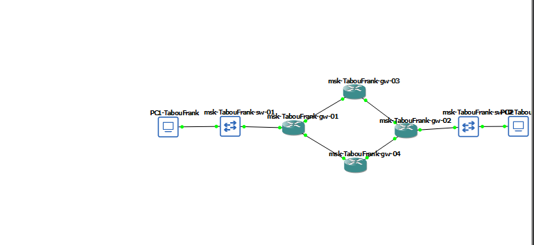{#fig:048 width=70%}

### Настройка динамической маршрутизации IPv4 по RIP

На маршрутизаторах VyOS настроена динамическая маршрутизация IPv4 с использованием протокола RIP (рис. @fig:049-051).

{#fig:049 width=70%}
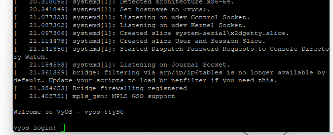{#fig:050 width=70%}
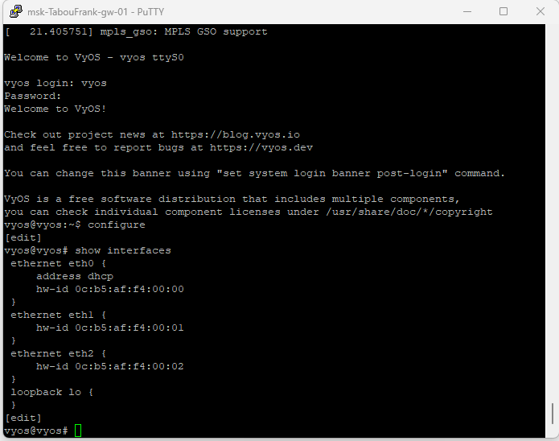{#fig:051 width=70%}

### Создание IPv6-туннеля через IPv4

На маршрутизаторах msk-alkamal-gw-01 и msk-alkamal-gw-02 настроен IPv6-туннель поверх IPv4 с использованием механизма SIT (рис. @fig:052).

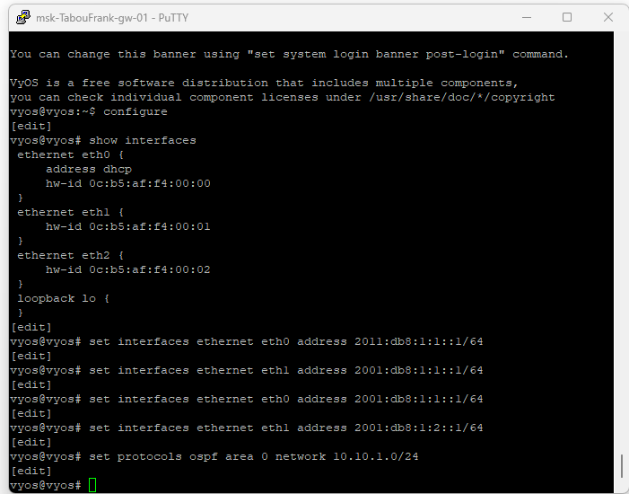{#fig:052 width=70%}

На msk-alkamal-gw-01 создан интерфейс tun0 с локальным IPv4-адресом 10.0.0.1, удалённым адресом 20.0.0.2 и IPv6-адресом туннеля 1001::1/64. На msk-alkamal-gw-02 интерфейс tun0 настроен с локальным IPv4-адресом 20.0.0.2, удалённым адресом 10.0.0.1 и IPv6-адресом 1001::2/64.

### Настройка статической маршрутизации IPv6

Для обеспечения связности между IPv6-подсетями через туннель настроена статическая маршрутизация IPv6 (рис. @fig:053).

{#fig:053 width=70%}

### Проверка доступности через туннель

С узла PC1 успешно выполнены команды `ping 1002::a` и `trace 1002::a`, что подтверждает достижимость узла PC2 по IPv6 через туннель (рис. @fig:054). Трассировка показывает прохождение трафика через туннельные IPv6-адреса 1001::1 → 1001::2.

{#fig:054 width=70%}

## Задание для самостоятельного выполнения

### Настройка IPv4-адресации

На маршрутизаторах выполнена настройка IPv4-адресации в соответствии с индивидуальным заданием (рис. @fig:055-058).

{#fig:055 width=70%}
{#fig:056 width=70%}
{#fig:057 width=70%}
{#fig:058 width=70%}

На узлах PC1 и PC2 настроены IPv4-адреса (рис. @fig:059-060).

{#fig:059 width=70%}
{#fig:060 width=70%}

### Настройка IPv6-адресации

На маршрутизаторах выполнена настройка IPv6-адресации (рис. @fig:061-064).

{#fig:061 width=70%}
{#fig:062 width=70%}
{#fig:063 width=70%}
{#fig:064 width=70%}

На узлах PC1 и PC2 настроены IPv6-адреса (рис. @fig:065-066).

{#fig:065 width=70%}
{#fig:066 width=70%}

### Настройка RIP v2

На всех маршрутизаторах настроен протокол RIP версии 2 (рис. @fig:067-070). Проверена таблица маршрутизации и связность между узлами.

{#fig:067 width=70%}
{#fig:068 width=70%}
{#fig:069 width=70%}
{#fig:070 width=70%}

### Настройка RIPng

На всех маршрутизаторах настроен протокол RIPng для IPv6 (рис. @fig:071-074). Проверена таблица маршрутизации и связность.

{#fig:071 width=70%}
{#fig:072 width=70%}
{#fig:073 width=70%}
{#fig:074 width=70%}

### Настройка OSPFv2

На всех маршрутизаторах настроен протокол OSPFv2 (рис. @fig:075-078). Проверена таблица маршрутизации и связность.

{#fig:075 width=70%}
{#fig:076 width=70%}
{#fig:077 width=70%}
{#fig:078 width=70%}

### Настройка OSPFv3

На всех маршрутизаторах настроен протокол OSPFv3 для IPv6 (рис. @fig:079-082). Проверена таблица маршрутизации и связность.

{#fig:079 width=70%}
{#fig:080 width=70%}
{#fig:081 width=70%}
{#fig:082 width=70%}

# Выводы

В ходе выполнения лабораторной работы была смоделирована сеть с поддержкой IPv4 и IPv6 в среде GNS3 и выполнена настройка адресации в соответствии с заданной топологией. Были настроены и исследованы протоколы динамической маршрутизации RIP/RIPng и OSPFv2/OSPFv3, а также проверены таблицы маршрутизации, соседство и пути прохождения пакетов.

Экспериментально подтверждена работа механизмов динамической маршрутизации и их реакция на изменение состояния интерфейсов, а также особенности маршрутизации в сетях IPv4 и IPv6. Был реализован туннель IPv6-over-IPv4 с использованием механизма SIT, обеспечивающий связность между удалёнными IPv6-сегментами через транзитную IPv4-сеть.

Полученные результаты соответствуют поставленной цели работы и требованиям задания.
