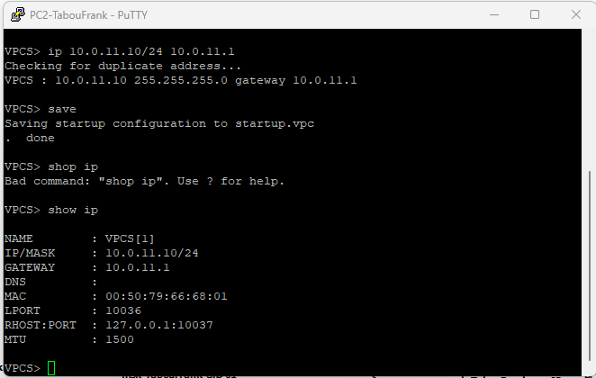
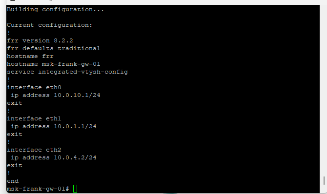
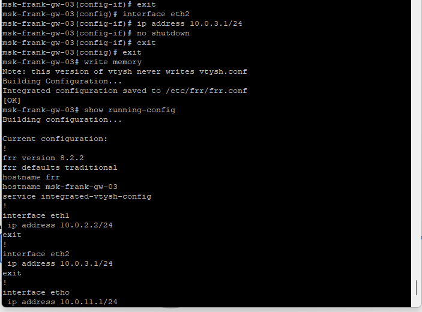
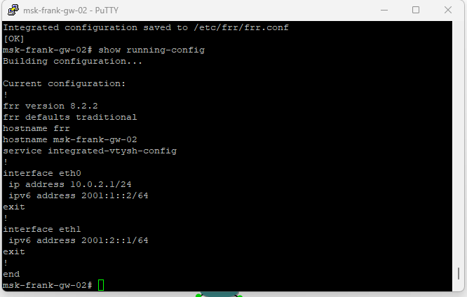
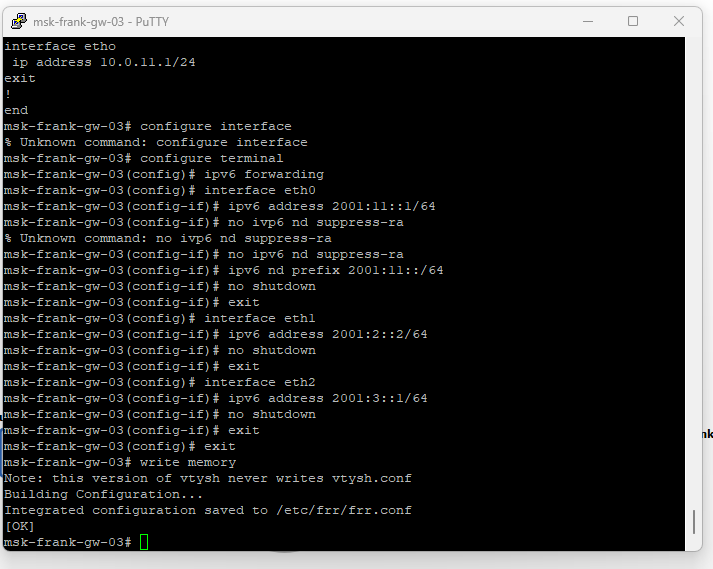
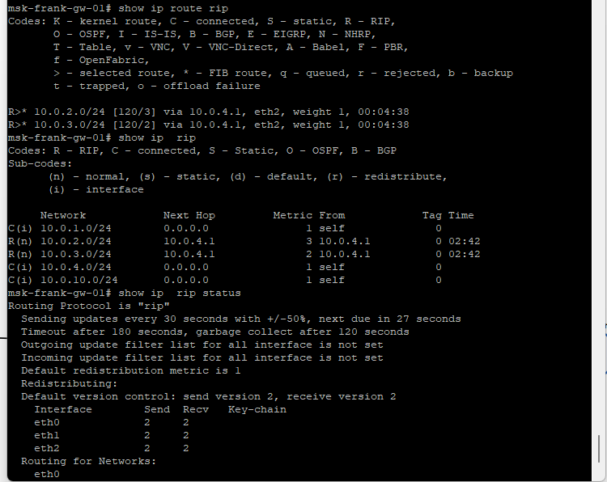
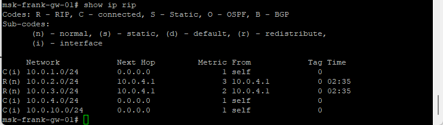

# Цели и задачи работы

## Цель лабораторной работы

Изучение принципов маршрутизации в IPv4- и IPv6-сетях и принципов настройки сетевого оборудования в среде GNS3.

# Выполнение лабораторной работы

## Топология в GNS3

{ #fig:001 width=85% }

## Настройка IPv6 на PC1

{ #fig:002 width=85% }

## Настройка IPv6 на PC2

{ #fig:003 width=85% }

## Подготовка gw-01

{ #fig:004 width=85% }

## Адресация gw-01

{ #fig:005 width=85% }

## Подготовка gw-02

{ #fig:006 width=85% }

## Адресация gw-02

{ #fig:007 width=85% }

## Подготовка и адресация gw-03

{ #fig:008 width=85% }

## Подготовка и адресация gw-03

{ #fig:009 width=85% }

## Проверка RA на оконечных устройствах

{ #fig:010 width=85% }

## Проверка RA на оконечных устройствах

{ #fig:011 width=85% }

## Ping с gw-01 до настройки маршрутизации

{ #fig:012 width=85% }

## Анализ трафика до RIP (gw-01 ↔ gw-03)

{ #fig:013 width=85% }

## Настройка RIP на gw-01

{ #fig:014 width=85% }

## Настройка RIP на gw-02

{ #fig:015 width=85% }

## Настройка RIP на gw-03

{ #fig:016 width=85% }

## Проверка связности после включения RIP

{ #fig:017 width=85% }

## Анализ трафика после RIP

{ #fig:018 width=85% }

## Туннель SIT на gw-01

{ #fig:019 width=85% }

## Туннель SIT на gw-02

{ #fig:020 width=85% }

## Статическая маршрутизация IPv6

{ #fig:021 width=85% }

## Статическая маршрутизация IPv6

{ #fig:022 width=85% }

## Проверка с PC1: ping e trace до PC2

{ #fig:023 width=85% }

## Проверка с PC2: ping e trace до PC1

{ #fig:024 width=85% }

## Трафик IPv6 при передаче через IPv4

{ #fig:025 width=85% }

## Где видна информация о прохождении через туннель

{ #fig:026 width=85% }

# Выводы по trabalho

## Вывод

В GNS3 настроена сеть с VyOS и VPCS, выполнена адресация IPv4/IPv6 и проведена проверка связности. Динамическая маршрутизация IPv4 (RIP) обеспечила доступность удалённых IPv4-сетей. Туннель SIT и статические маршруты IPv6 обеспечили обмен трафиком между удалёнными IPv6-сегментами. Анализ Wireshark подтвердил обмен ARP/ICMP/RIP и наличие инкапсуляции IPv6-пакетов внутри IPv4 при передаче через туннель.
