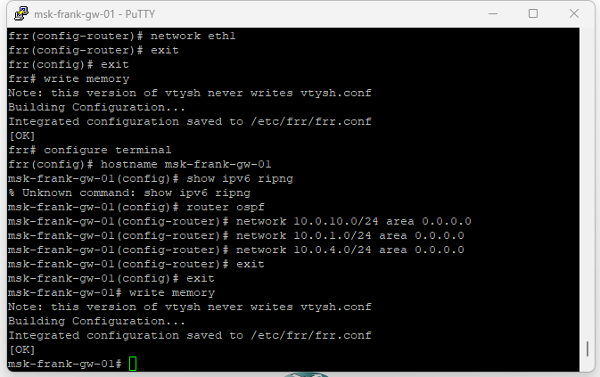
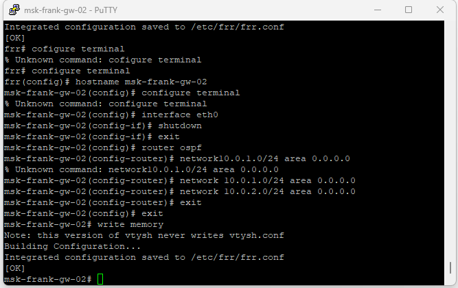
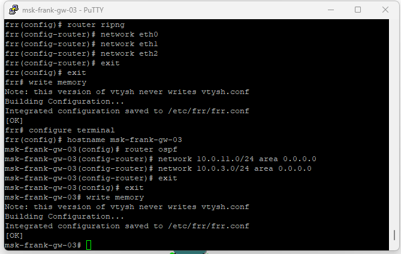
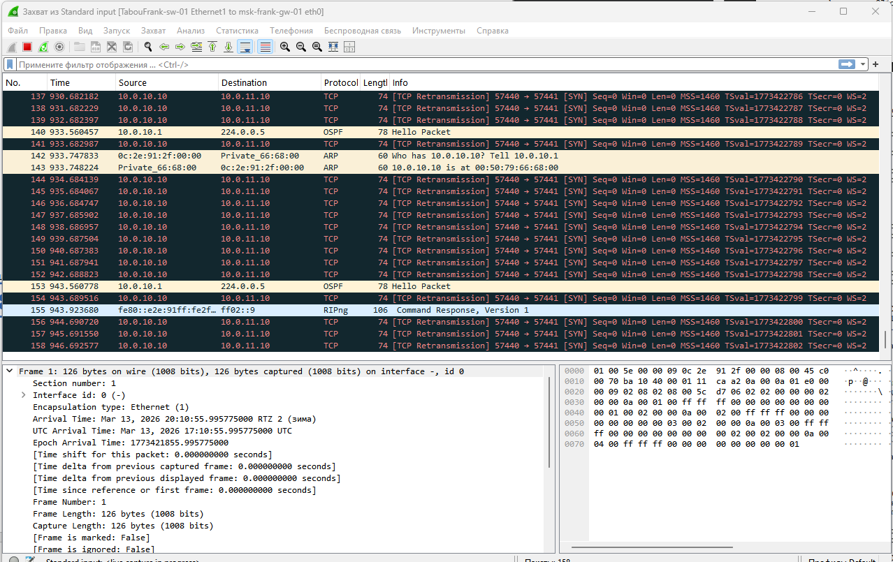
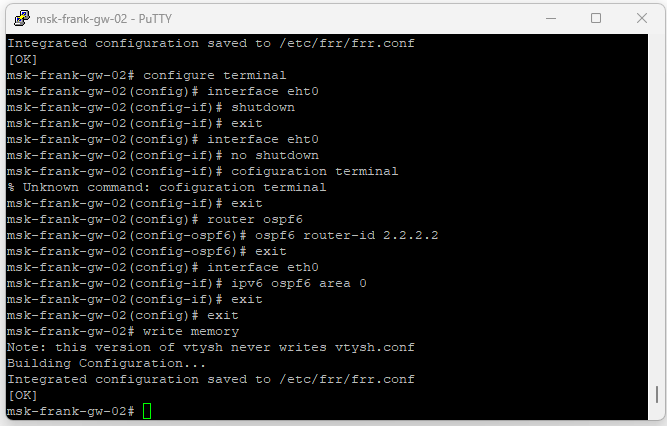
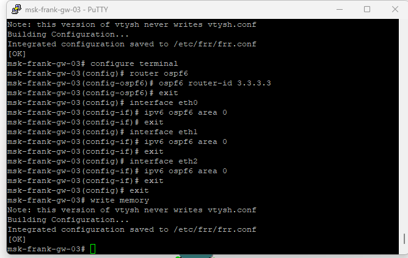
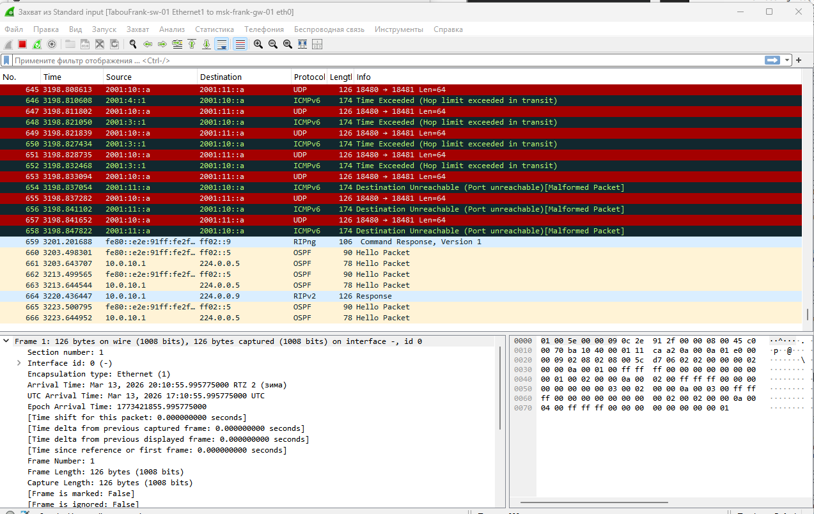
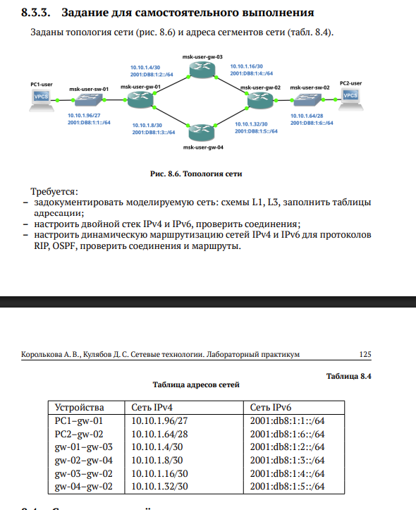

## Докладчик

* Талебу Тенке Франк Устон
* Студент группы НФИбд-02-23
* Студ. билет 1032224534
* Российский университет дружбы народов

## Цель работы

Изучение принципов работы сетевых технологий

---

## Далее были изменены отображаемые имена устройств в соответствии с требованиями задания: коммутаторы получили имена по шаблону `msk-user-sw-0x`, маршрутизаторы — `msk-user-gw-0x`, а узлы VPCS — `PCx-user`. На завершающем этапе был включён захват трафика на соединениях между sw-01 и gw-01, а также между sw-02 и gw-03, что позволило в дальнейшем проанализировать работу протоколов маршрутизации и передачу пользовательского трафика.

{ width=90% }

---

## В соответствии с таблицей адресации были настроены IPv4-адреса на оконечных устройствах PC1 и PC2 с использованием команд VPCS. На узле PC1 был назначен IP-адрес 10.0.10.10/24 с указанием шлюза по умолчанию 10.0.10.1. Конфигурация была сохранена, после чего с помощью команды `show ip` подтверждена корректность заданных параметров (рис. @fig:002).

{ width=90% }

---

## На узле PC2 был назначен IP-адрес 10.0.11.10/24 с шлюзом по умолчанию 10.0.11.1. После сохранения конфигурации проверка команды `show ip` показала корректное применение настроек (рис. @fig:003).

{ width=90% }

---

## На маршрутизаторе msk-user-gw-01 были настроены IPv4-адреса на интерфейсах eth0, eth1 и eth2 в соответствии с таблицей адресации. После назначения адресов интерфейсы были переведены в активное состояние с помощью команды `no shutdown`. Конфигурация была сохранена, а корректность настроек подтверждена командой `show running-config` (рис. @fig:004).

{ width=90% }

---

## На маршрутизаторе msk-user-gw-02 была выполнена настройка IPv4-адресов на интерфейсах eth0 и eth1 согласно заданной схеме сети. Все интерфейсы были активированы, после чего конфигурация сохранена (рис. @fig:005).

{ width=90% }

---

## На маршрутизаторе msk-user-gw-03 были назначены IPv4-адреса на интерфейсах eth0, eth1 и eth2, обеспечивающих подключение к локальной сети и соседним маршрутизаторам. Все интерфейсы успешно активированы, конфигурация сохранена (рис. @fig:006).

{ width=90% }

---

## На маршрутизаторе msk-user-gw-04 выполнена настройка IPv4-адресов на интерфейсах eth0 и eth1 в соответствии с топологией сети. После включения интерфейсов и сохранения конфигурации была выполнена проверка, подтвердившая корректность параметров (рис. @fig:007).

{ width=90% }

---

## На узле PC1 был назначен глобальный IPv6-адрес 2001:10::a/64. После сохранения конфигурации проверка с помощью команды `show ipv6` подтвердила корректное назначение глобального и link-local адресов (рис. @fig:008).

{ width=90% }

---

## На узле PC2 был назначен глобальный IPv6-адрес 2001:11::a/64. Конфигурация была сохранена, а вывод команды `show ipv6` подтвердил корректность параметров IPv6 (рис. @fig:009).

{ width=90% }

---

## На маршрутизаторе msk-user-gw-01 была включена поддержка пересылки IPv6 (`ipv6 forwarding`) и настроены IPv6-адреса на интерфейсах eth0, eth1 и eth2. На интерфейсе eth0 дополнительно включена рассылка Router Advertisement для узлов локальной сети (рис. @fig:010).

{ width=90% }

---

## На маршрутизаторе msk-user-gw-02 выполнено включение IPv6-пересылки и назначение IPv6-адресов на интерфейсах eth0 и eth1 (рис. @fig:011).

{ width=90% }

---

## На маршрутизаторе msk-user-gw-03 была активирована поддержка IPv6 и назначены IPv6-адреса на интерфейсах eth0, eth1 и eth2. На интерфейсе eth0 включена рассылка Router Advertisement (рис. @fig:012).

{ width=90% }

---

## На маршрутизаторе msk-user-gw-04 выполнена настройка IPv6-адресов на интерфейсах eth0 и eth1 с предварительным включением пересылки IPv6 (рис. @fig:013).

{ width=90% }

---

## На маршрутизаторе msk-user-gw-01 был включён протокол динамической маршрутизации RIP версии 2. Маршрутизация активирована на интерфейсах eth0, eth1 и eth2, что позволило объявлять все непосредственно подключённые сети и получать маршруты от соседних маршрутизаторов (рис. @fig:014).

{ width=90% }

---

## На маршрутизаторе msk-user-gw-02 выполнена настройка RIPv2 с активацией протокола на интерфейсах eth0 и eth1 (рис. @fig:015).

{ width=90% }

---

## На маршрутизаторе msk-user-gw-03 был настроен протокол RIPv2 и включён на интерфейсах eth0, eth1 и eth2 (рис. @fig:016).

{ width=90% }

---

## На маршрутизаторе msk-user-gw-04 выполнена настройка RIPv2 с включением протокола на интерфейсах eth0 и eth1 (рис. @fig:017).

{ width=90% }

---

## Результаты команды `show ip route rip` показали, что маршрутизаторы успешно получили маршруты к удалённым сетям по протоколу RIP, с указанием следующего перехода (Next Hop) и соответствующих метрик (рис. @fig:018).

{ width=90% }

---

## Вывод команды `show ip rip` отразил список объявляемых и полученных сетей, значения метрик и источники маршрутной информации (рис. @fig:019).

{ width=90% }

---

## Команда `show ip rip status` показала, что используется RIP версии 2, обновления отправляются каждые 30 секунд, таймеры протокола соответствуют стандартным значениям (рис. @fig:020).

{ width=90% }

---

## С узла PC1 была выполнена проверка связности с узлом PC2 с помощью команды `ping 10.0.11.10`. Ответы ICMP были успешно получены, что подтверждает корректную маршрутизацию в сети. С помощью команды `trace 10.0.11.10 -P 6` был определён путь следования пакетов (рис. @fig:021).

{ width=90% }

---

## В захваченном трафике присутствуют RIP-пакеты, отправляемые на мультикаст-адрес 224.0.0.9, которые содержат информацию об объявляемых сетях и соответствующих метриках маршрутов (рис. @fig:022).

{ width=90% }

---

## На маршрутизаторе msk-alkamal-gw-01 выполнена настройка протокола OSPFv2. В процесс OSPF добавлены сети 10.0.10.0/24, 10.0.1.0/24 и 10.0.4.0/24, все они включены в область 0.0.0.0 (рис. @fig:023).

{ width=90% }

---

## На маршрутизаторе msk-alkamal-gw-02 активирован процесс OSPFv2 и выполнено объявление сетей 10.0.1.0/24 и 10.0.2.0/24 в область 0.0.0.0 (рис. @fig:024).

{ width=90% }

---

## На маршрутизаторе msk-alkamal-gw-03 в процесс OSPFv2 включены сети 10.0.11.0/24, 10.0.2.0/24 и 10.0.3.0/24, относящиеся к области 0.0.0.0 (рис. @fig:025).

{ width=90% }

---

## На маршрутизаторе msk-alkamal-gw-04 выполнена настройка OSPFv2 с добавлением сетей 10.0.3.0/24 и 10.0.4.0/24 в магистральную область 0.0.0.0 (рис. @fig:026).

{ width=90% }

---

## С узла PC1 выполнена проверка связности с узлом PC2 (10.0.11.10) командой `ping`, получены ответы ICMP. Командой `trace 10.0.11.10 -P 6` определён маршрут прохождения пакетов: 10.0.10.1 → 10.0.1.2 → 10.0.2.2 → 10.0.11.10 (рис. @fig:027).

{ width=90% }

---

## На маршрутизаторе msk-alkamal-gw-01 проверено состояние соседства OSPFv2 и таблица маршрутов протокола командами `show ip ospf neighbor` и `show ip ospf route`. В выводе отображаются два соседа в состоянии Full/Backup. В таблице OSPF присутствуют маршруты к сетям 10.0.2.0/24 и 10.0.3.0/24 через соответствующие next-hop, а также к сети 10.0.11.0/24 сразу по двум направлениям (рис. @fig:028).

{ width=90% }

---

## Для моделирования отказа канала на маршрутизаторе msk-alkamal-gw-02 выполнено отключение интерфейса eth0 командой `shutdown`. После отключения на msk-alkamal-gw-01 маршрут к сети 10.0.2.0/24 отображается через 10.0.4.1 (eth2), а маршрут к сети 10.0.11.0/24 остаётся доступным через 10.0.4.1, то есть используется альтернативный путь (рис. @fig:029).

{ width=90% }

---

## С узла PC1 повторно выполнены `ping` и `trace` — связность сохраняется, а трассировка показывает изменённый маршрут: 10.0.10.1 → 10.0.4.1 → 10.0.3.1 → 10.0.11.10 (рис. @fig:030).

{ width=90% }

---

## В захваченном трафике фиксируются ARP-пакеты, ICMP Echo Request и Echo Reply, а также служебные пакеты протоколов маршрутизации OSPF (Hello Packet), передаваемые на мультикаст-адрес 224.0.0.5 (рис. @fig:031).

{ width=90% }

---

## На маршрутизаторе msk-alkamal-gw-01 активирован процесс маршрутизации OSPFv3 для IPv6 и задан идентификатор маршрутизатора 1.1.1.1. Протокол OSPFv3 включён на интерфейсах eth0, eth1 и eth2 с привязкой к области 0 (рис. @fig:032).

{ width=90% }

---

## На маршрутизаторе msk-alkamal-gw-02 выполнено включение OSPFv3 с назначением router-id 2.2.2.2 на интерфейсах eth0 и eth1 (рис. @fig:033).

{ width=90% }

---

## На маршрутизаторе msk-alkamal-gw-03 настроен процесс OSPFv3 с идентификатором 3.3.3.3 на интерфейсах eth0, eth1 и eth2 (рис. @fig:034).

{ width=90% }

---

## На маршрутизаторе msk-alkamal-gw-04 активирован OSPFv3 с router-id 4.4.4.4 на интерфейсах eth0 и eth1 (рис. @fig:035).

{ width=90% }

---

## С узла PC1 выполнена проверка связности с PC2 по IPv6-адресу 2001:11::a с помощью `ping`; получены ответы ICMPv6. Командой `trace 2001:11::a` определён маршрут прохождения пакетов: 2001:10::1 → 2001:1::2 → 2001:2::2 → 2001:11::a (рис. @fig:036).

{ width=90% }

---

## На маршрутизаторе msk-alkamal-gw-01 проверено состояние соседства OSPFv3 и таблица маршрутизации протокола командами `show ipv6 ospf6 neighbor` и `show ipv6 ospf6 route`. В списке соседей отображаются router-id 2.2.2.2 и 4.4.4.4, а в таблице маршрутов присутствуют все префиксы сети (рис. @fig:037).

{ width=90% }

---

## В среде GNS3 был создан новый проект, после чего выполнено размещение и соединение сетевых устройств в соответствии с топологией, включающей маршрутизаторы VyOS, коммутаторы и узлы VPCS (рис. @fig:038). Топология состоит из двух IPv6-сегментов, соединённых через IPv4-транзитную сеть, а также логического IPv6-туннеля между граничными маршрутизаторами.

{ width=90% }

---

## На узле PC1-alkamal назначен IPv6-адрес 1000::a/64 (рис. @fig:039).

{ width=90% }

---

## На узле PC2-alkamal назначен IPv6-адрес 1002::a/64 (рис. @fig:040).

{ width=90% }

---

## На маршрутизаторах изменены имена в соответствии с заданием (рис. @fig:041-043).

{ width=90% }

---

## Этап выполнения работы №42

{ width=90% }

---

## {#fig:041 width=70%}

{#fig:041 width=70%}](43.png){ width=90% }

---

## На маршрутизаторах настроены IPv4- и IPv6-адреса. На msk-alkamal-gw-01 на интерфейсе eth0 назначен IPv6-адрес 1000::1/64 с RA, на eth1 — IPv4-адрес 10.0.0.1/8 (рис. @fig:044).

{ width=90% }

---

## На msk-alkamal-gw-02 на eth0 назначен IPv6-адрес 1002::1/64 с RA, на eth1 — IPv4-адрес 20.0.0.2/8 (рис. @fig:045).

{ width=90% }

---

## На msk-alkamal-gw-03 на eth0 назначен IPv4-адрес 10.0.0.2/8, на eth1 — 20.0.0.1/8 (рис. @fig:046).

{ width=90% }

---

## На узлах PC1 и PC2 проверено получение IPv6-параметров по Router Advertisement (рис. @fig:047-048).

{ width=90% }

---

## Этап выполнения работы №48

{ width=90% }

---

## На маршрутизаторах VyOS настроена динамическая маршрутизация IPv4 с использованием протокола RIP (рис. @fig:049-051).

{ width=90% }

---

## Этап выполнения работы №50

{ width=90% }

---

## {#fig:049 width=70%}

{#fig:049 width=70%}](51.png){ width=90% }

---

## На маршрутизаторах msk-alkamal-gw-01 и msk-alkamal-gw-02 настроен IPv6-туннель поверх IPv4 с использованием механизма SIT (рис. @fig:052).

{ width=90% }

---

## Вывод

В ходе выполнения лабораторной работы были получены практические навыки

---

## Список литературы

[1] Методические указания к лабораторной работе №08
[2] Документация по сетевым технологиям
