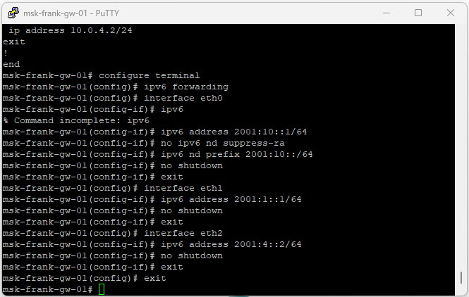
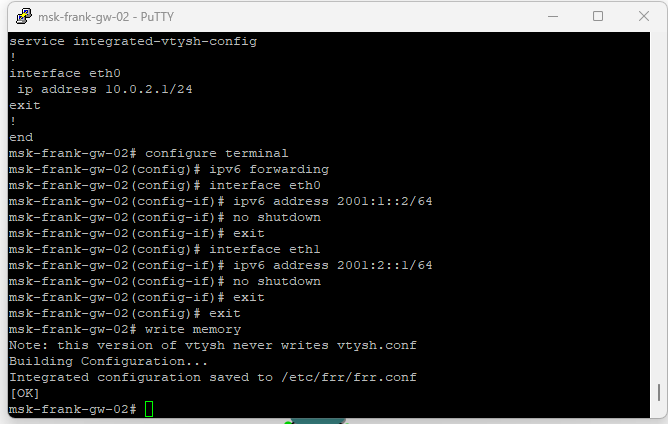
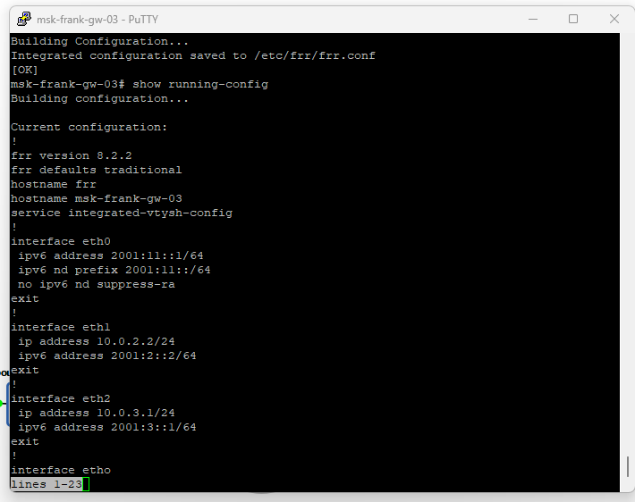

## Докладчик

* Талебу Тенке Франк Устон
* Студент группы НФИбд-02-23
* Студ. билет 1032224534
* Российский университет дружбы народов

## Цель работы

Изучение принципов работы сетевых технологий

## Далее были изменены отображаемые имена устройств в соответствии с требованиями задания: коммутаторы получили имена по шаблону `msk-user-sw-0x`, маршрутизаторы — `msk-user-gw-0x`, а узлы VPCS — `PCx-user`. На завершающем этапе был включён захват трафика на соединениях между sw-01 и gw-01, а также между sw-02 и gw-03, что позволило в дальнейшем проанализировать работу протоколов маршрутизации и передачу пользовательского трафика.

## В соответствии с таблицей адресации были настроены IPv4-адреса на оконечных устройствах PC1 и PC2 с использованием команд VPCS. На узле PC1 был назначен IP-адрес 10.0.10.10/24 с указанием шлюза по умолчанию 10.0.10.1. Конфигурация была сохранена, после чего с помощью команды `show ip` подтверждена корректность заданных параметров (рис. @fig:002).

## На узле PC2 был назначен IP-адрес 10.0.11.10/24 с шлюзом по умолчанию 10.0.11.1. После сохранения конфигурации проверка команды `show ip` показала корректное применение настроек (рис. @fig:003).

## На маршрутизаторе msk-user-gw-01 были настроены IPv4-адреса на интерфейсах eth0, eth1 и eth2 в соответствии с таблицей адресации. После назначения адресов интерфейсы были переведены в активное состояние с помощью команды `no shutdown`. Конфигурация была сохранена, а корректность настроек подтверждена командой `show running-config` (рис. @fig:004).

## На маршрутизаторе msk-user-gw-02 была выполнена настройка IPv4-адресов на интерфейсах eth0 и eth1 согласно заданной схеме сети. Все интерфейсы были активированы, после чего конфигурация сохранена (рис. @fig:005).

## На маршрутизаторе msk-user-gw-03 были назначены IPv4-адреса на интерфейсах eth0, eth1 и eth2, обеспечивающих подключение к локальной сети и соседним маршрутизаторам. Все интерфейсы успешно активированы, конфигурация сохранена (рис. @fig:006).

## На маршрутизаторе msk-user-gw-04 выполнена настройка IPv4-адресов на интерфейсах eth0 и eth1 в соответствии с топологией сети. После включения интерфейсов и сохранения конфигурации была выполнена проверка, подтвердившая корректность параметров (рис. @fig:007).

## На узле PC1 был назначен глобальный IPv6-адрес 2001:10::a/64. После сохранения конфигурации проверка с помощью команды `show ipv6` подтвердила корректное назначение глобального и link-local адресов (рис. @fig:008).

## На узле PC2 был назначен глобальный IPv6-адрес 2001:11::a/64. Конфигурация была сохранена, а вывод команды `show ipv6` подтвердил корректность параметров IPv6 (рис. @fig:009).

## На маршрутизаторе msk-user-gw-01 была включена поддержка пересылки IPv6 (`ipv6 forwarding`) и настроены IPv6-адреса на интерфейсах eth0, eth1 и eth2. На интерфейсе eth0 дополнительно включена рассылка Router Advertisement для узлов локальной сети (рис. @fig:010).

## На маршрутизаторе msk-user-gw-02 выполнено включение IPv6-пересылки и назначение IPv6-адресов на интерфейсах eth0 и eth1 (рис. @fig:011).

## На маршрутизаторе msk-user-gw-03 была активирована поддержка IPv6 и назначены IPv6-адреса на интерфейсах eth0, eth1 и eth2. На интерфейсе eth0 включена рассылка Router Advertisement (рис. @fig:012).

## На маршрутизаторе msk-user-gw-04 выполнена настройка IPv6-адресов на интерфейсах eth0 и eth1 с предварительным включением пересылки IPv6 (рис. @fig:013).

## На маршрутизаторе msk-user-gw-01 был включён протокол динамической маршрутизации RIP версии 2. Маршрутизация активирована на интерфейсах eth0, eth1 и eth2, что позволило объявлять все непосредственно подключённые сети и получать маршруты от соседних маршрутизаторов (рис. @fig:014).

## На маршрутизаторе msk-user-gw-02 выполнена настройка RIPv2 с активацией протокола на интерфейсах eth0 и eth1 (рис. @fig:015).

## На маршрутизаторе msk-user-gw-03 был настроен протокол RIPv2 и включён на интерфейсах eth0, eth1 и eth2 (рис. @fig:016).

## На маршрутизаторе msk-user-gw-04 выполнена настройка RIPv2 с включением протокола на интерфейсах eth0 и eth1 (рис. @fig:017).

## Результаты команды `show ip route rip` показали, что маршрутизаторы успешно получили маршруты к удалённым сетям по протоколу RIP, с указанием следующего перехода (Next Hop) и соответствующих метрик (рис. @fig:018).

## Вывод команды `show ip rip` отразил список объявляемых и полученных сетей, значения метрик и источники маршрутной информации (рис. @fig:019).

## Команда `show ip rip status` показала, что используется RIP версии 2, обновления отправляются каждые 30 секунд, таймеры протокола соответствуют стандартным значениям (рис. @fig:020).

## Вывод

В ходе выполнения лабораторной работы были получены практические навыки

## Список литературы

[1] Методические указания к лабораторной работе №08
[2] Документация по сетевым технологиям
