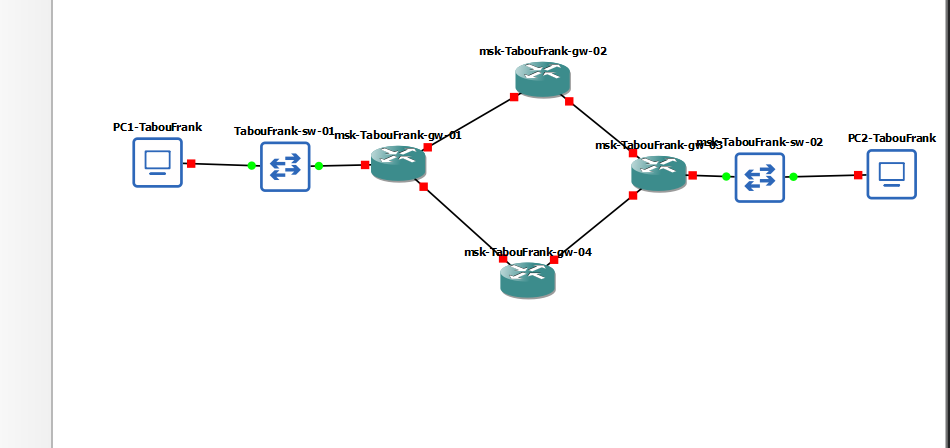
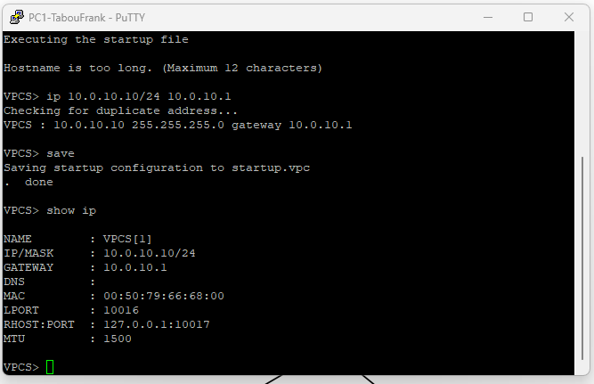
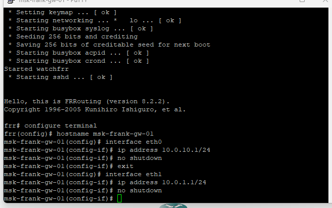
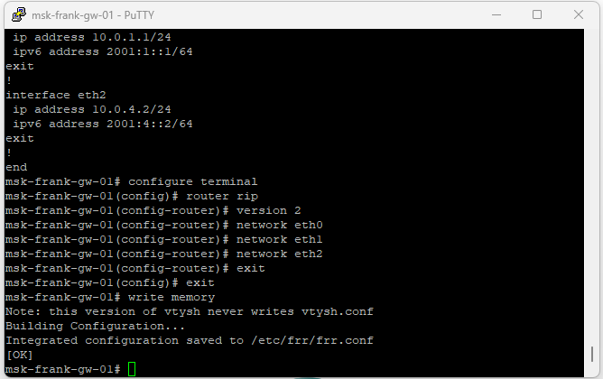
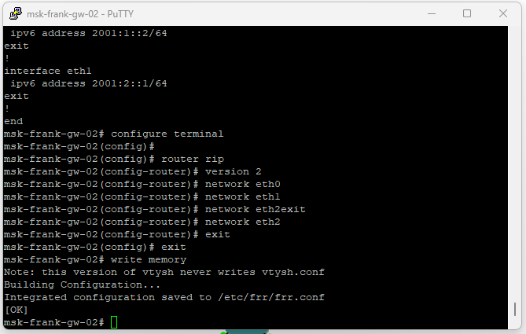
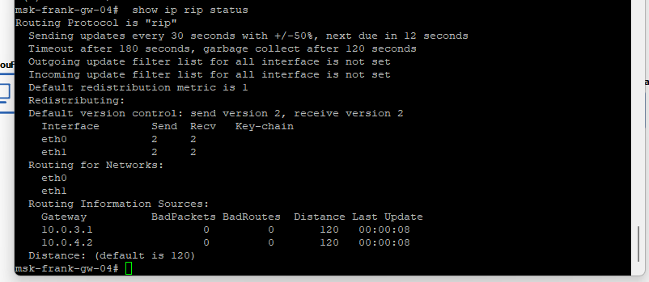
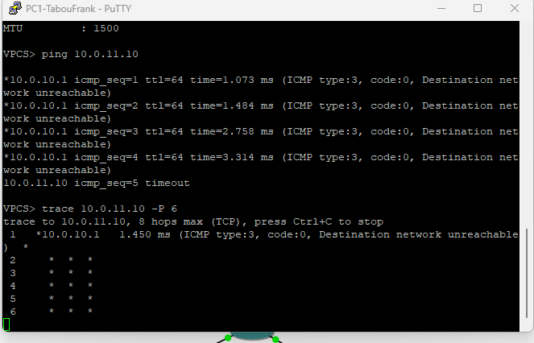
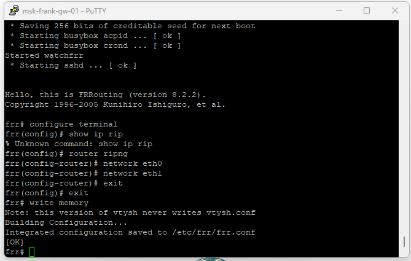

{ #fig:001 width=80% }

{ #fig:002 width=80% }

{ #fig:003 width=80% }

{ #fig:004 width=80% }

{ #fig:005 width=80% }

{ #fig:006 width=80% }

{ #fig:007 width=80% }

{ #fig:008 width=80% }

{ #fig:009 width=80% }

{ #fig:010 width=80% }

{ #fig:011 width=80% }

{ #fig:012 width=80% }

{ #fig:013 width=80% }

{ #fig:014 width=80% }

{ #fig:015 width=80% }

{ #fig:016 width=80% }

{ #fig:017 width=80% }

{ #fig:018 width=80% }

{ #fig:019 width=80% }

{ #fig:020 width=80% }

{ #fig:021 width=80% }

{ #fig:022 width=80% }

{ #fig:023 width=80% }

{ #fig:024 width=80% }

{ #fig:025 width=80% }

{ #fig:026 width=80% }

